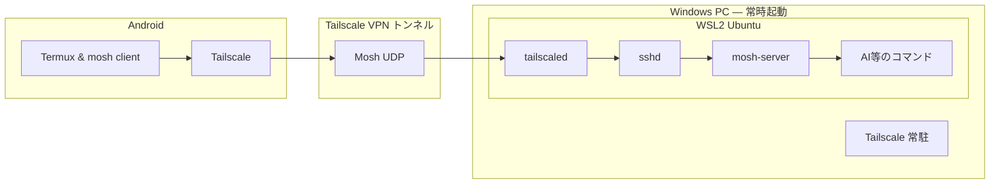

## やりたいこと

一昔前までは、スマホの小さな画面でのコーディングは非現実的でしたが、 **AIコーディングエージェント** の登場によって、自然言語の指示からコードを生成・修正してくれるため、スマホからの入力でも十分に実用的になりました。

更に、普段開発に使っているPCにもリモートでアクセスできれば、充分なスペックの実行環境でさえも文字通り掌の上にあるのでいつでもどこでもAIコーディングができるようになります。

iPhoneアプリだと Moshi というものがあるようですが、Androidにはそれらしきものがないため、組み合わせて同等の環境を作りたいと思います。私の環境はWindows WSLで開発しているので、(面倒なことになりがちな)WSLをサーバとします。

ということで、 **AndroidスマホからWindows PC（WSL環境）にリモート接続**し、外出先からでもAIエージェントを操作できる環境を構築します。

## 全体アーキテクチャ



**通信の流れ**:
1. Windows PC側ではTailscale・tailscaled・sshdが常時起動し、接続を待ち受けています
2. Android側でTailscaleをONにし、Termuxを起動します。TailscaleがWireGuardで暗号化されたVPNトンネルを確立します
3. TermuxからMoshで接続すると、トンネルを通ってWSL内のsshdに到達し、mosh-serverが起動されます
4. 以降の通信はMosh（UDP）に切り替わり、電波断でもセッションが維持されます
5. Moshの通信はすべてTailscaleトンネルの中を通るため、インターネットに直接ポートを公開する必要がありません

**サービス一覧**:

| サービス        | 場所      | 動作         | 備考                     |
|:------------|:--------|:-----------:|:-----------------------|
| Tailscale   | Windows | 常駐         | インストール時に設定されます         |
| tailscaled  | WSL内    | 常駐         |                        |
| sshd        | WSL内    | 常駐         | Mosh接続の入口              |
| Tailscale   | Android | **使用時にON** | バッテリー節約のため普段はOFFの想定    |
| Termux      | Android | **使用時に起動** | 閉じてもサーバー側のセッションは維持されます |
| mosh-server | WSL内    | 接続時に自動起動   | SSH経由で起動・終了されます        |

## 利用ツールの紹介

### Tailscale — メッシュVPN

[Tailscale](https://tailscale.com/) は、WireGuardプロトコルをベースにしたメッシュVPNサービスです。デバイス間を**エンドツーエンド暗号化**で直接つなぎ、ポート開放やVPNサーバーの構築が一切不要になります。

- 元Googleエンジニア4名が2019年に創業。累計$275Mの資金調達を受けており、Accel、Insight Partners等の大手VCが出資しています
- 暗号化には[WireGuard](https://www.wireguard.com/)（独立した暗号学的レビュー済みのオープンプロトコル）を使用
- クライアントソフトは**オープンソース**（[GitHub](https://github.com/tailscale/tailscale)）
- 外部セキュリティ監査を定期的に実施し、SOC 2 Type II認証を取得済みです
- 無料プラン（Personalプラン）で3ユーザー・100デバイスまで利用可能。

### Termux — Android上のLinuxターミナル環境

[Termux](https://termux.dev/) は、Android上でLinuxのコマンドライン環境を提供するオープンソースのターミナルエミュレータです。root化不要で動作し、`apt` でパッケージをインストールできます。

- GPLv3ライセンスでソースコード全体が[GitHub](https://github.com/termux/termux-app)上に公開
- root権限を要求せず、ユーザー空間で完全に動作します
- ストレージアクセス等の権限はデフォルトで無効です。必要に応じてユーザーが明示的に許可します

**Google Play版ではなくF-Droid版を使う理由**: Google Play版はストアポリシー対応のため機能が制限されており、更新も停止しています。F-Droid版が最新の安定版として公式に推奨されています。

### F-Droid — オープンソース専門のアプリストア

[F-Droid](https://f-droid.org/) は、オープンソースアプリのみを扱うAndroid向けアプリリポジトリです。Termuxの最新版を入手するために使用します。

- 2010年から運営されているコミュニティ主導のプロジェクトです。100名以上のコントリビューターが開発に参加しています
- 掲載アプリはすべてオープンソースであることが必須です。F-Droidのサーバー上で**ソースコードからビルド**されるため、開発者がバイナリに不正なコードを混入するリスクが低くなっています
- アカウント登録不要。ユーザーの行動追跡や広告は一切無し
- [Cure53](https://cure53.de/)等の外部セキュリティ企業による監査を受けています

**注意点**: Google Play以外からのアプリインストールとなるため、Androidの設定で「不明なソースからのインストール」を許可する必要があります。F-Droidアプリに対してのみ許可すれば、他のアプリへの影響はありません。

---

## セットアップ手順

### Step 1: WSL内にSSHサーバーとMoshをインストール

WSLのターミナルを開き、以下を実行します。

```bash
sudo apt update && sudo apt upgrade -y
sudo apt install -y openssh-server mosh
```

SSHサーバーの設定と起動を行います。

```bash
sudo systemctl enable ssh
sudo systemctl start ssh
```

WSLの場合、`systemd` が有効になっていない環境もあります。その場合は以下で直接起動します。

```bash
sudo service ssh start
```

WSL起動時にsshdとtailscaledを自動起動させたい場合は、`~/.bashrc` に以下を追記します。

```bash
# WSL起動時にsshd・tailscaledを自動起動
if ! pgrep -x sshd > /dev/null; then
    sudo service ssh start > /dev/null 2>&1
fi
if ! pgrep -x tailscaled > /dev/null; then
    sudo tailscaled > /dev/null 2>&1 &
fi
```

これらコマンドのみ`sudo` をパスワードなしで実行するために `/etc/sudoers` を編集して以下を追記します（`sudo visudo`）。

```
ユーザー名 ALL=(ALL) NOPASSWD: /usr/sbin/service ssh start, /usr/bin/tailscaled
```

### Step 2: ネットワーク基盤 (Tailscale)

Windows - WSL環境ではポートフォワーディングの設定が煩雑になるため、**Tailscale**を使って直接接続するのが圧倒的に楽です。  
Windows と WSLそれぞれにインストールする必要がありますが、通信部分はよしなにやってくれるので非常に便利です。

#### Windows側

1. [Tailscale公式サイト](https://tailscale.com/)からインストーラーをダウンロードし、インストールします
2. ログインして接続状態にします

#### WSL側

WSL内にもTailscaleをインストールします。

```bash
curl -fsSL https://tailscale.com/install.sh | sh
```

`tailscaled` を起動します。

```bash
sudo tailscaled &
```

> **注意**: `address already in use` エラーが出る場合は、 `tailscaled` プロセスが残っています。 `sudo killall tailscaled` で停止してから再実行してください。

> **補足**: 起動時に `TPM: error opening: stat /dev/tpmrm0: no such file or directory` という警告が出ますが、WSL2にTPMデバイスがないだけなので**無視して問題ありません**。`tailscaled` 自体は正常に起動しています。

`tailscaled` を起動すると大量のログが流れますが、`NeedsLogin` という表示が出ていれば起動成功です。続けて `tailscale up` を実行します。

```bash
sudo tailscale up
```

表示されるURLをブラウザで開き、同じアカウントでログインします。これでWSLに固有のTailscale IPアドレス（`100.x.y.z`）が割り当てられます。

```bash
tailscale ip -4
```

#### Android側

PlayストアからTailscaleアプリをインストールし、同じアカウントでログインします。

### Step 3: Android側の環境構築 (Termux)

[F-Droid](https://f-droid.org/)からTermuxをインストールし、起動して以下を実行します。

```bash
pkg update && pkg upgrade
pkg install -y openssh mosh
```

### Step 4: SSH公開鍵の設定

TermuxからWSLへSSH接続するために、公開鍵認証を設定します。

#### Termux側（Android）で鍵ペアを生成

Termuxで以下を実行します。

```bash
ssh-keygen -t ed25519
```

#### WSL側で公開鍵を受け入れる準備

WSLのターミナルで以下を実行し、`authorized_keys` ファイルを作成しておきます。

```bash
mkdir -p ~/.ssh
chmod 700 ~/.ssh
touch ~/.ssh/authorized_keys
chmod 600 ~/.ssh/authorized_keys
```

#### Termux側からWSLへ公開鍵を転送

Termuxに戻り、生成した公開鍵をWSLに転送します。

```bash
ssh-copy-id ユーザー名@WSLのTailscale IP
```

> **注意**: `ssh-copy-id` の実行時はパスワード認証が必要です。WSL側の `/etc/ssh/sshd_config` で `PasswordAuthentication` がコメントアウトされている（デフォルトでyes）ことを確認してください。もし `PasswordAuthentication no` と明示されている場合は、一時的に `yes` に変更し、`sudo service ssh restart` でsshdを再起動してから実行します。転送が完了したら `no` に戻して構いません。

`ssh-copy-id` が使えない場合は、Termuxで公開鍵の中身を表示し、手動でWSL側の `~/.ssh/authorized_keys` に追記する方法でも構いません。

```bash
# Termuxで公開鍵を表示
cat ~/.ssh/id_ed25519.pub
# → 出力された内容をWSL側の ~/.ssh/authorized_keys に追記
```

### Step 6: 接続テスト

TermuxからWSLへ接続してみます。

```bash
mosh ユーザー名@100.x.y.z
```

---

## 日常の作業イメージ

1. **Tailscale ON**: AndroidのTailscaleアプリを開き、接続をONにします
2. **Termux起動**: Termuxを開き、MoshでWSLに接続します
   ```bash
   mosh ユーザー名@100.x.y.z
   ```
3. **指示**: `claude` を起動し、タスクを指示します
4. **放置**: 指示を出したら、Moshなので移動中に地下鉄で電波が切れても自動で再接続されます
5. **終了時**: 作業が終わったらTermuxを閉じ、TailscaleをOFFにします。バッテリーへの影響はほぼなくなります

> **補足**: Termuxを閉じても、WSL側のmosh-serverはセッションを保持し続けます。次回接続時に同じ `mosh` コマンドを実行すれば、前回の画面がそのまま復帰します。

---

## WSL固有のトラブルシューティング

### tailscaled が「address already in use」で起動しない

以下のようなエラーが出る場合、前回の `tailscaled` プロセスが残ってソケットファイル (`/var/run/tailscale/tailscaled.sock`) を掴んでいます。

```
safesocket.Listen: /var/run/tailscale/tailscaled.sock: address already in use
```

対処法は、既存プロセスを停止してから再起動します。

```bash
sudo killall tailscaled
sudo tailscaled &
```

それでもダメな場合はソケットファイルを直接削除します。

```bash
sudo rm /var/run/tailscale/tailscaled.sock
```

### systemd が有効でない

WSL2はデフォルトで `systemd` が無効な場合があります。`/etc/wsl.conf` に以下を追記して WSL を再起動すると `systemd` が有効になります。

```ini
[boot]
systemd=true
```

```powershell
# PowerShellからWSLを再起動
wsl --shutdown
```

### Mosh接続がタイムアウトする

Moshサーバーが起動していない、またはUDPポートがブロックされている可能性があります。以下を確認してください。

```bash
# WSL側でMoshサーバーが存在するか確認
which mosh-server

# Tailscale経由でUDPが通るかテスト
# Android側のTermuxから
ssh ユーザー名@WSLのTailscale IP "echo OK"
```

---

## 本家Moshiとの比較

| 機能 | Moshi (iOS) | 本構成 (Android + WSL) |
| :--- | :--- | :--- |
| **接続プロトコル** | Mosh | Mosh |
| **自由度** | アプリの範囲内 | 無制限（任意のCLIツールと連携可） |
| **コスト** | 無料(Beta) | 無料 |

## まとめ

Tailscale + Mosh + Termux の組み合わせにより、Android端末からWSL上のAIエージェントを快適に操作できる環境が構築できます。

特にWSL環境では、ネットワーク周りの設定が直接Linuxマシンより一手間かかりますが、Tailscaleを使うことでWSL固有のポートフォワーディング問題をスキップできる点がポイントです。

一度セットアップしてしまえば、通勤中の電車の中からでもAIエージェントに作業を指示できるようになります。
