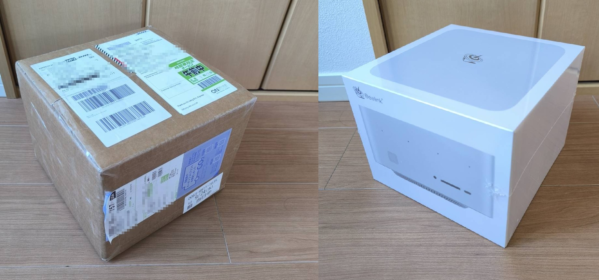

## 1. はじめに：ローカルで120Bを動かしたい！

AI最盛期の今「クラウドではなくローカルでLLMを動かす」無料でAI使い放題を夢見て購入をしました。
Chat-GPT-OSS 120B がオープンウェイトモデルとしては中々パフォーマンスが良さそうなので、をローカルで使いたい理由（コスト／プライバシー／レスポンス）

そのためにBeelink GTR9 Proを選んだ経緯

### → 結論（先出し）

120Bは起動できたが、コンテキスト長を確保するとメモリ不足で破綻。
つまり **動く** けど **実用には至らず** 。
しかし、それでもこの価格帯でこの性能は非常に魅力的で、言い訳がましいが満足感はある。

## 2. Beelink GTR9 Pro 概要レビュー

### ハードウェア仕様

- AMD Ryzen™ AI Max+ 395 Processor
- AMD Radeon™ 8060S GPU (内蔵GPU)
- 128GB RAM LPDDR5x-8000
- 2TB Crucial SSD

特筆すべきは、 **AMD Ryzen™ AI Max+ 395** 搭載と、 **128GBという特大メモリサイズ**
ユニファイドメモリというなのでCPUとGPUで共有する形にはなりますが、それぞれ最大96GBものメモリを使うことができるのが利点です。
GPUは内蔵のものになってしまいスペックは見劣りしますが、低コストで高速大容量のVRAMが使えるという点ではパフォーマンスの利点があります。

:::note info
ユニファイドメモリとは、CPUとGPUが単一のメモリ領域を共有するアーキテクチャのこと。Appleシリコンなどで採用され、CPUとGPUがデータを高速にやり取りできるため、効率とパフォーマンスが向上します。一般的なPCのようにRAMとVRAMが別々にあるのではなく、必要に応じてメモリを動的に融通し合えるのが最大の特徴です。
:::

### 実際の使用感

- **この値段でここまでの潤沢なメモリ性能** という圧倒的コスパの良さ
- 本体サイズと筐体品質

ファン音はとても静かです。基本的に動作音は聞こえないです。

## 3. 商品購入から届くまで

### 価格
定価は \$2,799だが、当時のキャンペーン価格で \$1,985  
日本円では30万円(304,861)。逆算ですが為替レートは153.5円/ドル
また、関税を払う必要があった。3,580円。 なのでトータルで31万円弱といったコストでした。

### 到着まで
- 2025年8月31日: 注文。予約受注扱いで、35日以内に発送という形。
- 2025年9月19日: DHLという配送会社からLINEで配達予定の通知。合わせて関税の支払いについての依頼も来た。
- 2025年9月24日: 商品到着
中国からの配送で心配でしたが、1ヶ月かからず段ボール外箱からしてきれいな状態で問題なく届きました。

## ローカルLLM実験結果：120Bモデルは少し動くけれどすぐにクラッシュ

- LM Studio にgpt-oss-120B を導入して起動
- Codex の入力に上記のローカルのgpt-oss-120Bを指定
- LM Studioからコンテキスト長不足でクラッシュして応答が返されず、Codexは固まった状態
  - LM Studioの設定でコンテキスト長を10000KBやそれ以上にするとハードウェアのメモリ不足で立ち上がらない。
    - BIOSのメモリ割り当てで、メイン64GB/GPU 64GBとメイン32GB/GPU 96GBとで設定変更できるが何れでもNG。
  - LM Studioの設定でコンテキスト長を8196KB程度だとギリギリ起動できるが、Codexでのコード生成には全く足りず、少しのチャットはできるが、ファイルを読み込ませたりするとすぐにコンテキストが足りなくなりまともにCodexが動かなくなる。

結果としての限界点：
→ 「動作はするが、120Bでまともにコンテキストを維持できない」
→ もっと軽量モデルでないと、賢さ云々以前にまともに動かない。

## 8. 総評：ローカルAI開発の夢破れても、大容量メモリは優秀
　
Chat-GPT-OSS 120Bを使ったローカルAI開発には届かなかったが、
この価格帯でここまで静か・速い・安定して動作するのは驚異的。
開発用途には十分戦えるマシン
とはいいつつも、CPUのAI最適化機能を使えてはないのでもったいなさはある。
GPU性能も活用できてないが、ゲーミング用途に今後使える可能性はあるか。現状未検証。

今後は「ローカルでどこまで現実的に使えるか」を継続検証していく