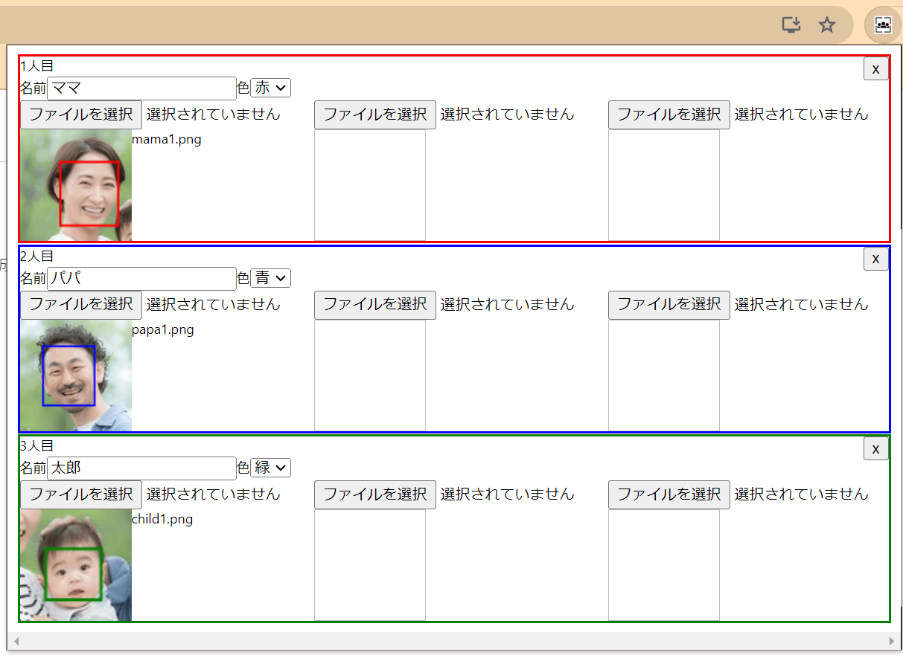
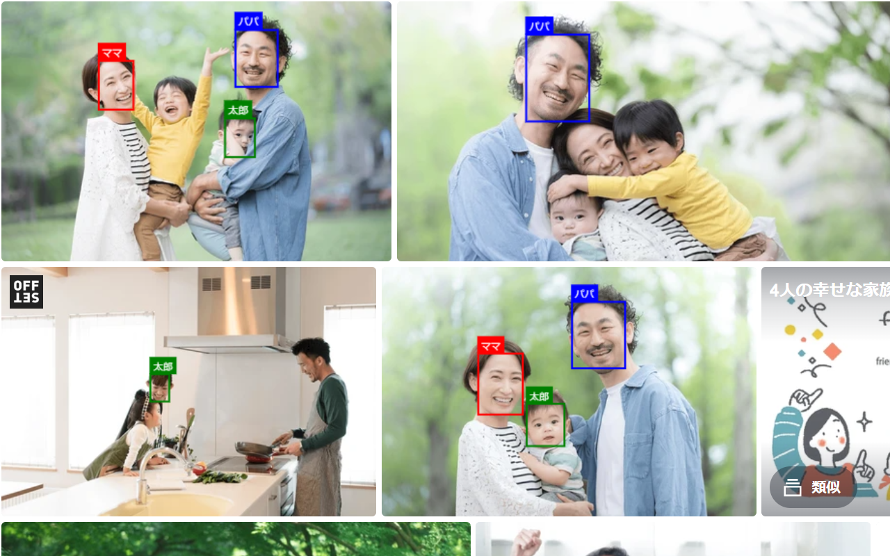

## はじめに

子どもを幼稚園に通わせていると、各種イベントの写真がアルバムサイトにアップされることがあります。  
今どき多くのサイトでは顔写真検索機能があったりすることも多いのですが、無い所もあって、そういう場合のために自作してしまおうと思ったのがこのChrome拡張を作成した背景です。  
実際のChrome拡張： [Family Photo Finder](https://chromewebstore.google.com/detail/family-photo-finder/fikdbpibhbgbedmnmlcfckckpohadebi?authuser=0&hl=ja)

### Chrome拡張の機能概要
- 集合写真やアルバムサイトで家族の姿を見逃さないためのツール。
- 家族や友人の顔画像を事前に登録し、任意のWebページで同じ人物が写っている写真を見つけて枠で囲って表示する。
- 機械学習による顔認識なので精度は100%ではなく、検知漏れや誤検知があることをご了承ください。
  - 残念なことに、子どもの顔は精度が低いことが多いです。

### 使用方法
1. Chrome拡張をインストールします。
[ここ](https://chromewebstore.google.com/detail/family-photo-finder/fikdbpibhbgbedmnmlcfckckpohadebi?authuser=0&hl=ja)から「Chromeに追加」でインストールできます。  
2. 探したい人物の顔画像を登録。(初回のみ)
右上にある拡張アイコンをクリックして、ポップアップを開きます。  
すると下記のように、表示する「名前」「枠の色」そして「対象人物の顔画像」を登録してください。1人につき3画像登録でき、多く登録するほど検知精度が上がります。  
  
ちなみにこの登録情報はGoogleアカウントで同期されるので、複数のPCで同じ情報が共有されます。  
3. 任意のWebページを開きます。
画像に登録した人物が写っている場合、自動で枠が表示されます。
例：


---

## 技術的な解説

Githubリポジトリはこちら。https://github.com/nisioka/face-api-on-chrome-extention

### 前提1: 使用ライブラリ
```json
{
  "devDependencies": {
    "@crxjs/vite-plugin": "2.0.0-beta.23",
    "@types/chrome": "^0.0.268",
    "typescript": "^5.5.4",
    "vite": "^5.3.5"
  },
  "dependencies": {
    "@extend-chrome/storage": "^1.5.0",
    "@vladmandic/face-api": "^1.7.13"
  }
}
```
特筆しておくと、
- `@crxjs/vite-plugin`はChrome拡張のビルドを行うためのViteプラグインです。マニフェストをTypescriptで型を持ちつつかけたり、いい感じにbuildしてくれたりで、Chrome拡張開発には最適でした。
- `@extend-chrome/storage`はChromeのストレージを使うためのラッパーライブラリで、無くてもそこまで困りませんが、async/awaitが使えて楽に綺麗に書きやすかったです。
- `@vladmandic/face-api`はface-api.jsのラッパーライブラリで、TypeScriptで書かれているため、型がしっかりしていて使いやすかったです。

### 前提2: face-api.jsの紹介
本Chrome拡張では、顔認識機能を実装するためにface-api.jsを使用しています。  
face-api.jsとは、ブラウザ上で動作する顔認識用のJavaScriptライブラリです。TensorFlow.jsをベースにしており、高度な顔認識機能を簡単に利用できるように設計されています。  
以下はface-api.jsの主な特徴と機能についての説明です。

**ブラウザ対応**

ブラウザ上で動作するため、クライアントサイドで顔認識を行え、Chrome拡張での利用にも適しています。
サーバーとの通信が不要なため、プライバシー保護にも寄与します。

**高精度の顔認識**

ディープラーニング技術を使用しており、高精度な顔認識が可能です。
事前に学習されたモデルを利用することで、すぐに顔認識機能を実装できます。

**多機能**

顔検出、特徴点の抽出、顔のランドマークの検出、顔の特徴ベクトルの取得など、様々な顔認識機能を提供しています。
本Chrome拡張では、顔検出と特徴点の抽出、枠の描画機能も使っていたりします。そのため下記3つのモデルをロードしています。
1つ目は顔検出のために必要、2つ目はランドマーク検出に必要でこれは軽量(tiny)版もありましたが精度が悪く感じたので無印版を、3つ目は顔の特徴ベクトルを取得するために必要です。
1. ssd_mobilenetv1.weights
2. face_landmark_68_model.weights
3. face_recognition_model.weights
ちなみにこれらのモデルデータは、[ここ](https://github.com/justadudewhohacks/face-api.js-models/tree/master/uncompressed)から取得しました。

**参考**
- https://justadudewhohacks.github.io/face-api.js/docs/index.html
- https://itnext.io/face-api-js-javascript-api-for-face-recognition-in-the-browser-with-tensorflow-js-bcc2a6c4cf07

### 前提3: Chrome拡張マニフェストV3を使用
拡張機能プラットフォームの最新バージョンであるマニフェストV3を使用しています。マニフェストV2は段階的に廃止されています。
スクリプトの実行箇所としては、Webページでの動作の`content_scripts`と、バックグラウンドで動く`service_worker`がありますが、前者のみを使用しています。
後者はマニフェストV3からの物で、これで動かそうとしましたが、face-api.jsが上手く起動されませんでした。
getEnvに失敗した旨のエラーが出ており、[こちら](https://github.com/justadudewhohacks/face-api.js/issues/47)のissueの議論を参考にも見ましたが、WebWorker環境での適切な設定がわからず断念しました。

### 処理詳細説明
#### 1. [popup.ts](https://github.com/nisioka/face-api-on-chrome-extention/blob/master/src/popup.ts)
顔画像の登録としてChromeのストレージに保存、設定値の表示を行うためのものです。  
popup.htmlは空っぽで、Chromeストレージから現設定値を初期値として取得し、それを元にゴリゴリとDOMを動的に生成しています。  
正直汚くレスポンスも遅いのですが、勢いで書いてしまっています。  
ここでユーザが顔写真を登録すると、face-api.jsで顔検出ならびに顔特徴ベクトル(face descriptor)を取得し、それをChromeのsyncストレージに保存しています。  
画像自体はChromeのlocalストレージに保存しています。syncには容量の関係で保存が難しいですが、同一端末だけでも画像が見れたほうがいいかと思っての仕様です。

※注： ここで「ストレージ」といっているのは、[chrome.storage](https://developer.chrome.com/docs/extensions/reference/api/storage?hl=ja)のことで、一般的なWebブラウザのローカルストレージとかではないです。

#### 2. [content_script.ts](https://github.com/nisioka/face-api-on-chrome-extention/blob/master/src/content_script.ts)
各Webページで動作するスクリプトです。  
Webページ読み込み時に、当該ページの「imgタグ」と「CSSでbackground-imageを持つもの」を対象に処理を行います。  
face-api.jsを使って、顔検出を行いその全てに足して、登録した顔画像と顔特徴ベクトルが近いかどうかを判定し、一致する場合は強調のための枠を描画します。
canvasを用いて描画していて、そのデータURLを、元の画像URLに差し替えることで、表示しています。

## まとめ
以上のように、face-api.jsを用いてChrome拡張機能を実装してみました。  
Chrome拡張が故に制約が多くて苦労したところも多かったですが、face-api.jsという強力な機械学習ライブラリがブラウザ上で動くことに感動する気持ちが大きかったです。


---
<div class="booklink-box" style="text-align:left;padding-bottom:20px;font-size:small;zoom: 1;overflow: hidden;"><div class="booklink-image" style="float:left;margin:0 15px 10px 0;"><a href="" target="_blank" rel="nofollow" ></a></div><div class="booklink-info" style="line-height:120%;zoom: 1;overflow: hidden;"><div class="booklink-name" style="margin-bottom:10px;line-height:120%"><a href="" target="_blank" rel="nofollow" >Chrome拡張×ChatGPTで作業効率化</a><div class="booklink-powered-date" style="font-size:8pt;margin-top:5px;font-family:verdana;line-height:120%">posted with <a href="https://yomereba.com" rel="nofollow" target="_blank">ヨメレバ</a></div></div><div class="booklink-detail" style="margin-bottom:5px;">I/O編集部 工学社 2023年08月29日頃    </div><div class="booklink-link2" style="margin-top:10px;"><div class="shoplinkamazon" style="margin:5px 0"><a href="//af.moshimo.com/af/c/click?a_id=1041250&p_id=170&pc_id=185&pl_id=4062&s_v=b5Rz2P0601xu&url=https%3A%2F%2Fwww.amazon.co.jp%2Fexec%2Fobidos%2FASIN%2F4777522644" target="_blank" rel="nofollow" >Amazon</a></div><div class="shoplinkkindle" style="margin:5px 0"><a href="//af.moshimo.com/af/c/click?a_id=1041250&p_id=170&pc_id=185&pl_id=4062&s_v=b5Rz2P0601xu&url=https%3A%2F%2Fwww.amazon.co.jp%2Fgp%2Fsearch%3Fkeywords%3DChrome%25E6%258B%25A1%25E5%25BC%25B5%25C3%2597ChatGPT%25E3%2581%25A7%25E4%25BD%259C%25E6%25A5%25AD%25E5%258A%25B9%25E7%258E%2587%25E5%258C%2596%26__mk_ja_JP%3D%2583J%2583%255E%2583J%2583i%26url%3Dnode%253D2275256051" target="_blank" rel="nofollow" >Kindle</a></div>                               	   	   	  	  <div class="shoplinktoshokan" style="margin:5px 0"><a href="http://calil.jp/book/4777522644" target="_blank" rel="nofollow" >図書館</a></div>	</div></div><div class="booklink-footer" style="clear: left"></div></div>