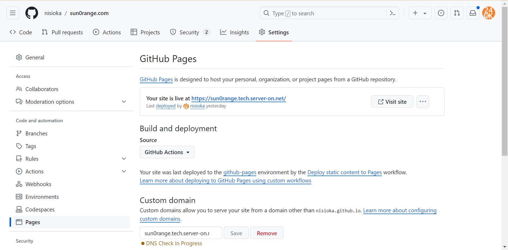

## はじめに

本ブログはWordPressをAWSにデプロイして運用していましたが、GatsbyJSを使ってGitHub Pagesでの静的サイトへの移行を行いました。その手順をここに残します。  
ちなみに、移行のモチベーションとしては、下記がありました。
1. 金銭的コストの削減をしたい
2. サイトのパフォーマンス向上を図りたい
3. セキュリティリスクを無くし、運用コストも下げたい
4. AWSを完全に理解したので(嘘)、何か別の技術スタックの勉強にもしたい(今回はReactの実践として良かった)

### Beforeの運用

- WordPressをAWSのEC2で動かす。
  - 記事はWeb上のWordPress管理者画面から投稿する。
    - （ここにセキュリティリスクがあるわけで、管理者乗っ取りやDB等への不正アクセスの可能性があった。）
  - CloudFrontでキャッシュを効かせて、サイトパフォーマンスの向上を図ってはいた。

### Afterの運用

- 既存のWordPressのバックアップをローカルPCで動かす。
- 新規の記事はMarkdownファイルで記述する。
- 上記をソースにして、GatsbyJSでSSG(Static Site Generation)でビルドする。
  - 静的ファイルをGitHub Pagesでホスティングする。

## 移行手順概要

1. WordPress サイトデータのエクスポート
2. WordPress のローカル環境へのインポート
3. GatsbyJS のセットアップ
4. サイトのSSGビルドとデプロイ

### 1. WordPress サイトデータのエクスポート

まず、WordPress サイトからデータをエクスポートします。

1. **WordPress 管理ダッシュボード**にログインします。
2. **ツール** > **エクスポート**を選択します。
3. **すべてのコンテンツ**を選び、**エクスポートファイルをダウンロード**をクリックします。

これで、投稿、ページ、メディアなどのデータを含む XML ファイルがダウンロードされます。

### 2. WordPress データのインポート

次に、ローカル環境で WordPress をセットアップし、エクスポートしたデータをインポートします。

この[docker-compose.yml](https://github.com/nisioka/docker-wordpress/blob/develop/docker-compose.yml)を使って、WordPressをローカル環境でセットアップします。  
これには、WordPress本体とそのDB、phpMyAdminが含まれているので、起動させて http://localhost にアクセスすると空のWordPressが表示されます。  
適当に初期設定を行った後、WordPressの管理画面にログインし、エクスポートしたデータをインポートします。

そして、WordPressのプラグインについても整理します。  
不要なものを削除します。認証系のプラグインはlocalhostだと上手く動かなかったりもするので、削除するのが良いかと思います。公開するわけでは無いローカル環境なのでセキュリティを高める必要がありません。
また、GatsbyJSでWordPressのデータを取得するための以下のプラグインを追加インストールします。  

- WP Gatsby
- WPGraphQL

この状態で既存のWordPress記事がローカルでも表示できていれば、次に進みます。

### 3. GatsbyJS のセットアップ

次に、GatsbyJS をセットアップします。

前提： `Node.js`と`npm`がインストールされていること。

Gatsby CLI をインストールし、新しい Gatsby プロジェクトを作成します。

```bash
npm install -g gatsby-cli
gatsby new my-gatsby-blog
cd my-gatsby-blog
```
※ `my-gatsby-blog`は任意のプロジェクト名です。


GatsbyJS で WordPress のデータを取得するためのプラグインをインストールします。
```bash
npm install gatsby-source-wordpress
```

gatsby-config.js ファイルを編集して、WordPress サイトのデータを取得するように設定します。

```javascript
module.exports = {
  plugins: [
    {
      resolve: `gatsby-source-wordpress`,
      options: {
        url: `http://localhost/graphql`,
      },
    },
  ],
}
```

gatsby-node.js ファイルを作成し、WordPress の投稿を Gatsby のページとして生成するスクリプトを追加します。

```javascript
const path = require(`path`)

exports.createPages = async ({ graphql, actions }) => {
  const { createPage } = actions

  const result = await graphql(`
    {
      allWpPost {
        nodes {
          slug
        }
      }
    }
  `)

  result.data.allWpPost.nodes.forEach(node => {
    createPage({
      path: node.slug,
      component: path.resolve(`./src/templates/blog-post.js`),
      context: {
        slug: node.slug,
      },
    })
  })
}
```

## 4. サイトのビルドとデプロイ

最後に、サイトをビルドし、GitHub Pages にデプロイします。

```bash
gatsby build
```

リポジトリを作成し、GitHub Pages にデプロイします。

```bash
git init
git remote add origin https://github.com/your-username/your-repo.git
git add .
git commit -m "Initial commit"
git push -u origin master
```

GitHub Pages の設定で、デプロイするブランチを gh-pages に設定します。


この時、Build and deployment は GitHub Actions を使うのが現在の推奨なので、/.github/workflows/ に下記のワークフローを置きます。
これはmasterブランチにpushされたら./publicディレクトリ(gatsby buildで生成される静的ファイルのデフォルトの置き場)をGitHub Pagesにデプロイするワークフローです。

```yaml
name: Deploy static content to Pages

on:
  push:
    branches: ["master"]
  workflow_dispatch:

permissions:
  contents: read
  pages: write
  id-token: write

concurrency:
  group: "pages"
  cancel-in-progress: false

jobs:
  deploy:
    environment:
      name: github-pages
      url: ${{ steps.deployment.outputs.page_url }}
    runs-on: ubuntu-latest
    steps:
      - name: Checkout
        uses: actions/checkout@v4
      - name: Setup Pages
        uses: actions/configure-pages@v5
      - name: Upload artifact
        uses: actions/upload-pages-artifact@v3
        with:
          path: './public'
      - name: Deploy to GitHub Pages
        id: deployment
        uses: actions/deploy-pages@v4
```

## まとめ

簡単な最小構成の設定ですが、以上の手順でAWS にデプロイされていた WordPress サイトを GatsbyJS と GitHub Pages を用いた静的サイトへと移行することができました。  
静的サイトに移行することで、サイトのパフォーマンス向上とセキュリティ強化を実現できます。ぜひ試してみてください。
