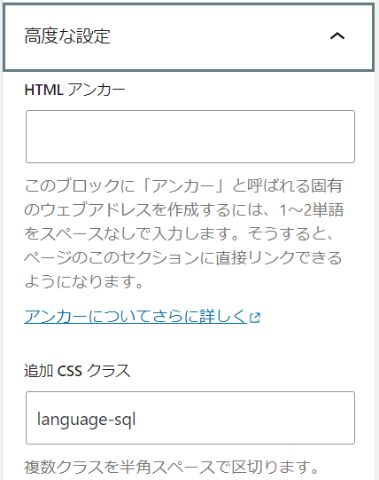

## 概要

GatsbyJS での汎用的な構文ハイライト(syntax highlight)の実装方法を紹介します。  
本ブログは Markdown ファイルと WordPress の両方のコンテンツを Gatsby で表示していて、その場合に使えるやり方です。もちろんどちらかのみの場合でも OK です。  
`react-syntax-highlighter`というプラグインを使って、それに上手くコンテンツデータを渡すということをやってます。

参考にしたサイトはこちら。  
<a href="https://dimitri.codes/adding-syntax-highlighting-wordpress-gatsby/" target="_blank">https://dimitri.codes/adding-syntax-highlighting-wordpress-gatsby/</a>

また、実コードが見たい方は、実際の変更コミットはこちらを見てください。  
<a href="https://github.com/nisioka/sun0range.com/commit/7a469363fc9b309f720cf7903ba1da5ce39f9895" target="_blank">https://github.com/nisioka/sun0range.com/commit/7a469363fc9b309f720cf7903ba1da5ce39f9895</a>

## 前提・準備

Gatsby でのコンテンツを表示に、`dangerouslySetInnerHtml={{__html=content}}` を使用していることを想定していて、それを書き換えていきます。
また、TypeScript も使用しているので以降のコードも.ts もしくは.tsx です。

まずは依存関係のインストールを行ってください。(TypeScript なので、開発のしやすさのために@types も dev に入れてます。)

```bash
npm install --save html-react-parser react-syntax-highlighter
npm install --save-dev @types/react-syntax-highlighter
```

## 実装

まず、修正前の実装イメージを示します。**post.content**がコンテンツデータで、それを dangerouslySetInnerHTML に渡して表示しているとします。

```typescript
import * as React from "react"

const BlogPostTemplate = () => {
  // ノイズになるため省略。ここでpostのデータを取得したりしている。

  return (
    <>
      // ノイズになるため省略。実際は他にもレイアウトしている。
      <section dangerouslySetInnerHTML={{ __html: post.content }} />
    </>
  )
}
```

修正後のコードが下記です。

```typescript
import * as React from "react"
import { Link, graphql } from "gatsby"

import parse, { domToReact } from "html-react-parser"
import SyntaxHighlighter from "react-syntax-highlighter"
import { androidstudio } from "react-syntax-highlighter/dist/cjs/styles/hljs"

const BlogPostTemplate = () => {
  // ノイズになるため省略。ここでpostのデータを取得したりしている。

  return (
    <>
      // ノイズになるため省略。実際は他にもレイアウトしている。
      <section>{parse(post.content, { replace: replaceCode })}</section>
    </>
  )
}

const replaceCode = (node: any) => {
  if (!node) return node
  if (node.name === "pre") {
    const dom = domToReact(getCode(node))
    let result = ""
    switch (typeof dom) {
      case "string":
        result = dom as string
        break
      case "object":
        if (Array.isArray(dom)) {
          // React.JSX.Element[]
          const elmArr = dom as React.JSX.Element[]
          elmArr.map(elm => {
            if (elm.props && elm.props.children) {
              result += elm.props.children as string
            }
          })
        } else {
          // React.JSX.Element
          const elm = dom as React.JSX.Element
          if (elm.props && elm.props.children) {
            result = elm.props.children as string
          }
        }
        break
    }

    return (
      node.children.length > 0 && (
        <SyntaxHighlighter
          style={androidstudio}
          language={getLanguage(node)}
          showLineNumbers={true}
        >
          {result}
        </SyntaxHighlighter>
      )
    )
  }
}

const getLanguage = (node: any) => {
  function getClassInLanguage(className: string) {
    let result = ""
    className.split(/\s+/).forEach(s => {
      if (s.startsWith("language-")) {
        result = s.replace("language-", "")
        break
      }
    })
    return result
  }

  if (node.attribs.class && node.attribs.class !== "wp-block-code") {
    return getClassInLanguage(node.attribs.class as string)
  } else if (node.children[0]?.attribs?.class) {
    return getClassInLanguage(node.children[0].attribs.class as string)
  }
  return "java" // default
}

const getCode = (node: any) => {
  if (node.children.length > 0 && node.children[0].name === "code") {
    return node.children[0].children
  } else {
    return node.children
  }
}
```

上記コードについて説明します。

1. 元々`dangerouslySetInnerHTML`を使っていたものを、`html-react-parser`ライブラリの`parse`関数を使うように変更します。
2. `parse`関数は HTML を React コンポーネントに変換し、後述する自作の`replaceCode`関数を使用して`<code>`ブロックを検出します。それ以外はそのままです。
3. `replaceCode`関数はコードブロックをハイライト表示するための処理を行います。
   1. `parse`関数が DOM 要素を node として一つづつ渡してくるので、node が「`<pre>`タグ内に`<code>`の子を持つ要素」**以外**の要素の場合は、置き換えせずそのままです。
   2. 「`<pre>`タグ内に`<code>`の子を持つ要素」である場合、その中のコードを取得し、`react-syntax-highlighter`ライブラリの`SyntaxHighlighter`コンポーネントで整形します。
   3. `SyntaxHighlighter`コンポーネントでは、言語やスタイルが選べて、
      1. `language`には<a href="https://github.com/react-syntax-highlighter/react-syntax-highlighter/blob/HEAD/AVAILABLE_LANGUAGES_HLJS.MD" target="_blank">ここ</a>にある言語を指定します。その言語の指定の仕方はメタ情報として付与されている html の class 名を使って自作の`getLanguage`関数で判定しています。
         1. Markdown では、` ```javascript`というようにコードブロックの先頭に指定します。
         2. WordPress では，「高度な設定」の「追加 CSS クラス」に`language-XXX`というように XXX に言語を指定します。(※1)
      2. `style`には<a href="https://github.com/react-syntax-highlighter/react-syntax-highlighter/blob/HEAD/AVAILABLE_STYLES_HLJS.MD" target="_blank">ここ</a>にある好きなスタイルを指定します。色々と試して好きな見た目を選んでください。

※1: WordPress の「高度な設定」の例。


## 終わりに

以上で、Gatsby アプリケーションを実行し、構文ハイライトされたコードを確認できるはずです。本記事内のコードも構文ハイライトされて見えているはずです。
これで、WordPress と Gatsby で構文ハイライトを実装しました。完全な例に興味がある場合は、このブログのソースコードを 以下の GitHub で確認できます。
https://github.com/nisioka/sun0range.com/blob/master/src/templates/blog-post.tsx
