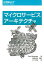

「マイクロサービスアーキテクチャ」（Sam Newman (著), 佐藤 直生 (監修), 木下 哲也 (翻訳) 出版社: オライリージャパン (2016/2/26) ISBN-10: 4873117607  
ISBN-13: 978-4873117607）を読みました。

これを、忙しい人のために5分で分かるようにまとめました。

[マイクロサービスアーキテクチャ](//af.moshimo.com/af/c/click?a_id=1041250&p_id=56&pc_id=56&pl_id=637&s_v=b5Rz2P0601xu&url=http%3A%2F%2Fbooks.rakuten.co.jp%2Frb%2F13770161%2F)

posted with [ヨメレバ](https://yomereba.com)

SamNewman/佐藤直生 オライリー・ジャパン 2016年02月26日

[楽天ブックス](//af.moshimo.com/af/c/click?a_id=1041250&p_id=56&pc_id=56&pl_id=637&s_v=b5Rz2P0601xu&url=http%3A%2F%2Fbooks.rakuten.co.jp%2Frb%2F13770161%2F)

[Amazon](//af.moshimo.com/af/c/click?a_id=1041250&p_id=170&pc_id=185&pl_id=4062&s_v=b5Rz2P0601xu&url=https%3A%2F%2Fwww.amazon.co.jp%2Fexec%2Fobidos%2FASIN%2F4873117607)

## 組織設計：アーキテクトの役割

マイクロサービスアーキテクチャを語るうえで、組織論を欠かすことはできません。ここではそれを統べる中心的な立場である、「アーキテクト」の役割を説明してくれています。特に状況に応じて成長していくという意味を込めて、「進化的アーキテクト」と表現していました。

> **ビジョン**
> 
> 　システムが顧客や組織の要件を満たすのを助けるシステムの技術ビジョンを、明確に伝えるようにします。
> 
> **共感**
> 
> 　顧客や同僚に対する自分の判断の影響を理解します。
> 
> **協調**
> 
> 　出来るだけ多くの仲間や同僚と関わり、ビジョンの定義、改良、実行に役立てます。
> 
> **適応性**
> 
> 　顧客や組織の要求により技術ビジョンを変更するようにします。
> 
> **自律性**
> 
> 　チームに対して標準化と自律性の実現との間の適切なバランスを見出します。
> 
> **ガバナンス**
> 
> 　実装しているシステムを技術ビジョンに合わせます。
> 
> 2章 進化的アーキテクト 2.11 まとめ

## マイクロサービス導入のために

マイクロサービス導入において、どのようにシステム統合をしていけばよいかのより実際的な検討箇所が4章にまとめられています。

> ・いかなる代償を払ってもデータベース統合を避けます。
> 
> ・RESTとRPCとの間のトレードオフを理解し、RESTをリクエスト/レスポンス統合の優れた出発点積極的にみなします。
> 
> ・オーケストレーションよりもコレオグラフィを選びます。
> 
> ・ポステルの法則を理解して体制のあるリーダー(Tolerant Readers)を使って破壊的変更を避け、バージョンが必要ないようにします。
> 
> ・ユーザインタフェースを合成レイヤと考えます。
> 
> 4章 統合 4.16 まとめ

特に一番強く述べられている、データベース統合ですが、DBはいわば大規模な共有APIとなるので非常に脆弱になりやすいです。DBにはあくまでデータだけを格納することを意識し、振る舞いの共有は何も無い事を考える必要があります。データベース統合は簡単に凝集性と疎結合を失う結果になりかねません。
