## 概要

本ブログは、Wordpressで動いています。今回、レンタルサーバー（Xserver)からAWSのクラウド上に移行しました。移行用途だけでなく、AWSでWordpressを構築・運用するにはどうしたら良いかということが共有できればと思っての記事です。閲覧者からの見やすさを損なわず、なるべく安価に構築することを目指しました。

※2021年3月時点での情報で記載しています。レートも1ドル=110円とします。

### AWSの構成図

まず初めに、最終的な構成について示します。


| AWSサービス | 用途 | 備考 |
| --- | --- | --- |
| Route 53 | DNS |  |
| [Cloud Front](http://localhost/aws-cloudfront/) | CDN   リバースプロキシ | サイト表示高速化の要。   EC2スペックが貧弱なのをキャッシュ等でカバー。 |
| Elastic Compute Cloud (EC2) | Wordpress環境   MariaDB環境 | インスタンスはT3a.microを使用。   左記は共にDockerコンテナで動かす。   費用節約のためにAWS RDSではなくここでDBを動かすこととした。 |
| Elastic Block Store (EBS) | ストレージ | EC2に必須の8GBだけ。   ここの料金が割高なのでS3に画像を置くことにした。 |
| [Simple Storage Service (S3)](http://localhost/aws-simple-storage-service-s3/) | ストレージ(動画像) | ブログサイトにおける容量はほぼ動画・静止画像で重たいので、安価なS3に置くことで節約効果が大きくなる。 |

安価に構築することに重きをおいて、この構成としました。EC2とそのEBSがかなりコストボリュームが大きいところなのでそれを極小とするように意識しています。まず、Cloud Frontによってキャッシュを効かすことでEC2へのアクセス負担を減らせるのでEC2スペックが低いものでも安定稼働できています。また、EBSに置くデータは最小にして安価なS3にメインのデータを置いています。  
ブログということで、キャッシュさせても問題がない、画像データ量が多くなりがち、という特性を考えてこのようになっています。

## 参考料金

概算料金は、$5.68 /月 （+変動費）です。1ドル110円で計算すると、625円ということになります。(ちなみに、プラスでドメインを購入する場合はその費用もかかります)

下記に簡単な内訳を示します(細かな費用で省いているものもあります)。従量課金故に変動費があるので一概には言えませんが参考までに。

| AWSサービス | 課金単位 | 料金 | 備考 |
| --- | --- | --- | --- |
| Route 53 | ホストゾーン数、   リクエスト数等 | $0.05/ホストゾーン   従量課金 |  |
| [Cloud Front](http://localhost/aws-cloudfront/) | データ転送量、   リクエスト数等 | 従量課金 | EC2やS3間のデータ転送量は無料。 |
| EC2 | リザーブドインスタンス   →コンバーティブル3年 | $166/3年 | スタンダードやオンデマンドに   変えれば価格は変わる。 |
| EBS | 容量×稼働時間 | $0.096/GB | 8GBで計算。 |
| [S3](http://localhost/aws-simple-storage-service-s3/) | データ容量   データ転送量 | $0.025/GB   $0 | 10GBで計算。   Cloud Front間のデータ転送量は無料。 |
| Certificate Manager | SSL証明書 | $0 | Cloud Frontに適用する場合は無料。 |
| Elastic IP | 固定IP数 | $0 | EC2の対象インスタンスが起動している間は無料。 |

参考までに、下記が実際の1ヶ月の金額です。実質的には$8.66(1ドル110円で約950円)となりました。もちろん、従量課金のためアクセス数によっても変わります。  
注意点としては、  
①EC2のリザーブドインスタンスの料金は全額前払いのため下記には入っていません。その分の$4.6($166/3年/12ヶ月)が実質加算されます。  
② 2サイトを運用しているためその合算になっています。しかしながら全てを2で割れるものでもなく、固定費として明確に増えているのはRoute53の$0.5分だけなので、それを引いた$4.06を変動費と言ってよいかと思います。

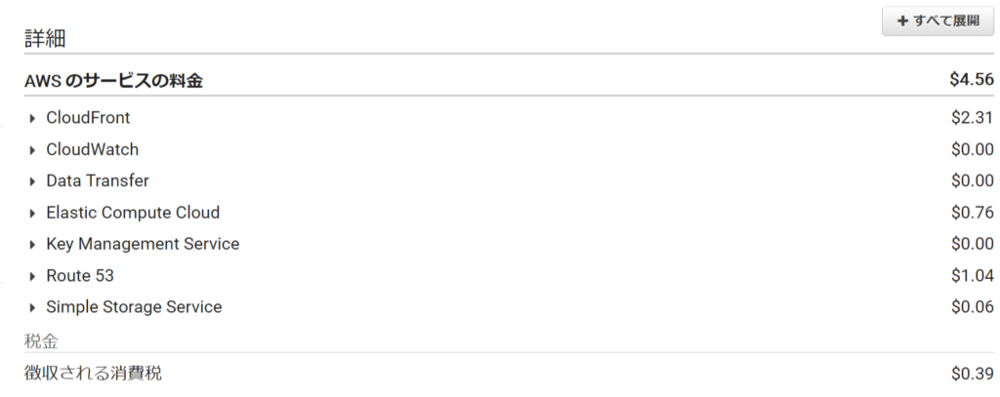

### 参考比較

一応、レンタルサーバーであるXserverからの移行でしたので、それとの比較も載せます。**個人の主観に強く依存します。**

まず、単純な費用とスペックの比較表です。XServerが十分に高いスペックを誇っており、AWSでの最小費用よりは高いとはいえ、正直、コスパで見るとXServerのほうが良さそうです。

|  | XServer X10プラン\[fn\]以下より抜粋   [https://www.xserver.ne.jp/price/price\_x10.php](https://www.xserver.ne.jp/price/price_x10.php)   [https://www.xserver.ne.jp/manual/man\_server\_spec.php](https://www.xserver.ne.jp/manual/man_server_spec.php)\[/fn\] | 今回のAWS構成 |
| --- | --- | --- |
| 料金 | 1100円(税込) | 約687円(税込) + 従量課金 |
| CPU | Xeon Gold 6126 @2.6GHz × 2 | AMD EPYC 7000 @2.5GHz × 2 |
| メモリ | 256GB | 1GB |
| ストレージ | 400GB | 従量課金 |
| データ転送 | 900GB/日 | 従量課金 |

#### メリット

- AWSの学習になった。（クラウド時代にこれは重要だと思います。そして楽しかった。）
- Cloud Frontのキャッシュが強力で、サイト表示の高速化が図れる。（別サーバでもCloud Frontを利用することもできるが、AWS内でやったほうが楽）
- 価格を安く抑えることができる場合もある。
- 無料で使える便利サービスもある。（Cloud Watch といった監視サービス等）

#### デメリット

- 多種のサービスを使わなければならないので、把握・学習に時間がかかる。
- 従量課金によるところが大きいので予算が読めない。
- マネージメントサービスは高く、それを使わないとサービス停止（たまに落ちる）したときにも手動で復旧する必要がある。ただし、Cloud Front があるため可用性としては影響が低減される。

## 実際の構築

### EC2の準備

まず、Wordpress（とMariaDB）を動かすためのEC2インスタンスを作成します。

インスタンスタイプはT3aタイプとしました。T系ファミリーが小規模スペックではコスパが良く、T2ではなく最新のT3ですが、AWSの無料枠が残っているのであれば対象のT2としても良いと思います。「a」としたのは価格が10%程安く、その割にスペック差がないようで\[fn\]参考：[https://www.pressmantech.com/tech/aws/6781](https://www.pressmantech.com/tech/aws/6781)\[/fn\]コスパが良いためです。メモリがかなりカツカツなのでmicroサイズは少なくとも必要そうです（スワップ領域も作っていますがそれでもギリギリ感があります）。  
選定の参考：[https://pages.awscloud.com/rs/112-TZM-766/images/C2-07.pdf](https://pages.awscloud.com/rs/112-TZM-766/images/C2-07.pdf)

[http://localhost/create-elastic-compute-cloud-ec2/](http://localhost/create-elastic-compute-cloud-ec2/)

上記の手順通りに進めますが、2点変更箇所があります。

- IAMロールにポリシーの追加
- ユーザデータの追加

##### IAM ロールにポリシーの追加

後述するパラメータストア等の情報を取得するために、下記の「AmazonEC2RoleforSSM」ポリシーをIAMロールに追加します。「ec2:DescribeInstances、ec2:DescribeVpcs、ssm:GetParametersByPath」の3つだけあれば良いようですが、厳密にしないのであればAWS管理ポリシーから選ぶのが楽だと思います。

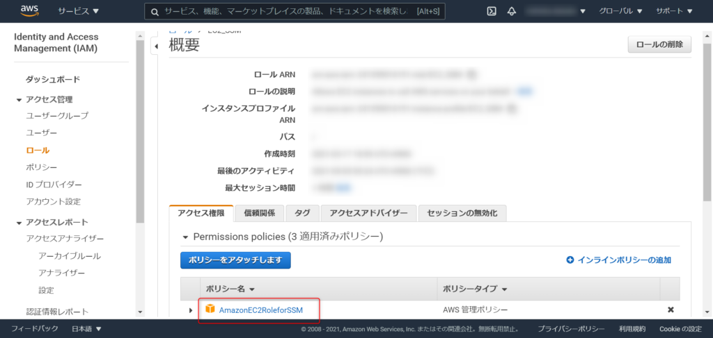

加えて、パラメータストアも追加しておいてください。後ほどWordpressとそのDBを起動するわけですが、これはそのDBのパスワード関連の情報です。こうした秘匿情報は、設定ファイルなどに直接記載するのではなく、パラメータストア等のSecretsに保存しておき、環境変数を介して読み取るようにするのが定石です。  
AWS Systems Manager > パラメータストアから、パラメータの作成をします。ここで作成してもらいたいのは下記4種類です。

- MYSQL\_DATABASE（DBの名称。分かりやすい任意の名前にしましょう。）
- MYSQL\_ROOT\_PASSWORD（DBのルート権限パスワード。複雑なランダム文字列にしましょう。）
- MYSQL\_USER（DBのユーザ(スキーマ)の名称。分かりやすい任意の名前にしましょう。）
- MYSQL\_PASSWORD（上記DBユーザのパスワード。複雑なランダム文字列にしましょう。）

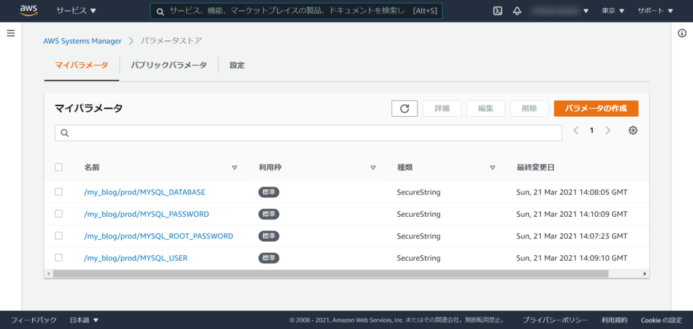

この時に、パス区切りで「/任意のプロジェクト名/任意の環境名」として、それに合わせてVPCにタグを追加してください。パラメータストアの名称には「/」が使えるので擬似的なディレクトリ管理というのができるので、他でも環境変数を使いたい場合などでも区別できるように一応そうしています。後述のユーザデータで使用するパラメータストアから環境変数として注入するスクリプトがこの前提で記載してあるので倣ってください。VPCには下記のように、keyが「Project」と「Env」で、それぞれにプロジェクト名と環境名となるvalueを設定し、それに沿ったパラメータストアのパス区切り名称としてください。

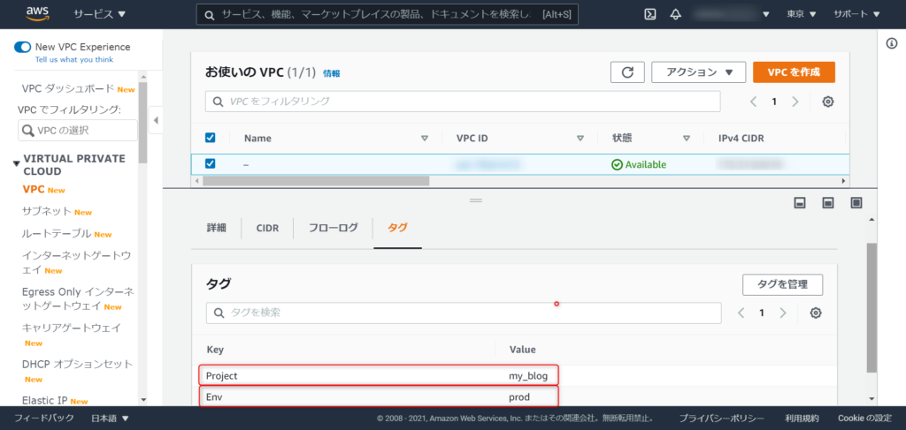

##### ユーザデータの追加

ユーザデータに下記のものを設定（コピペして登録）しています。  
[https://github.com/nisioka/docker-wordpress/blob/main/sh/user\_data.sh](https://github.com/nisioka/docker-wordpress/blob/main/sh/user_data.sh)

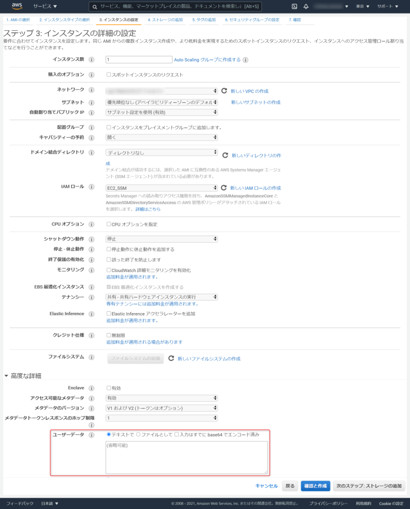

ステップ3のインスタンスの詳細の設定画面で、下部にユーザデータ入力箇所があるため、そこにコピペすればよいです。

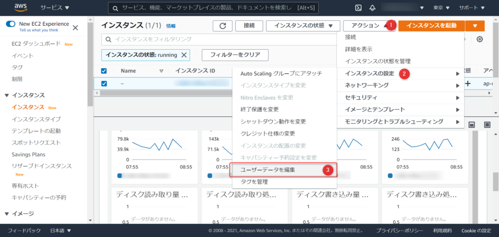

もし、インスタンスを既に作成してしまっていても、後からユーザデータを編集することもできます。（ただしインスタンスを一度停止する必要はあります。）  
インスタンスダッシュボードで、①アクション→②インスタンスの設定→③ユーザデータの編集で、編集画面が開きますので同様にコピペ後に保存してください。

このユーザデータとは、インスタンスの初期セットアップのようなもので、このスクリプトに記載したものはインスタンス起動時に実行されるため、やるべき事を設定しておけば手動での作業の必要がなくなります。必須ではありませんが、便利作業です。

[上記のユーザデータ](https://github.com/nisioka/docker-wordpress/blob/main/sh/user_data.sh)でやっていることの説明としては、以下の通りです。

- 1.5GBのスワップ領域の作成。（メモリの代替にストレージ領域を使う設定。メモリ不足対策の気休め程度のもの。）
- 使用する予定のモジュール（下記）をインストール。
    - git
    - docker
    - docker-compose
    - jq
- AWSのパラメータストアのデータを、環境変数として読み込むためのスクリプト作成。

#### Wordpressの導入作業

まずは、EC2インスタンスに接続します。下記のようにSSMで接続できます（上記[記事](http://localhost/create-elastic-compute-cloud-ec2/)参照）。


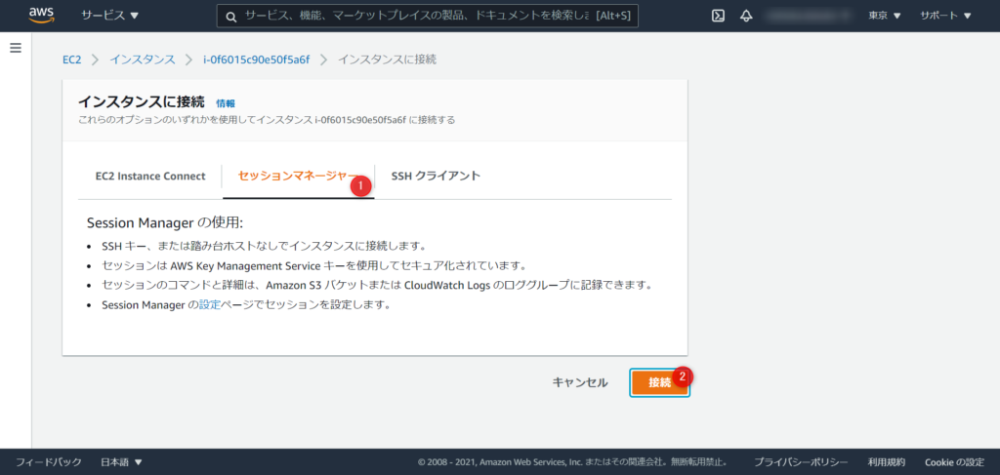

アクセスしたら下記のコマンドを順々に実行してください。これにより、WordpressとDBが環境変数のパスワード情報等を読み取ってセットアップされ、起動します。

```
source /etc/profile.d/setenv.sh
git clone https://github.com/nisioka/docker-wordpress.git
cd docker-wordpress
docker-compose build
docker-compose up -d
```

※基本的にこれら全てのコマンドを実行するのは初回だけで、以降は「docker-compose up -d」だけで良いです。アプリケーションだけ再起動したい場合は、「docker-compose down」で終了させた後、「docker-compose up -d」で起動させれば良いです。

これでWordpressが動き始めたはずなので起動確認のためにアクセスしてみます。EC2にはデフォルトでパブリックなDNSも発行されているため、インスタンス情報から参照してアクセスできます。

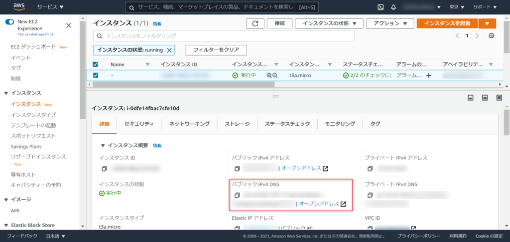

するとWordpressのスタートアップ画面となるはずです。（本記事ではWordpress自体の設定方法について詳説しないので、以降は適宜進めてください。）

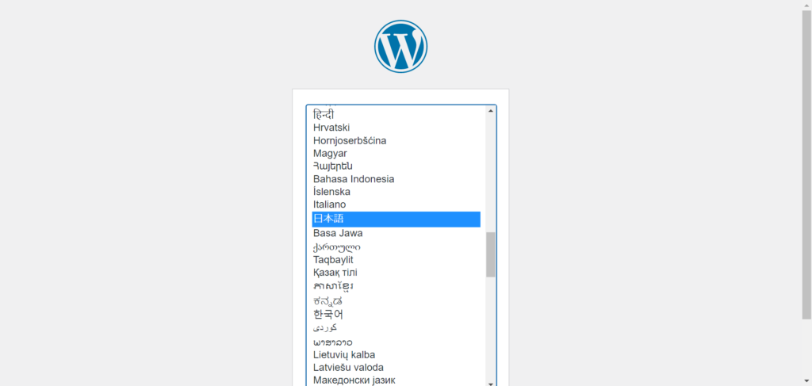

## CloudFrontを用いた任意ドメインでのSSL化

https://qiita.com/nakanishi03/items/3a514026acc7abe25977

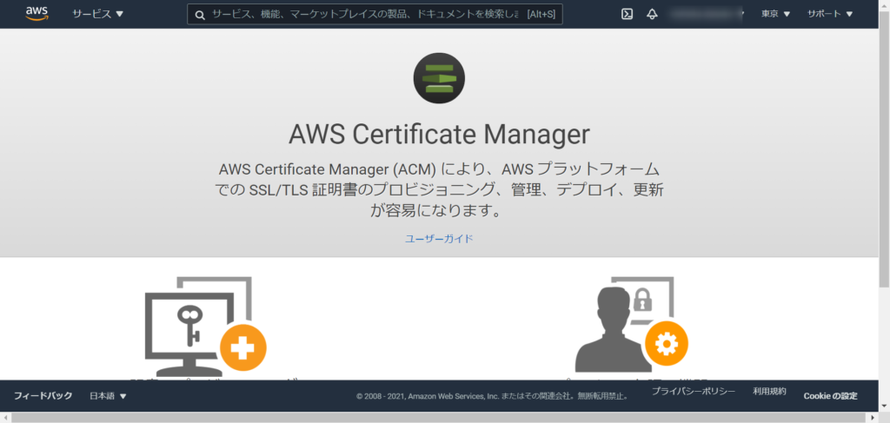

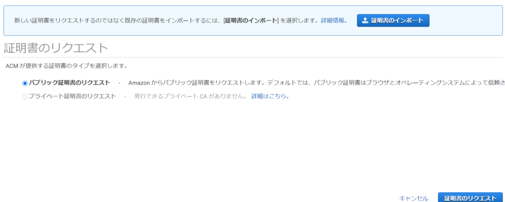

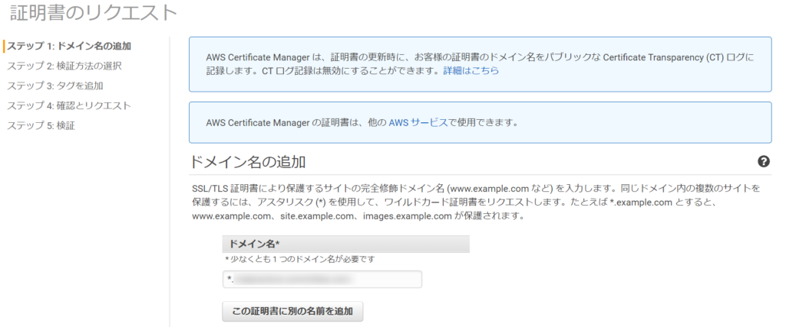

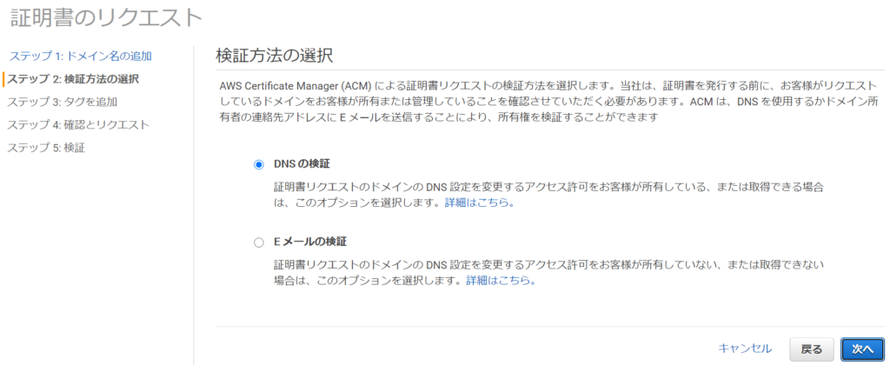

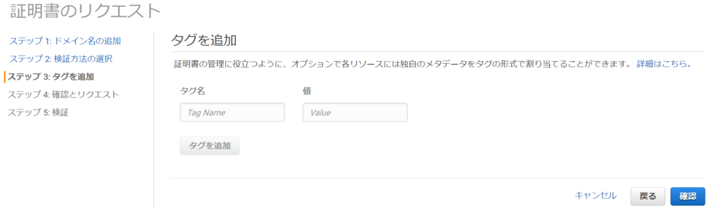

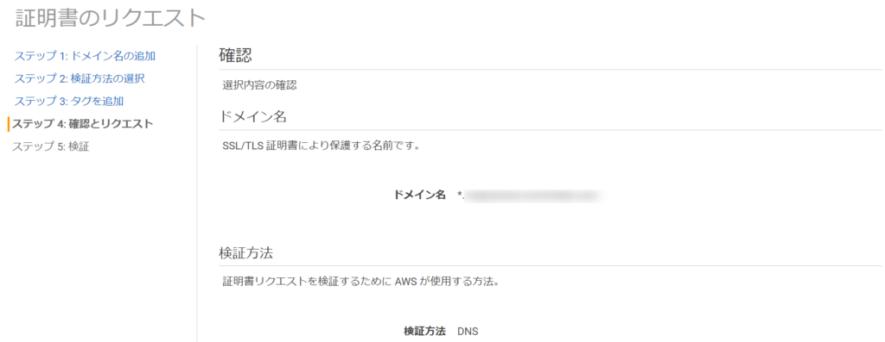

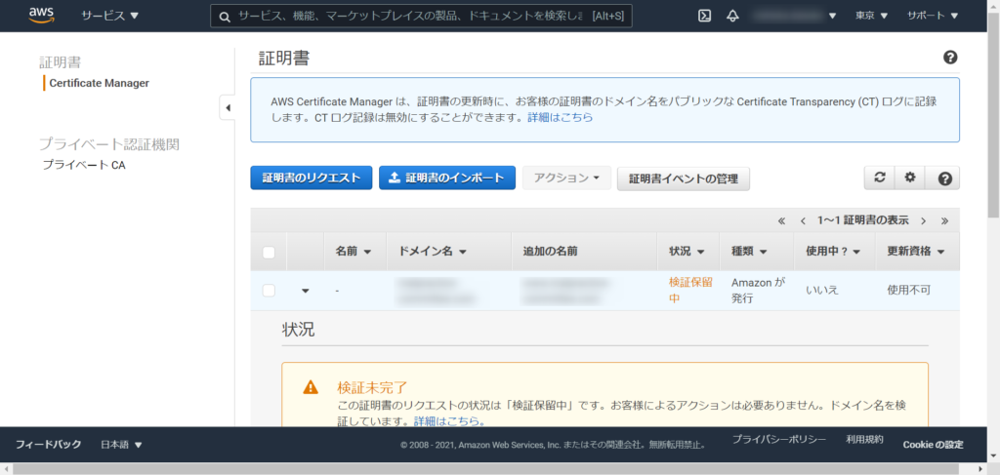

https://deliciousbrains.com/wp-offload-media/doc/cloudfront-setup/#create-cname

https://console.aws.amazon.com/cloudfront/home?#oai:

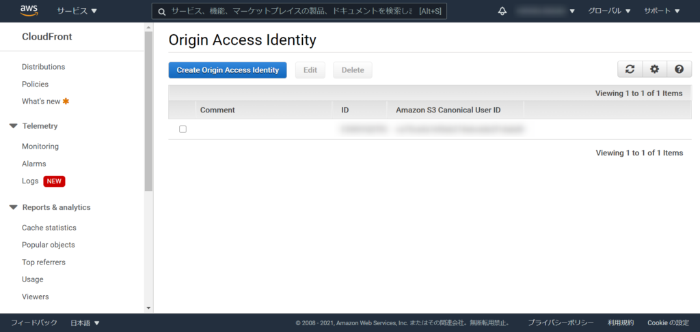

https://console.aws.amazon.com/cloudfront/home

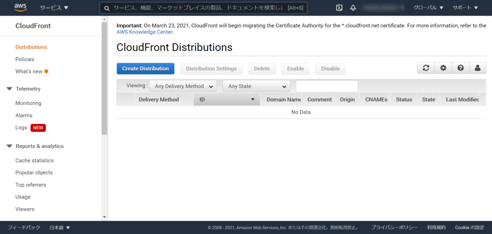

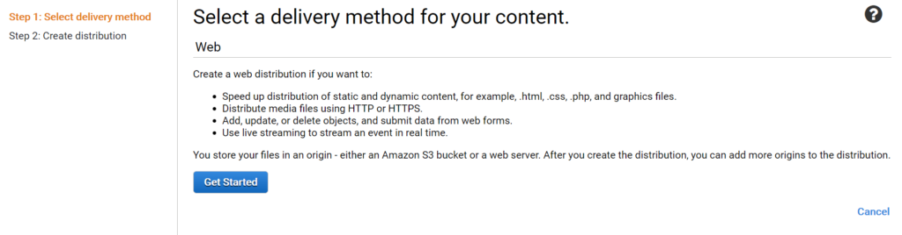

https://garafu.blogspot.com/2020/08/ec2-set-env-from-paramstore.html

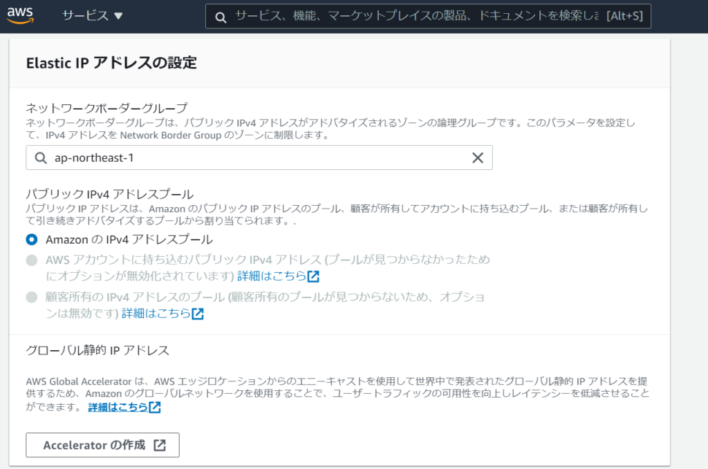

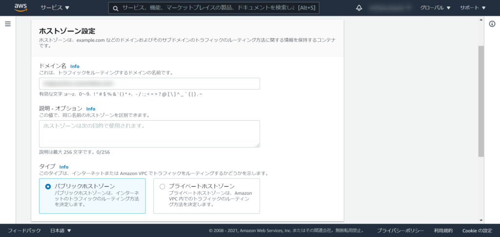

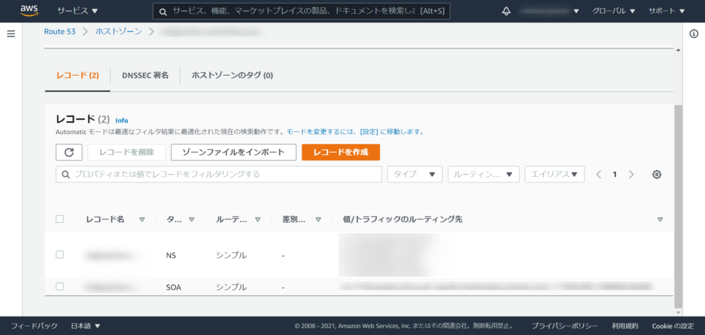

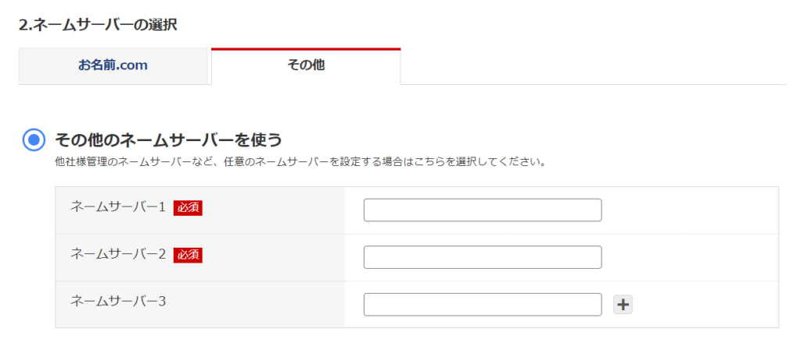

# **名前解決できるか確認する**

- [http://dnscheck.jp](http://dnscheck.jp/) にアクセスする

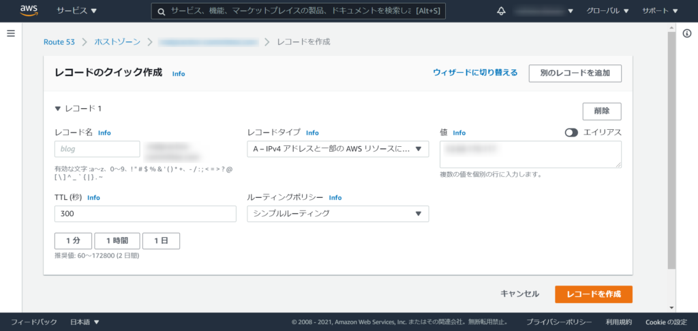

## 参考資料

https://inaba-serverdesign.jp/blog/20200609/wp\_offload\_media\_lite\_cloudfront\_s3.html

https://deliciousbrains.com/wp-offload-media/doc/cloudfront-setup/#configure-plugin

https://docs.aws.amazon.com/ja\_jp/AmazonCloudFront/latest/DeveloperGuide/cnames-and-https-requirements.html

https://deliciousbrains.com/wp-offload-media/doc/developer-guide/#automatic-offload-data

https://qiita.com/Ichiro\_Tsuji/items/8471fe0b3d4d17cde146#a%E3%83%AC%E3%82%B3%E3%83%BC%E3%83%89%E3%81%AE%E7%99%BB%E9%8C%B2

https://qiita.com/reon777/items/05e7ad47ed75597470e8

https://qiita.com/comefigo/items/b705325d082018ab2348

https://qiita.com/comefigo/items/b705325d082018ab2348

https://recipe.kc-cloud.jp/archives/11408

https://recipe.kc-cloud.jp/archives/5120

https://recipe.kc-cloud.jp/archives/4997

https://hacknote.jp/archives/49886/

https://sitecloud.jp/blog/2711/

https://tech.tabilabo.co.jp/40/?\_fsi=sOhKUmyo

https://qiita.com/Ichiro\_Tsuji/items/38592e737257cb45ca13

https://qiita.com/sygnas/items/a2ffa7b3c858c3f557c8

https://oh-sky.hatenablog.com/entry/2013/05/18/104416
