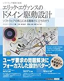

ドメイン駆動設計（Domain-Driven-Design：DDD）という概念の提唱となった聖典に近い書籍です。非常にボリューミーな内容ですが、重要なことが山程書かれている良書です。

[エリック・エヴァンスのドメイン駆動設計](//af.moshimo.com/af/c/click?a_id=1005417&p_id=170&pc_id=185&pl_id=4062&s_v=b5Rz2P0601xu&url=https%3A%2F%2Fwww.amazon.co.jp%2Fexec%2Fobidos%2FASIN%2FB00GRKD6XU%2Fref%3Dnosim)

posted with [カエレバ](https://kaereba.com)

Eric Evans 翔泳社 2013-11-20

[Amazon](//af.moshimo.com/af/c/click?a_id=1005417&p_id=170&pc_id=185&pl_id=4062&s_v=b5Rz2P0601xu&url=https%3A%2F%2Fwww.amazon.co.jp%2Fgp%2Fsearch%3Fkeywords%3D%25E3%2583%2589%25E3%2583%25A1%25E3%2582%25A4%25E3%2583%25B3%25E9%25A7%2586%25E5%258B%2595%25E9%2596%258B%25E7%2599%25BA%26__mk_ja_JP%3D%25E3%2582%25AB%25E3%2582%25BF%25E3%2582%25AB%25E3%2583%258A)

[楽天市場](//af.moshimo.com/af/c/click?a_id=1005417&p_id=54&pc_id=54&pl_id=616&s_v=b5Rz2P0601xu&url=https%3A%2F%2Fsearch.rakuten.co.jp%2Fsearch%2Fmall%2F%25E3%2583%2589%25E3%2583%25A1%25E3%2582%25A4%25E3%2583%25B3%25E9%25A7%2586%25E5%258B%2595%25E9%2596%258B%25E7%2599%25BA%2F-%2Ff.1-p.1-s.1-sf.0-st.A-v.2%3Fx%3D0)

モデルにおいて重要な要素-同一性 ・同一性を持つ（同一性というのはtheなのかaなのかということ）かどうかが、 そのシステムにおいて重要な意味を持つか。 ・同一性があるもの：エンティティ ・ないもの：値オブジェクト
