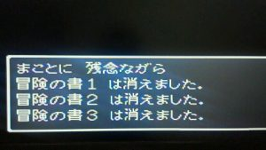

LinuxというOSのコマンドに「rm -rf /」というものがある。

これは、そこそこ有名なもので、何故有名なのかというと、"絶対にやってはいけない"からである。ド○クエで例えると、このコマンドを実行すると、冒険の書だけでなくドラ○エのゲーム自体も消えてしまうのである。1からやり直すことも適わず、文字通り"何もできなくなる"恐怖のコマンドだ。

このコマンドを正確に説明すると、"rm"が削除(remove)を表すコマンドで、"-rf"がオプションで強制的に対象階層以下を全て削除する事を表し、"/"が最上位の階層(ルートディレクトリ)を表す。つまり、

> 全てのデータを強制的に削除する。

というコマンドである。最上位の階層以下なので全てである。OSも含めて全て。

 

前置きが長くなったが、"絶対にやってはいけない"と言われると、やってみたくなるのでやってみる。ただし犠牲は最小限にしたいので、仮想OSを用いることとする。こうすれば大した被害もなくできるので、皆さんも興味があればやってみよう！(もちろん自己責任で)

まずは準備として、仮想環境の準備。

■実施するPC環境

- OS：Windows 10 64bit

※どのOSでもやりかたはそんなに変わらない。後述するVirtualBoxのインストーラを適切なOSバージョンのものに合わせればOK。

■導入するもの

- ツール：Virtual Box
- 仮想OS：Ubuntu 14.04

では、環境構築しましょう。

 

 

ちなみにこれからやることは、「rm -rf /」コマンドで全て消えます。なんか上手く行かなくても気にせずに。全て消えますから。。。動けばいい。
