[Autify Advent Calendar](https://qiita.com/advent-calendar/2021/autify "https://qiita.com/advent-calendar/2021/autify") の○日目の記事...として載せようとしましたが、準備をしているうちにアドベントカレンダーが埋まってしまいました。しかしせっかく作ったので公開します。  
AutifyのAPIを自動取得するGASを公開しています。それを使いつつ、簡単にダッシュボードの表示までの作り方の紹介です。

### 完成イメージ

まず出来上がりのイメージですが、 Autify によるテストの結果をこのように一覧できるダッシュボードが作れます。この部分は自在に調整可能なので、お好みに合わせてカスタマイズすることができます。

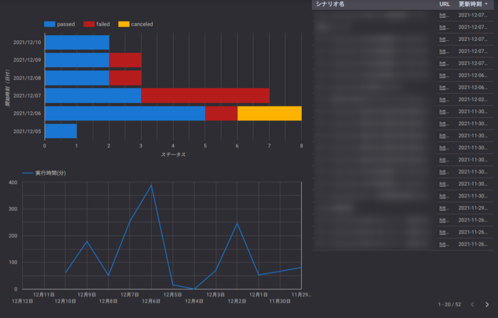

### Autify とは

さて、そもそも Autify とは、ブラウザを用いたテストが簡単にできるサービスです。  
ブラウザ操作を記録するだけでテストが **ノーコード** で **誰にでも簡単** に作れます

https://autify.com/ja

### システム構成

今回作ったダッシュボードは、次のような構成としていて、

1. [Autify のAPI](https://autifyhq.github.io/autify-api/#/)によってテスト結果やシナリオなどを、
2. Google App Script (GAS)を用いて定期的にデータ取得し、
3. Google Spreadsheetに表として保存し、
4. Google データポータルでダッシュボードとしてグラフ等を描画します。

## 作り方

### スプレッドシート&GASの準備

まず、下記のスプレッドシートをご自身のGoogleDriveに**コピー**してください。【注意】**必ずコピー**をしてください。編集リクエストをするのでは**ありません**。よく間違えて編集リクエストを送ってくる方がいますのでご注意ください。

https://docs.google.com/spreadsheets/d/1STDIpSjK6Vz9f18vK6vPHqYSeG4-Xj3hA4Y3j2hBfaQ/edit?usp=sharing

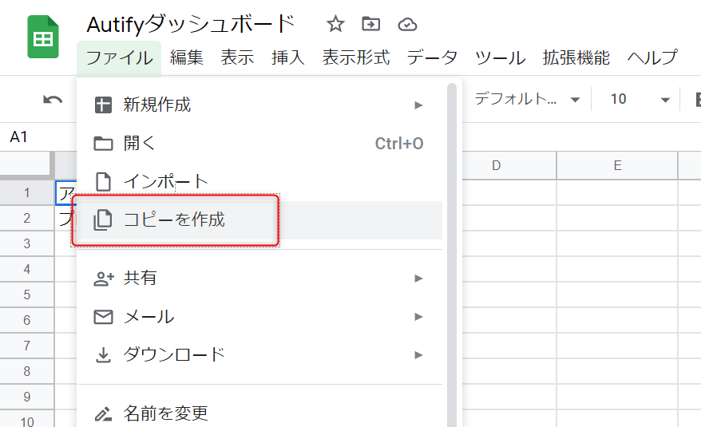

続いて、AutifyのAPIアクセストークンをスプレッドシートに記入します。  
Autifyにログインしてもらい、設定 > 個人設定 画面で、「新しいパーソナルアクセストークンを生成」に任意の区別できる名前を記入して、作成ボタンを押します。するとアクセストークンが生成されるのでそれをコピーします（下図の⑤）。  
補足ですが、もちろんこのアクセストークンは外部にばれないように管理してください。仮に流出してしまったのであれば同画面で当該アクセストークンを無効にすれば以降不正に使われることはありません。

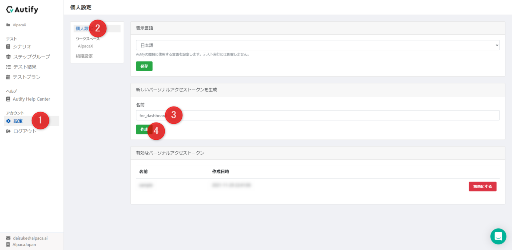

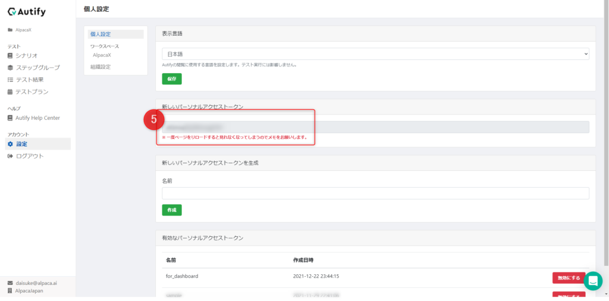

上記でコピーしたアクセストークンをスプレッドシートの「secrets」シートにある**B1**セルに貼り付けてください。

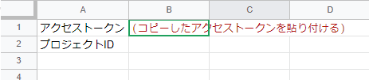

もうひとつ、AutifyのAPIを利用するために、プロジェクトIDを取得する必要があります。Autifyのログイン後トップ画面において、URLの projects/ の後の番号をコピーしてください。  
そしてそれを同じようにスプレッドシートの「secrets」シートにある**B2**セルに貼り付けてください。

上記でコピーしたアクセストークンをスプレッドシートの「secrets」シートにある**B1**セルに貼り付けてください。

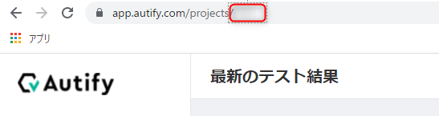

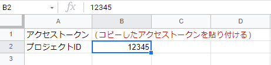

AutifyとGASの接続確認として、「データ取得実行」ボタンを押します。初回実行の場合、承認を求められるので、確認の上承認してもらえればGASのスクリプトが実行されます。しばらく待つとAutifyのデータが、「data\_results」シートや「data\_scenarios」シートに書き込まれます。

スプレッドシートでの準備の最後に、トリガーを設定します。最新のAutifyの情報を定期的に取得するように、GASのトリガーを任意のタイミングで実行されるように設定します。スプレッドシートの 拡張機能 > Apps Script をクリックしてください。

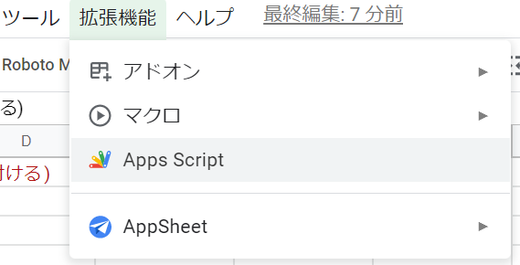

するとApps Script画面になるので、①左メニューの時計マーク(トリガーメニュー)を押して、②右下のトリガーを追加ボタンを押します。出てくるポップアップで、③実行する関数で「allUpdate」を選択し、④実行させたいタイミングを選びます（更新させたい頻度によりますが、1時間に一度程度が妥当かと思います。適宜選んでください）。これで⑤作成ボタンを押せばトリガーが作成されて、定期的にAutifyの最新情報を取得するようになります。

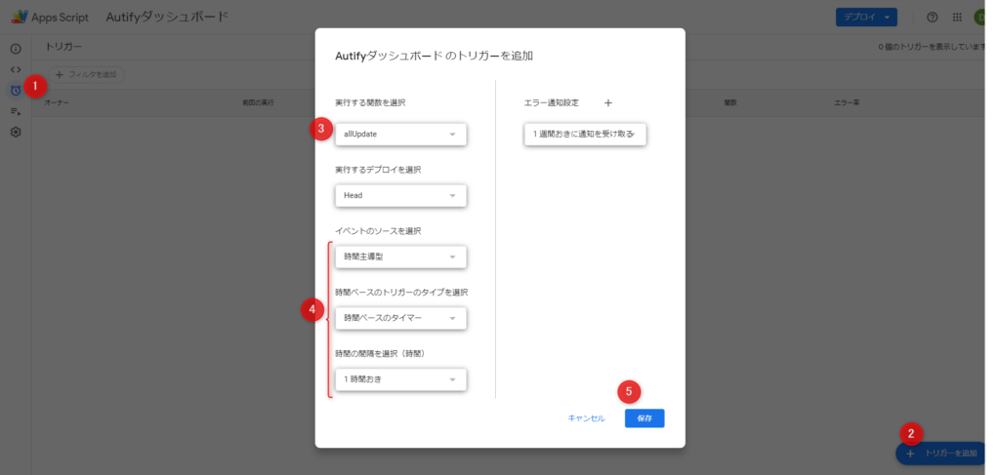

### ダッシュボードの表示

上記でデータ取得ができるようになったので、あとは見やすく表示をします。スプレッドシートでグラフを作るのでもいいと思います。ここでは [Google データポータル](https://marketingplatform.google.com/intl/ja/about/data-studio/) というものを連携させてグラフ表示をしていきます。  
データポータル は設定の仕方にやや癖がありますが、かなり柔軟に表示をコントロールできるのが利点です。

[https://marketingplatform.google.com/intl/ja/about/data-studio/](https://marketingplatform.google.com/intl/ja/about/data-studio/)

上記にアクセスして、「空のレポート」から新規で作成します。

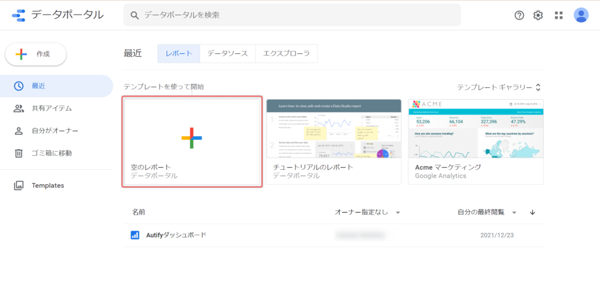

「データを追加」から「Google スプレッドシート」を選択します。ちなみにご覧のようにGoogleデータポータルでは他にも様々なデータソースを追加できるので、気になれば他のものも試してみるのもよいでしょう。色々なデータを簡単にカスタマイズして表示ができます。

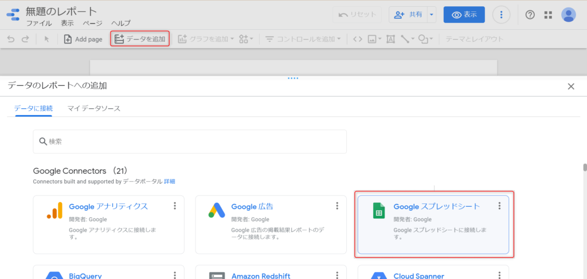

インポートするスプレッドシートを選ぶ画面になるので、先程準備したスプレッドシートのURLを「URL」のところにコピペすれば対象のスプレッドシートが選択肢に出てきます。一度参照できていれば「すべてのアイテム」にも出てきます。そこでスプレッドシート、ワークシートを選んで「追加」を押します。

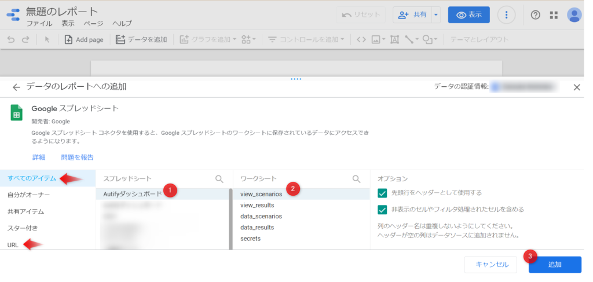

データソースが追加できたら、あとはそのデータを元に好きに表示をカスタマイズしていきます。「グラフを追加」というところから、適宜表示したいものを選び、またデータソースのカラム（スプレッドシートの列）をマッピングさせていきます。

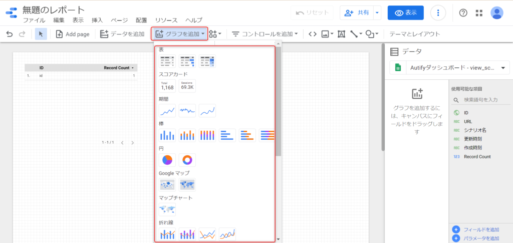

例えば、例示したダッシュボードは、左上が棒グラフ（横）、左下が折れ線グラフ、右が表、を表示しています。また、背景色含めたカラーテーマをブラックにしています。

## 終わりに

とりあえずこの記事では、AutifyAPIを自動取得するGASを提供しました。

ダッシュボードの表示部分を作るのは各々でカスタマイズしながらやっていってもらう必要がありますが、以降は自動で最新の情報がグラフィカルに表示できるカッコイイ（かどうかは作る人次第）ものが作れます。

### 参考

https://docs.autify.com/ja/

[https://marketingplatform.google.com/intl/ja/about/data-studio/](https://marketingplatform.google.com/intl/ja/about/data-studio/)
