CodeZineさんの記事で、AWSの超初歩的なサンプルが紹介されていたので、やってみました。こちら少し古い記事（2017/08）で、AWSの画面構成が結構変わっていたため現在版（2018/12）での紹介です。体感的にAWSは画面が頻繁に変わるので本記事もすぐに古くなるかもしれませんが。。  
  
※ 本記事はほとんど下記の元記事の引用です。画像だけ取得し直しました。

https://codezine.jp/article/detail/10332?p=3

上記記事に記載の通りですが、作成するAPI仕様は以下の通りです。

- GETリクエストに対してHello, Lambda!の文字列を返却する
- クエリストリングにnameが含まれている場合は、Hello, ${name}!の文字列を返却する
- GET以外のメソッドに対しては、405（Method Not Allowed）のHTTPステータスコードを返却する

## Lambda関数の作成

（一応、リージョンを「アジアパシフィック（東京）」として作業を進めましょう）  
AWSマネジメントコンソールから、［Lambda］をクリックします。

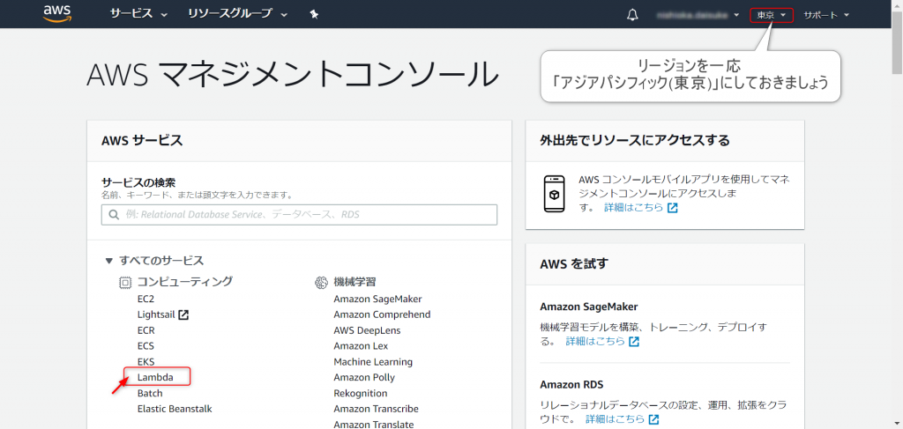

Lambdaの画面で、「関数の作成」をクリックします。

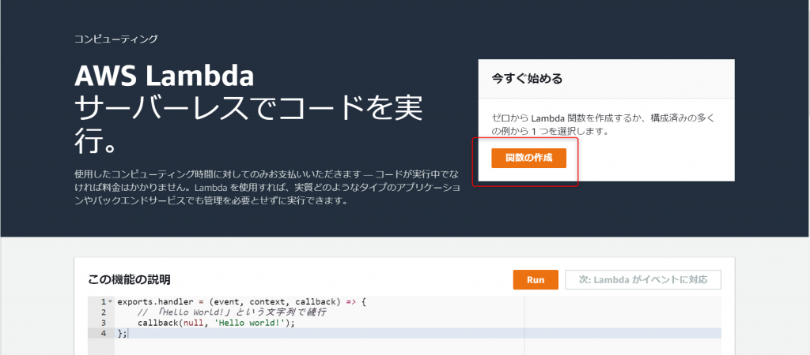

### （1）設計図の選択

　まずは設計図を選択します。  
　利用する言語やシナリオを元に設計図を選択し、必要に応じてカスタマイズすることができます。  
　今回はランタイムに「hello-world」テンプレートを用います。

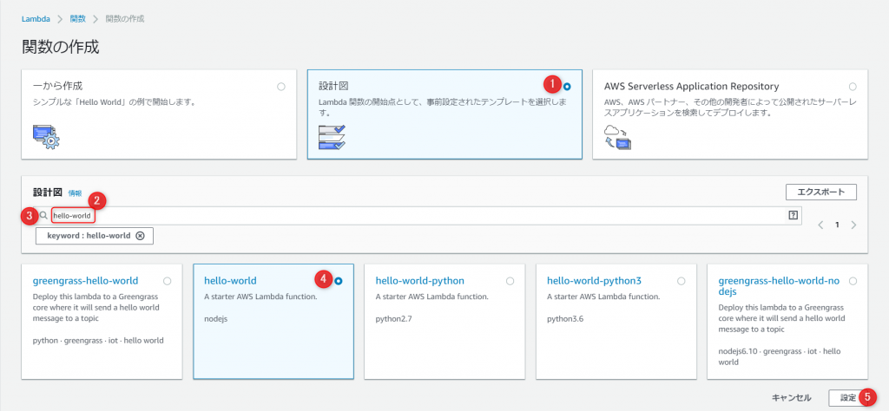

### （2）関数の設定

　続いて関数の設定を行います。  
　ここで、API Gatewayが受け付けたリクエストに対して、どのようなレスポンスを返却するかを定義します。

1. 名前：任意の関数名を入力します。例）「hello-lambda」
2. ロール：「1つ以上のテンプレートから新しいロールを作成します。」
3. ロール名：任意のロール名を入力します。例）「hello-lambda-role」
4. ポリシーテンプレート：「シンプルなマイクロサービスのアクセス権限」
5. 関数の作成：最後に押下。
6. （補足）Lambda 関数のコードはテンプレートのものが設定されており、ここでは変更できないので後で編集します。

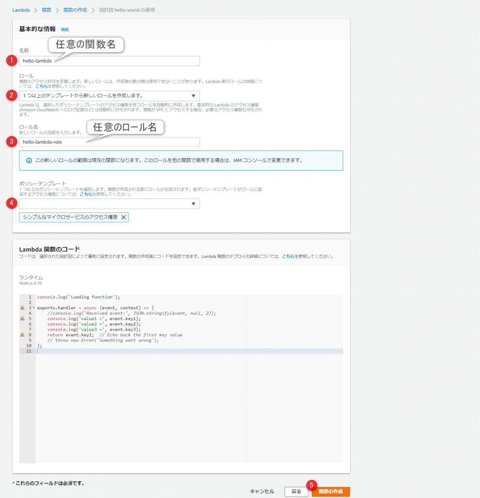

　「Lambda関数のコード」セクションでは、Lambdaで実行されるコードを設定します。今回は「コードをインラインで編集」機能を利用して直接JavaScriptを記述していきますが、［コード エントリ タイプ］ で選択できるように、`.zip`ファイルでのアップロードやS3経由でのファイルアップロードも行うことが可能です。

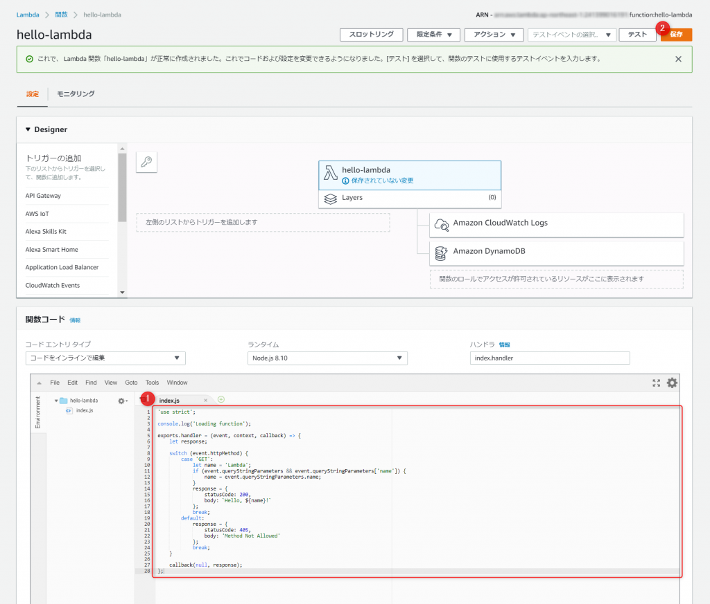

今回利用するLambda関数のコードは以下の通りです。

> 'use strict';
> 
> console.log('Loading function');
> 
> exports.handler = (event, context, callback) => {
> 
> let response;
> 
> switch (event.httpMethod) {
> 
> case 'GET':
> 
> let name = 'Lambda';
> 
> if (event.queryStringParameters && event.queryStringParameters\['name'\]) {
> 
> name = event.queryStringParameters.name;
> 
> }
> 
> response = {
> 
> statusCode: 200,
> 
> body: \`Hello, ${name}!\`
> 
> };
> 
> break;
> 
> default:
> 
> response = {
> 
> statusCode: 405,
> 
> body: 'Method Not Allowed'
> 
> };
> 
> break;
> 
> }
> 
> callback(null, response);
> 
> };

Lambda 関数で利用可能な引数は以下の通りです。

- `event`：API Gatewayから渡されるリクエストのイベントデータ
- `context`：実行中のLambda関数のランタイムの情報
- `callback`：呼び出し元であるAPI Gatewayにレスポンスを返す際に使用するコールバック関数

　API Gatewayのプロキシ統合タイプでは`statusCode`だけでなく、必要に応じて`body`や`headers`を含むレスポンスオブジェクトを返却する必要があります。　`event`に含まれるリクエストの情報に基づいて必要な処理を行った上で、レスポンスオブジェクトを組み立て、API Gatewayに`callback`を返却するという流れが基本となります。

### （3）トリガーの設定

　このテンプレートでは、トリガーとなるイベントソースがデフォルトでは設定されていません。  
　「API Gateway」を選択し、API Gatewayのプロキシ統合タイプをイベントソースとして設定します。

1. トリガーの追加：「API Gateway」を選択すると、自動で右のツリーに追加されます。
2. API：「新規APIの作成」
3. セキュリティ：「オープン」（簡単のためどこからもアクセス可能に）
4. 追加：トリガーを追加します。
5. 保存：全体を保存します。

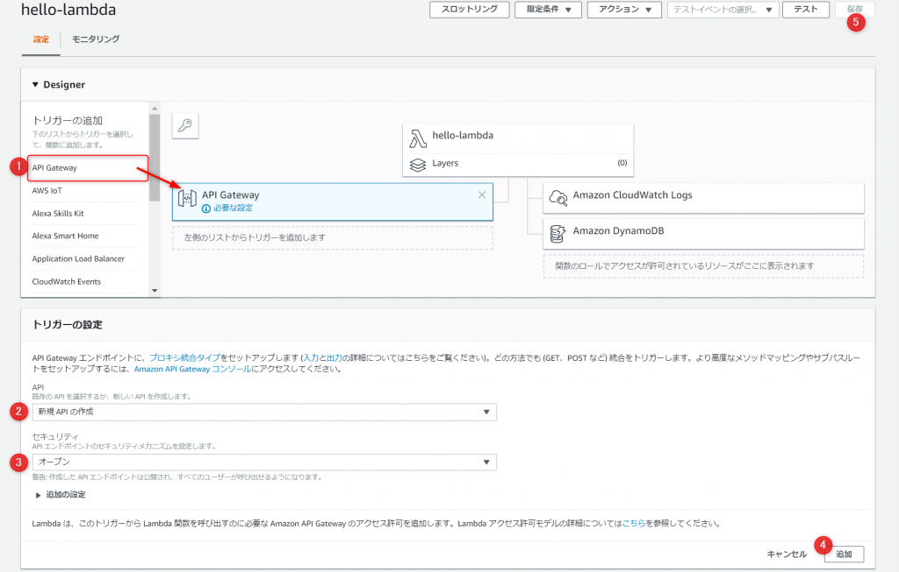

### （4）実行

　関数が作成されたら、実際に動かしてみましょう。

<figure>

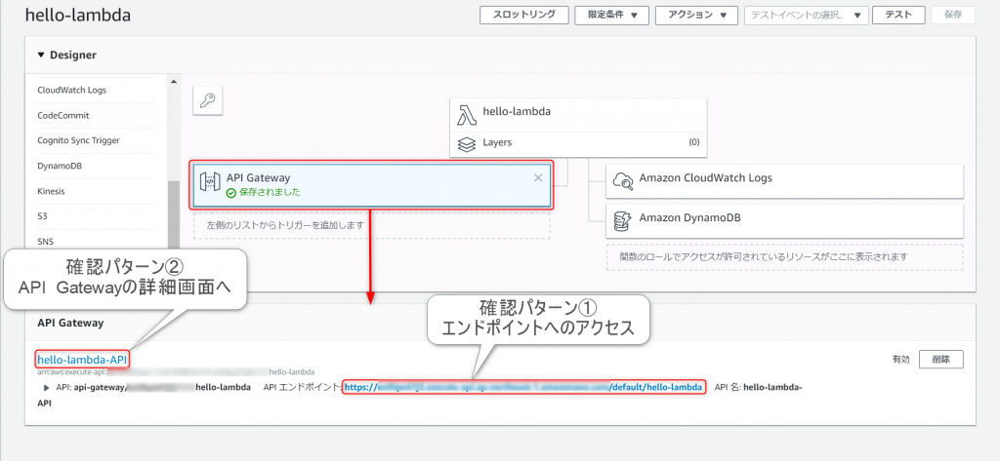

<figcaption>

画像：API作成後画面

</figcaption>

</figure>

Designerブロックで、API Gatwayが選択されている状態だと上記のような画面になります。

#### 確認パターン①

エンドポイントのURLをクリックすると、ブラウザでAPIにアクセスできます。これはインターネット上に公開されているAPIとなりますので、他のPCやスマホからもアクセスできます。

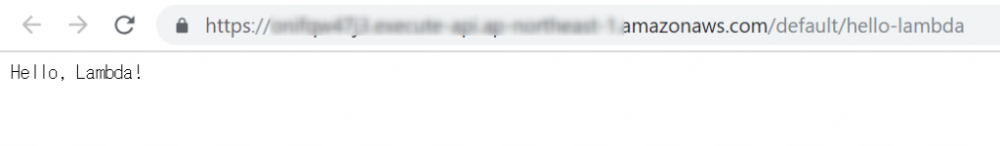

#### 確認パターン②

また、もう一つの確認パターンとして、API Gatewayの詳細画面でテストを実施することができます。

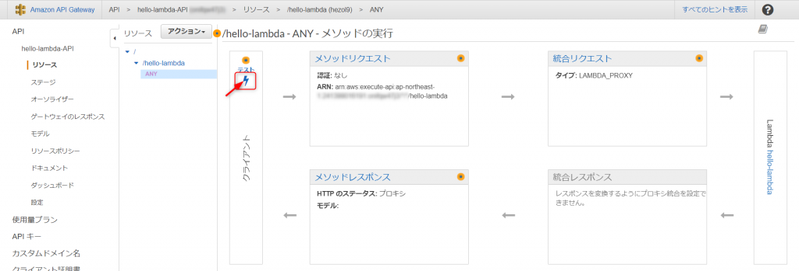

テストボタン（稲妻マーク）を押下すると以下の画面に遷移します。

1. HTTPメソッド：「GET」他にもPOSTなど任意のものを選択できます。
2. クエリ文字列：今回のAPI仕様では、nameパラメータを渡すとレスポンスが変わるため、それを踏まえて任意に設定できます。ここでは、「name=John」としています。
3. テストボタン：最後に押下すると、右側に結果が出力されます。
4. 結果：種々の結果が出力されます。今回は使用どおりに、「Hello, John」というレスポンス本文が返ってきました。

## 完成

以上で、サーバレスアーキテクチャによるAPIの作成ができました。ものの数分で簡単にできましたね。

### （おまけ）作成したものの削除

今回作成したものの削除方法も残しておきます。（無駄に課金されても嫌）

#### API削除

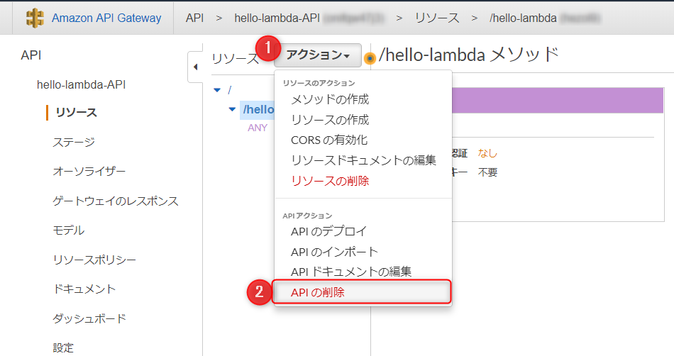

削除の確認ダイアログが出るので、API名称をコピペして「APIの削除」ボタンを押しましょう。

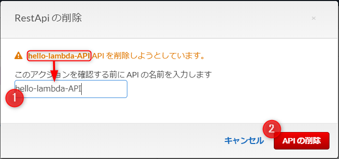

#### ロール削除

「IAM」機能に遷移します。そこで「ロール」の対象のロール名を選択し（ここでは「hello-lambda-role」）、「ロールの削除」を押します。

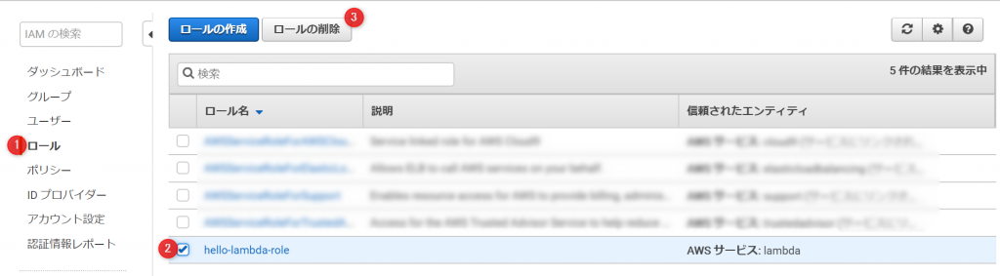

ここでも削除の確認ダイアログが出るので、「はい、削除します」ボタンを押しましょう。

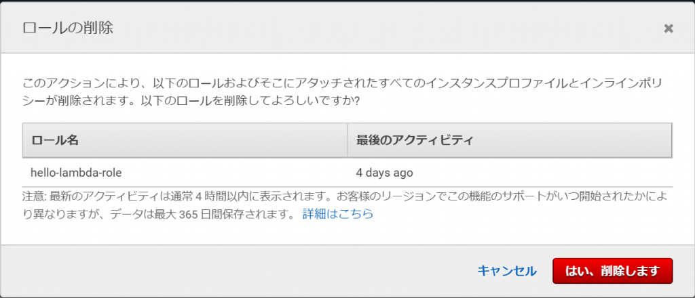

これで、後片付けまで完全終了です。

### 参考URL（再掲）

- [https://codezine.jp/article/detail/10332?p=3](https://codezine.jp/article/detail/10332?p=3)
