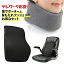
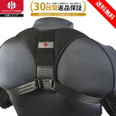
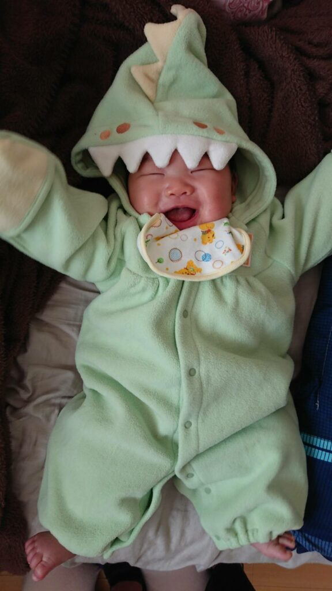

男性育休体験談として、実際の育児休業中の流れを話していきたいと思います。

前回の記事はこちら：

[http://localhost/life/childcare-leave-1/](http://localhost/life/childcare-leave-1/)

## タイムスケジュール

夫婦別で1日の流れをタイムスケジュールとして書き起こしてみました。もちろん時間通りに子供が動くことはありえないのであくまでサンプルケースです。  
ここで、「育児」と書いているのは「泣いたら対応する」ことで、場合によって、「オムツ交換」「あやして寝かす」「授乳する」「よくわからず泣いているから頑張ってあやす」をしています。泣いていない時は自由に個人的なことをしてます。

<iframe src="https://docs.google.com/spreadsheets/d/e/2PACX-1vT3Bx_7CXI9IahhLNurO8EInUVSSl5U8kYERvb59HXYx8PcvTwHw9iTPOB597cNk7cGKkPlEV9w3b1j/pubhtml?gid=0&amp;single=true&amp;widget=false&amp;headers=false&amp;range=A1:E49" style="width: 400px; height: 1200px; border: 0;"></iframe>

## 辛いこと

### 睡眠時間

2~3時間おきに夜泣きされるのが辛いのは想像に難くないかと思います。私(夫)は熟睡するタイプのため、妻が対応してくれる限りは基本起きないので、妻に大感謝です。授乳も場合によっては30分や1時間になることもあり、夜中にそれはかなり辛いです。

睡眠時間を合計すれば、時間的には確保はできていることにはなるのですが、そう単純な足し算ではないのが人間の体です。まとまった時間を寝れないのは寝た気がしなくて、物凄くストレスです。

### 肩・腰・腕の凝り

赤ん坊の数Kgというのは地味に重たくて、かつ長い時間、抱きかかえたり、だっこ・おんぶすることになるのででも体にそこそこの負担があります。腕は疲れるし、私は肩凝りが酷かったです。妻は腰にきてました。

### ストレス

基本的に育児は気を張っていなければなりません。そして泣いたらすぐに対応しなければなりません。まさに奴隷的で、何か自分の私事や趣味をしていても、意識は少し子供に向け続けていますし、中断させられることもしょっちゅうです。

自分のやりたいことも満足にできず、労働だけ強いられるため、精神的にかなりストレスフルですし、これが上記の肉体的ストレスもかかっている状態で起きるのです。

エンジニアぽいことも書くと、技術書読んだりのインプットやコード書いたりといったアウトプットはエンジニアの成長にとても大事でやりたいのですが、ほとんどできなくてストレスでした。それでも、子供を抱っこして寝かし付けながら片手でスマホで電子書籍を読んだりしました。抱っこひもを使えば立ちながらPC操作してコードを書けますが、肩や足の負担と引き換えになります（なぜか座ると、子供は同じ体勢のハズなのに泣き出す）。子供が産まれる前後では、勉強時間の確保が天と地ほど難しくなると感じました。

## 夫婦で気をつけたこと

### 役割分担

昼間は夫が、夜中は妻が、という基本方針で育児分担としました。そうならざるを得ませんでした。  
夫婦・子供は同じ寝室で寝ているのですが、夫が夜泣きでも起きないため、妻が先に起きますし、ほぼ母乳のみで育てていたので夜中の授乳も元々夫ができることが特にありませんでした。  
そのかわり、夫が起きてからは妻にゆっくり寝させてあげるよう努めました。

父親に出来ない育児は母乳をあげることだけなので、属人化を避けるためにも、ミルク作り・オムツ交換・沐浴等のお風呂など、育児が全てできるようにしました。おかけで、夫婦の片一方がでかけたりすることも出来たので良かったと思っています。

### マッサージ

週一でマッサージに通い、肩凝りをごまかしていました。回復しては凝っての繰り返しでした。  
ただ、姿勢が悪い（少し猫背）のが良くなかったりするようで、姿勢の矯正も並行して行うようにしました。また、肩甲骨はがしというものも風呂上がりにやるようにして、肉体改善に努めました。

[【10/11 1:59〆切★全品10%OFFクーポン】背もたれクッション　首サポーター　デスクワーク　テレワーク　首　コルセット　ネックサポーター　ランバーサポート 腰対策クッション](//af.moshimo.com/af/c/click?a_id=1041250&p_id=54&pc_id=54&pl_id=616&s_v=b5Rz2P0601xu&url=https%3A%2F%2Fitem.rakuten.co.jp%2Fvidas-web%2Fvi0429%2F)

posted with [カエレバ](https://kaereba.com)

[楽天市場](//af.moshimo.com/af/c/click?a_id=1041250&p_id=54&pc_id=54&pl_id=616&s_v=b5Rz2P0601xu&url=https%3A%2F%2Fsearch.rakuten.co.jp%2Fsearch%2Fmall%2F%25E9%25A6%2596%25E3%2582%25B5%25E3%2583%259D%25E3%2583%25BC%25E3%2582%25BF%25E3%2583%25BC%2520%25E9%25A6%2596%25E3%2582%25B3%25E3%2583%25AB%25E3%2582%25BB%25E3%2583%2583%25E3%2583%2588%2F-%2Ff.1-p.1-s.1-sf.0-st.A-v.2%3Fx%3D0)

[Amazon](//af.moshimo.com/af/c/click?a_id=1041250&p_id=170&pc_id=185&pl_id=4062&s_v=b5Rz2P0601xu&url=https%3A%2F%2Fwww.amazon.co.jp%2Fgp%2Fsearch%3Fkeywords%3D%25E9%25A6%2596%25E3%2582%25B5%25E3%2583%259D%25E3%2583%25BC%25E3%2582%25BF%25E3%2583%25BC%2520%25E9%25A6%2596%25E3%2582%25B3%25E3%2583%25AB%25E3%2582%25BB%25E3%2583%2583%25E3%2583%2588%26__mk_ja_JP%3D%25E3%2582%25AB%25E3%2582%25BF%25E3%2582%25AB%25E3%2583%258A)

[猫背矯正ベルト 姿勢矯正ベルト 男性用 メンズ 姿勢矯正 猫背矯正 猫背 男性 肩こり 背筋矯正サポーター 猫背ベルト 姿勢ベルト ねこぜ矯正 男 背筋ベルト 矯正 肩こり解消グッズ 姿勢 姿勢サポーター ねこぜ 改善 【IWAMA HOSEI】 STYLE FIT イワマホウセイ](//af.moshimo.com/af/c/click?a_id=1041250&p_id=54&pc_id=54&pl_id=616&s_v=b5Rz2P0601xu&url=https%3A%2F%2Fitem.rakuten.co.jp%2Fiwama-hosei%2F10000003%2F)

posted with [カエレバ](https://kaereba.com)

[楽天市場](//af.moshimo.com/af/c/click?a_id=1041250&p_id=54&pc_id=54&pl_id=616&s_v=b5Rz2P0601xu&url=https%3A%2F%2Fsearch.rakuten.co.jp%2Fsearch%2Fmall%2F%25E8%2583%258C%25E7%25AD%258B%25E3%2583%2599%25E3%2583%25AB%25E3%2583%2588%2F-%2Ff.1-p.1-s.1-sf.0-st.A-v.2%3Fx%3D0)

[Amazon](//af.moshimo.com/af/c/click?a_id=1041250&p_id=170&pc_id=185&pl_id=4062&s_v=b5Rz2P0601xu&url=https%3A%2F%2Fwww.amazon.co.jp%2Fgp%2Fsearch%3Fkeywords%3D%25E8%2583%258C%25E7%25AD%258B%25E3%2583%2599%25E3%2583%25AB%25E3%2583%2588%26__mk_ja_JP%3D%25E3%2582%25AB%25E3%2582%25BF%25E3%2582%25AB%25E3%2583%258A)

### 夫婦の会話

ストレスフルでイライラしがちというのもあって、夫婦間でのストレスも貯まらないように気をつけました。1日中一緒にいるからこそ、しっかりとコミュニケーションをとって、会話でストレス解消になるように頑張りました。ほぼ毎日一緒に「散歩」に行っていたのですがこれがとても良かったと思います。ベビーカーに乗せていると子供の期限が良いこともあって、1時間位散歩してまとまった時間を話せました。また、歩くことで適度な運動にもなりそれもストレス軽減に効いていたかと思っています。

### 子供の写真をいっぱい撮る

これが夫婦で楽しむ一番の娯楽なのかなと思いました。「笑った」とか「寝顔がそっくり」とか、そんなことだけで癒やされます。育児は労働としては辛いだけですが、楽しみを見つけていくのが大事だと思います。（左は我が子です。）

今の時代、簡単に写真の共有ができるアプリもあるので、夫婦間での共有はもちろん、おじいちゃん・おばあちゃんにも見てもらえます。「みてね」というアプリが有名ですし、無料で十分使えておすすめです。

## 最後に

24時間育児が続くのが、本当に大変です。終わりのない感じがかなり絶望的で、日々生活するだけでいっぱいいっぱいでした。

ということで、当初3ヶ月間の育休予定でしたが、+3ヶ月の追加申請をして、計半年の育休を取ることにしました。

なので、次回に続きます。

[http://localhost/life/childcare-leave-3/](http://localhost/life/childcare-leave-3/)
