AWS Elastic Compute Cloud (EC2)のインスタンス構築手順です。さすがクラウドサービスなだけあって、いくつかポチポチと入力していくだけで簡単に作成できます（起動していると課金されていくので注意）。

### 前提

AWSアカウントを持っていること。

## 手順

まずAWSにログインして、[https://ap-northeast-1.console.aws.amazon.com/ec2/v2/home](https://ap-northeast-1.console.aws.amazon.com/ec2/v2/home) にアクセス。

アベイラビリティゾーンが望みのとおりになっていることを確認しつつ、「インスタンスを起動」ボタンを押します。

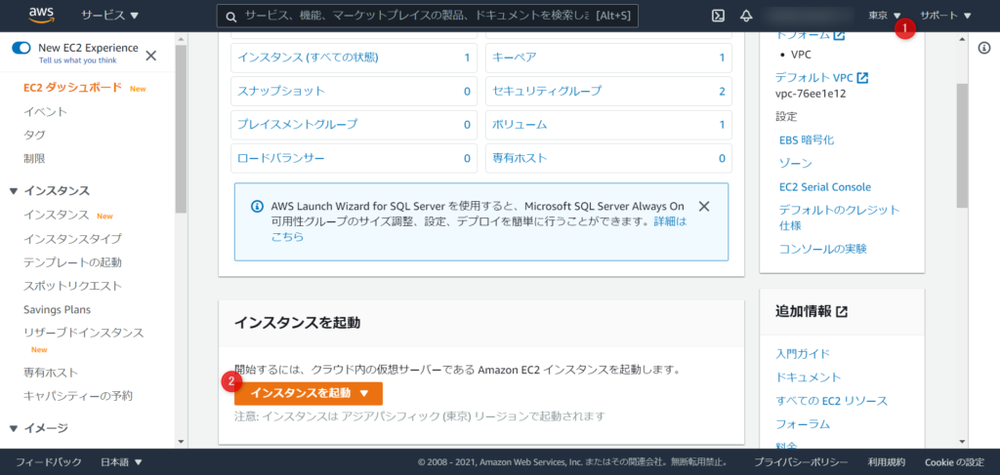

アベイラビリティゾーンが望みのとおりになっていることを確認しつつ、「インスタンスを起動」ボタンを押します。

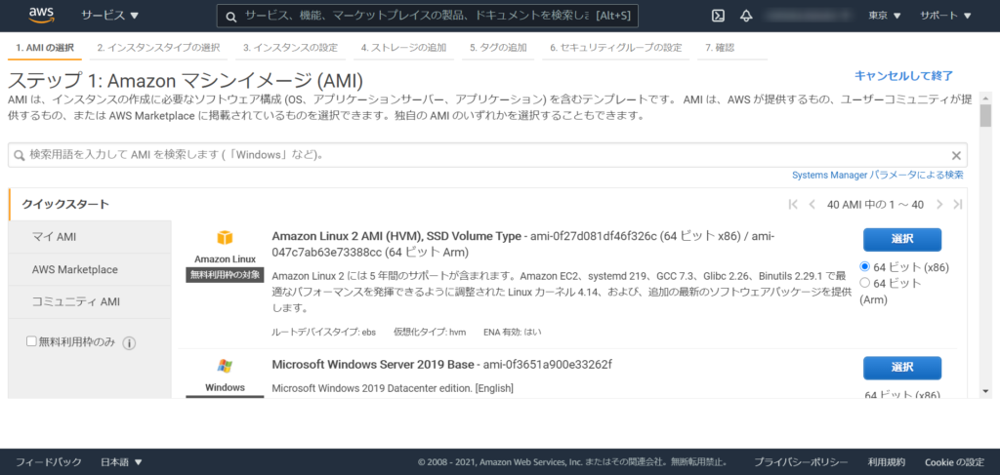

マシンイメージ(AMI)を選択します。AWS Systems Manager エージェント(SSM エージェント)がインストールされているのが便利(後述)なので「Amazon Linux 2」を選びました。

インスタンスタイプを選択します。私が使う用途的にメモリが0.5GBだと少なすぎるので1GB以上のものということで、T3a.microを選びました。  
選定の参考：[https://pages.awscloud.com/rs/112-TZM-766/images/C2-07.pdf](https://pages.awscloud.com/rs/112-TZM-766/images/C2-07.pdf)

右下の「次のステップ」のボタンを押します。(「確認と作成」ボタンを押してしまうと以降の設定がデフォルトのままになってしまいます。)

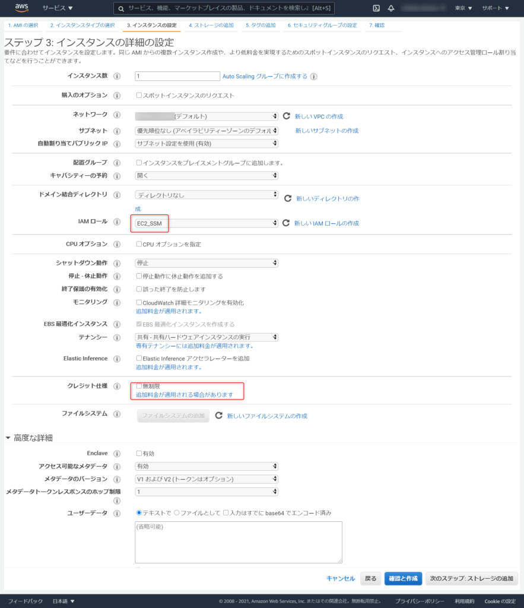

たくさんある詳細設定を行います。確認してもらいながら細々とお好みに合わせて設定してもらえばと思います。  
まず、Identity and Access Management (IAM)ロールを設定しましょう。下記で示しますが、SSMが利用できるポリシーがセットされているIAMロールを付けましょう。  
また、クレジット使用がデフォルトでオンになっていて利用状況によってはさらなる課金が発生するので不要であればオフにしましょう。  
そして、必要であれば「ユーザデータ」にシェルスクリプトを記載しておくとインスタンス起動時に実行してくれるので楽になります。

* * *

### IAMロール作成の仕方

SSMでのEC2コンソールにアクセスできるように、IAMロールを作成します。上記より「新しいIAMロールの作成」リンクから遷移します。

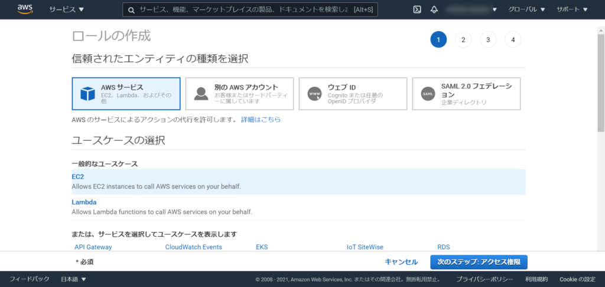

AWS サービスで、「EC2」を選びます。一般的なユースケースに出ていると思うので分かりやすいかと思います。次のステップへ。

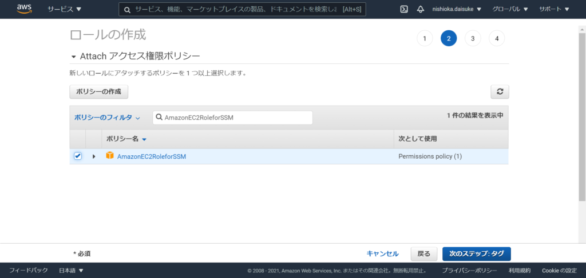

ポリシーがたくさん表示されるので、フィルターで「AmazonEC2RoleforSSM」を絞り込んでチェックします。次のステップへ。  
次の「タグ」は必須ではないので必要なければそのまま次のステップへ。

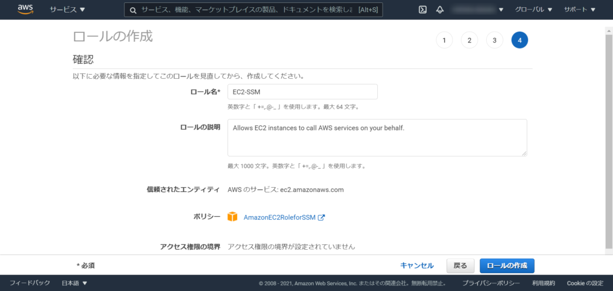

任意のロール名を記入して「ロールの作成」を押下したら作成完了です。  
EC2のロールで作成したロールを選択しましょう。

* * *

IAMロールを作成し終えたら、EC2の作成に戻ります。

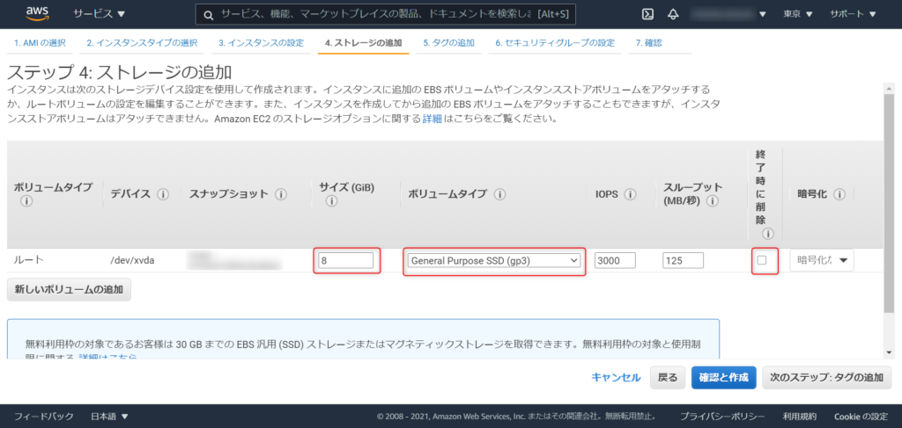

Elastic Block Store(EBS)の設定を行います。サイズは最低の8GBにしましょう（後から容量を増やすことは出来ますが、減らすことは出来ないので）。ボリュームタイプは汎用ボリュームで最新のgp3としました。また、「終了後に削除」のチェックを外しておくと、EC2のインスタンスが停止した場合もストレージデータがなくなりません。

次の「タグ」は必須ではないので必要なければそのまま次のステップへ。

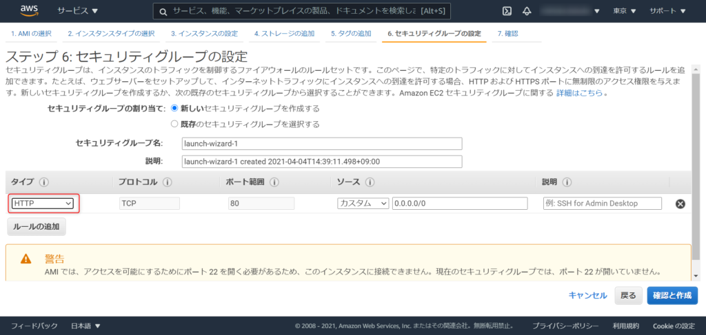

セキュリティグループを作成します。初期値でSSHのポート22が定義されていますが、SSMを利用するためSSHは不要で、HTTPの80ポートを開放します。タイプのプルダウンをHTTPに変えるだけです。  
そして「確認と作成」ボタンを押して、これまでの入力内容を確認してインスタンス起動をします。

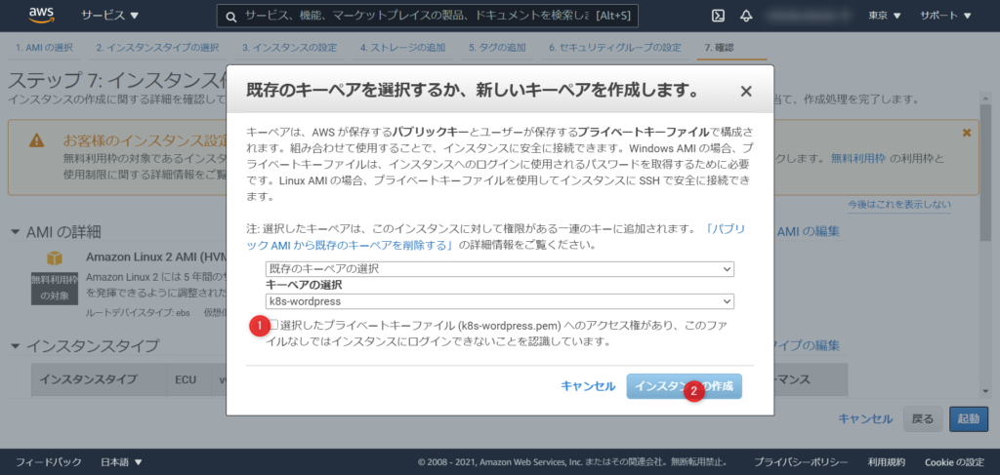

キーペアについて聞いてきますが、SSH接続しないので公開鍵を使用しないです。無ければ作成しなければならないですが、使わないので画面の指示通りで問題ないです。

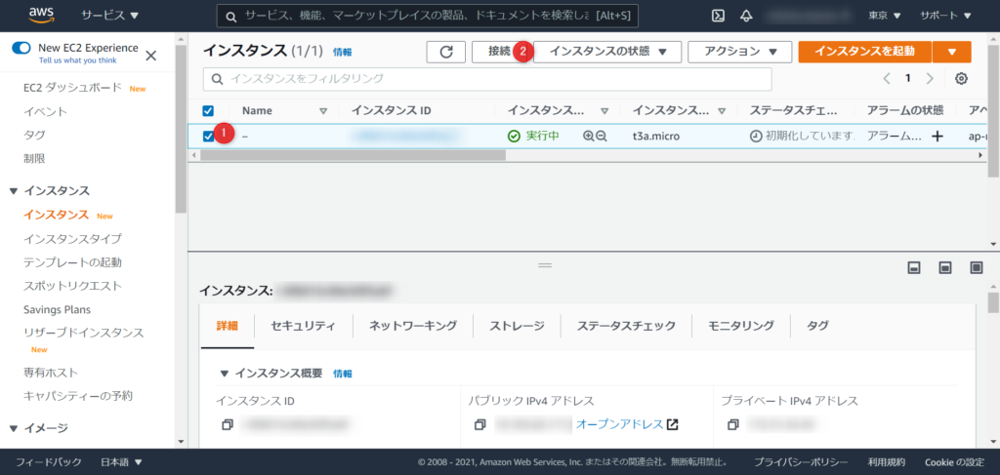

すると、インスタンスが起動されます。対象レコードを選択すると、画面下部に詳細が見れるようになったり、停止などのアクションができるようになります。  
SSMでアクセスするには、選択した状態で、「接続」ボタンを押します。

セッションマネージャのタブを選択して、「接続」をするとまるでSSHしたようにCLIでインスタンスにアクセスすることが出来ます。

※この時エラーが発生することがありますが、原因は恐らく、①SSMエージェントがまだ起動していないか、②ロール設定誤りかと思われます。  
①：インスタンスが起動して、SSMエージェントが動いていないとアクセスできません。少し(1~2分程)待って画面リロードしてみましょう。  
②：数分待っても変わらない場合は、AmazonEC2RoleforSSMポリシーを持つロールがインスタンスにちゃんとアタッチされているかを確認してみましょう。

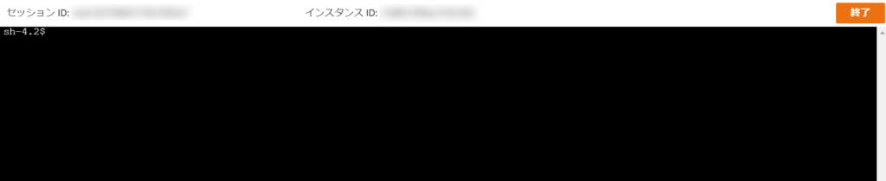

黒いコンソール画面が表示されれば、インスタンスが起動してSSMでのアクセス成功です。インスタンスを操作していきましょう。
