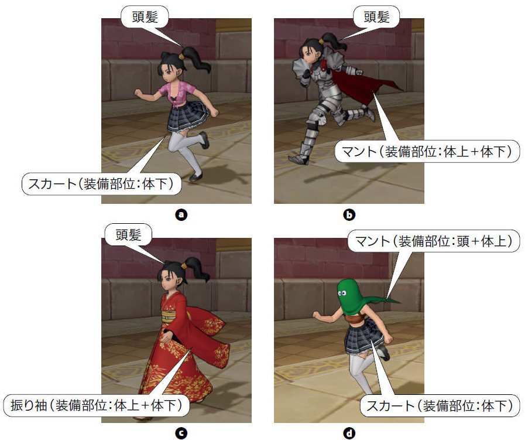
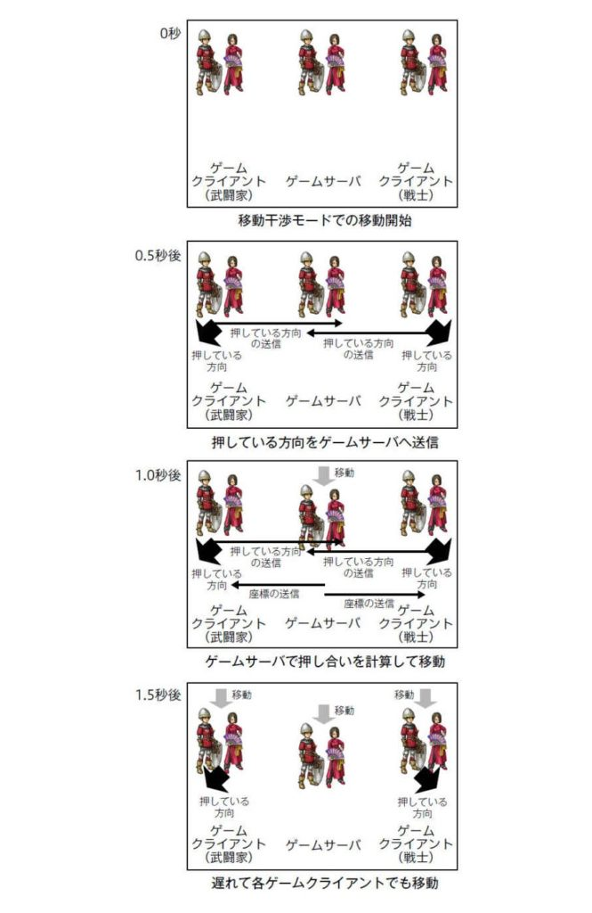

### はじめに

技術評論社が出している、「ドラゴンクエストXを支える技術 ─ 大規模オンラインRPGの舞台裏」を読みましたのでその書評です。"〇〇を支える技術"シリーズの一冊です。

著者は技術責任者でもあった青山プロデューサーです。著者のこだわりによりプログラミングやドラゴンクエストXの事前知識がなくても読み進められるよう丁寧に解説されているので、技術者やドラゴンクエストXのプレイヤーでなくても、楽しめる内容かと思います。

かくいう私は、ドラクエは何シリーズかプレイしたことはありますが、ドラクエXは未プレイです。また、エンジニアではありますが、ゲームプログラミングに触れたことはありません。ただ、システム開発/運用には携わったことはあるので、ドラクエXという大人数のユーザを抱えるアプリケーションの運用について興味深く読ませてもらいました。

[ドラゴンクエストXを支える技術](//af.moshimo.com/af/c/click?a_id=1041250&p_id=56&pc_id=56&pl_id=637&s_v=b5Rz2P0601xu&url=http%3A%2F%2Fbooks.rakuten.co.jp%2Frb%2F15664679%2F)

posted with [ヨメレバ](https://yomereba.com)

青山公士 技術評論社 2018年11月

[楽天ブックス](//af.moshimo.com/af/c/click?a_id=1041250&p_id=56&pc_id=56&pl_id=637&s_v=b5Rz2P0601xu&url=http%3A%2F%2Fbooks.rakuten.co.jp%2Frb%2F15664679%2F)

[Amazon](//af.moshimo.com/af/c/click?a_id=1041250&p_id=170&pc_id=185&pl_id=4062&s_v=b5Rz2P0601xu&url=https%3A%2F%2Fwww.amazon.co.jp%2Fexec%2Fobidos%2FASIN%2F4297101742)

[Kindle](//af.moshimo.com/af/c/click?a_id=1041250&p_id=170&pc_id=185&pl_id=4062&s_v=b5Rz2P0601xu&url=https%3A%2F%2Fwww.amazon.co.jp%2Fgp%2Fsearch%3Fkeywords%3D%25E3%2583%2589%25E3%2583%25A9%25E3%2582%25B4%25E3%2583%25B3%25E3%2582%25AF%25E3%2582%25A8%25E3%2582%25B9%25E3%2583%2588X%25E3%2582%2592%25E6%2594%25AF%25E3%2581%2588%25E3%2582%258B%25E6%258A%2580%25E8%25A1%2593%26__mk_ja_JP%3D%2583J%2583%255E%2583J%2583i%26url%3Dnode%253D2275256051)

## プロジェクト体制

### 堀井雄二さんの存在

> 絶対的な責任者が存在し、その決定が明確だからこそ、各スタッフが個々人の感覚で自由に意見を述べても、最終的には方向性が定まります。つまり、自由な意見交換が可能になり、風通しの良さにつながると考えます。
> 
> 引用：Column 絶対的な責任者がいると風通しが良くなる？

どんなシステム開発にもプロジェクト体制はありますが、ことドラクエXにおける最たる利点としては上記の堀井雄二さんの存在だと思います。私のシステム開発の経験としても、的確に信頼感/納得感を伴った意思決定をしてもらえる存在はありがたいことこの上ないです。

## 開発の苦悩と工夫

### メモリ使用量を考慮した開発

> 家庭用ゲーム機での開発は、メモリ使用量がボトルネックになるケースが多いです。そのためメモリの無駄遣いかもしれないソースコードに筆者たちは敏感なんですよ！
> 
> 引用： Column プログラマークイズ

データを扱う構造体を作成する時、メモリサイズを明示させているそうです。これは私が携わったりしているWebアプリケーション開発の感覚とは異なると感じました。確かにメモリは貴重なリソースですが、そこまでしてカツカツに有効利用しようとするのはゲームプログラミングならではだと思いました。

### 試行錯誤したい部分を実装するための仕組み

> ゲームのおもしろさは、実際にプレイすることでわかる部分が多いです。そのため実行速度より、試行錯誤のしやすさを優先したいことがあります。ゲーム開発ではその箇所にスクリプトを使用します。
> 
> 引用： Lua──試行錯誤したい部分の実装

Lua（るあ）と呼ばれるスクリプト言語を用いて、"試しに実装してみて動かしてみる"ということをできるようにしているそうです。こうした開発のしやすさを意識した環境作りは大事だと感じました。システム開発の現場でもアジャイルという、「動くものを早く作ってユーザに見てもらう」手法が流行っていますが、根っ子が同じだと思いました。昨今求められる要求が複雑であるなか、机上の空論ではなく動いているところを見たいというのは当然なのかもしれません。

### 独自プロトコル

> Vceは、スクウェア・エニックスの関連会社が開発したオンラインゲーム用プロトコルです。
> 
> Vceはステートフルなプロトコルです。ステートフルとは、クライアント／サーバ型のオンラインゲームやオンラインサービスにおいて、サーバがクライアントの状態を保持するしくみです。毎回の通信ではその状態をあらためて送る必要がないため、継続通信の場合は通信量が必要最小限で済みます。
> 
> 引用：Vce──オンラインゲーム用プロトコル

効率やパフォーマンス向上のために自らプロトコルを作ったのは驚きです。かなり大変なはずです。

通信と言ったらまずhttpプロトコルが浮かびますが、メリット/デメリットあります。ここではステートレスであることを大きなデメリットと考えて自作に至ったようです。確かにオンラインゲームは特に連続通信が発生し続けるのでステートレス(状態を保持できない)ことは無視できなさそうです。

## ゲーム部分の実装工夫

### 装備（マント）の物理演算

長い髪の毛やマントなどが、走ったりするとたなびくように動くとキャラクターに躍動感がでます。こうした現実世界における重力や慣性といった法則にしたがった動きをシステム上で演算することを物理演算と言います。しかし、この物理演算は計算量が多いのでシステム負荷が高いです。

そこで、仕様として物理演算するのは2ヶ所に制限することとしたそうです。そうやって装備品を工夫することで、髪+マント+スカートといったような3ヶ所物理演算するような組み合わせを出来ないようにしています。下図のdが顕著に分かるかと思いますが、あえて髪の毛が出ないようなマントのデザインとなっています。

<figure>

<figcaption>

引用：図6.20 物理骨を含む部位と装備

</figcaption>

</figure>

（やっぱりマントがたなびくのはカッコいいですもんね。装備として絶対必要とと思います。）

### 移動干渉

多くのオンラインゲームでは、キャラクター同士が同じ位置に重なって被って見えることを許容しています。しかしドラクエXではそうではなく、同じ位置に重なることはなく、押し合い(要はこれが移動干渉)が発生します。重さなどのパラメータを元に、相手のキャラクターを押し出したり、自分が押し戻されたりします。こちらのほうが自然ですが、処理量がとても増えてシステム負荷が上がってしまいます。重なってもいいなら自由に移動できますが、移動干渉があると、各キャラクター全ての移動の前にその場所に移動できるか計算しなければならないので、ユーザ数や敵キャラクター、岩などのオブジェクトの分だけ演算が必要です。

以下が移動干渉の例です。要はクライアント側の入力をサーバサイドで計算し、その結果がクライアント側で表示されます。レスポンス遅延はありますが、押し合うというのはユーザ操作としては自然で、ゲーム性を高めます。パフォーマンス的な難しさを乗り越えてまでも対応すべきとしたことにも頷けます。

<figure>

<figcaption>

引用：図8.5 移動干渉を実現するための移動処理

</figcaption>

</figure>

## 運用における苦労

### リリース後のほうが多忙

> オンライン非対応のゲームはリリース版の完成がすべてでした。そのためマスタアップには全神経を注ぎますが、完了したら長期休暇を取得し、旅行にいくなどリフレッシュしていました。筆者にはこれが普通でした。
> 
> 引用:Column リリース後のほうが多忙

Webシステムでは当たり前のことですが、PlayStationやファミコン(古)といったゲーム開発にはなかった感覚かなと思われます。

### チートとの戦い

> 発覚後にはチート行為の実施者のアカウントを利用停止にしており、一応の決着はついています。しかし、オンラインショッピングサイトのアプリケーション評価で「チートが蔓延しているゲーム」と書かれるなど、この1件が深い傷跡を残しています。
> 
> 引用:チート防止方法── ゲームサーバで防ぐことが基本

6年間の運営の中で、明確に問題となったチート(不正)行為が上記のことだそうです。犯人は悪徳企業などではなく一般ユーザだったそうです。軽い気持ちで一般ユーザが不正アクセスするというのはゲームならではの問題かなと思いました。

不正に対する対策は、大きく二点で、検知と難読化だそうです。サーバログから人間に不可能な動きなどを適宜チェックして検知する仕組みを設けていたり、特にクライアント側のプログラムは難読化を行いセキュリティホールを探しにくくしているそうです。

## 終わりに

ドラクエという世界に名の知れた巨大なコンテンツなので、だからこその苦労も読み取れましたし、逆にシステム開発との共通点も見つけられました。プレイヤーの皆さんはこうした苦労や工夫を知った上でプレイするとまた違った楽しみを感じられるかもしれません。

[ドラゴンクエストXを支える技術](//af.moshimo.com/af/c/click?a_id=1041250&p_id=56&pc_id=56&pl_id=637&s_v=b5Rz2P0601xu&url=http%3A%2F%2Fbooks.rakuten.co.jp%2Frb%2F15664679%2F)

posted with [ヨメレバ](https://yomereba.com)

青山公士 技術評論社 2018年11月

[楽天ブックス](//af.moshimo.com/af/c/click?a_id=1041250&p_id=56&pc_id=56&pl_id=637&s_v=b5Rz2P0601xu&url=http%3A%2F%2Fbooks.rakuten.co.jp%2Frb%2F15664679%2F)

[Amazon](//af.moshimo.com/af/c/click?a_id=1041250&p_id=170&pc_id=185&pl_id=4062&s_v=b5Rz2P0601xu&url=https%3A%2F%2Fwww.amazon.co.jp%2Fexec%2Fobidos%2FASIN%2F4297101742)

[Kindle](//af.moshimo.com/af/c/click?a_id=1041250&p_id=170&pc_id=185&pl_id=4062&s_v=b5Rz2P0601xu&url=https%3A%2F%2Fwww.amazon.co.jp%2Fgp%2Fsearch%3Fkeywords%3D%25E3%2583%2589%25E3%2583%25A9%25E3%2582%25B4%25E3%2583%25B3%25E3%2582%25AF%25E3%2582%25A8%25E3%2582%25B9%25E3%2583%2588X%25E3%2582%2592%25E6%2594%25AF%25E3%2581%2588%25E3%2582%258B%25E6%258A%2580%25E8%25A1%2593%26__mk_ja_JP%3D%2583J%2583%255E%2583J%2583i%26url%3Dnode%253D2275256051)
