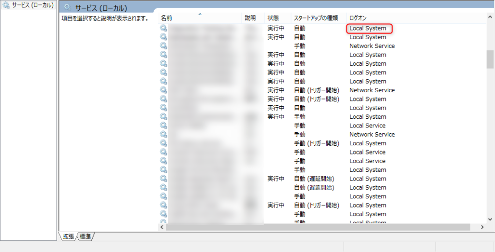

Windowsサービスに登録されているアプリケーションのために環境変数を新規追加したり変更した場合には、**マシンの再起動**が必要です。サービスの再起動などでは環境変数は反映されません。  
「環境変数設定が全然反映されない！」とハマった場合はこのあたり確認してみてください。

## 条件

- Windowsサービスに登録されているアプリケーション
- そのサービスが「Local System」ユーザで実行されている
- 環境変数を参照している
- その環境変数を追加/更新/削除などの変更を加えている

<figure>

<figcaption>

対象のWindowsサービスがどのユーザで実行されているかの確認箇所  

</figcaption>

</figure>

## 対応

Windowsマシンを再起動する。

## 根拠

以下、公式にドキュメントで回答があります。

- [Changes that you make to environment variables do not affect services that run under the Local System account until you restart Windows](https://support.microsoft.com/en-us/help/821761/changes-that-you-make-to-environment-variables-do-not-affect-services)（英語版元記事）
- [環境変数への変更には Windows を再起動するまで、ローカル システム アカウントで実行されているサービスは影響しません](https://support.microsoft.com/ja-jp/help/821761/changes-that-you-make-to-environment-variables-do-not-affect-services)（日本語訳版）
