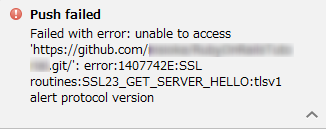
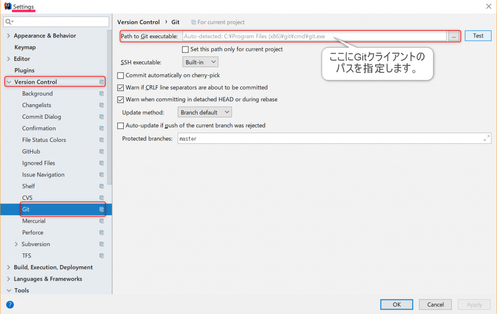

## 事象

githubにpushしようとしたら以下のようなエラーが発生しました。ちなみにInteliJで操作しました。

Failed with error: unable to access 'https://github.com/nisioka/RubyOnRailsTutorial.git/': error:1407742E:SSL routines:SSL23\_GET\_SERVER\_HELLO:tlsv1 alert protocol version

## 原因

以下のgithubのブログで報知されている通り、githubのセキュリティ向上のため、TLSのVersion1.0と1.1を無効にしたそうです。故に、TLSのVersion1.2に対応していないGitクライアントソフトを使用していると今回のようなエラーが発生してしまいます。 https://githubengineering.com/crypto-removal-notice/

> (補足)SSL/TLSについて。
> 
> これらはセキュリティのプロトコルで、古くからの風習で総称してSSLとして呼ばれることも多いです。バージョンとしては、{SSL1.0、SSL2.0、SSL3.0、TLS1.0、TLS1.1、TLS1.2}などがあります（右に行くほど新しい）。このうち、SSL系は重大な脆弱性が見つかっており、基本的に使用してはならないというのが通説です。TLS1.0や1.1も脆弱性が見つかっているのですが、それほど致命的でないので許容していることも多いです。ただもちろんTLS1.2にするのがセキュリティ上、より安全ではあります。
> 
> ですので、GitHubが今回の対策をとったのは意識の高さの現れであると言えます。

## 対策

使用しているGitクライアントソフトの最新版では、基本的にTLS1.2対応がなされているはずなので、バージョンアップをすれば解決されます。

### 手順1

最新のGitクライアントをインストールします。Windowsなら例えば[こちら](https://gitforwindows.org/)でよいと思います。使用しているクライアントが別であればそれの最新版をインストールしましょう。

### 手順2（InteliJを使用している場合）

InteliJにGitクライアントを教えてあげる必要があるかもしれません。

Settings＞Version Controll＞Gitに設定箇所があります。（最後のところはGitHubではないので選択誤りに注意。）ここの"Path to Git executable"に手順1でインストールまたはアップデートしたGitクライアントソフトのパスを指定します。ただし、多くの場合、以下の画像にある通り、"Auto-detected"と、自動で捜索してくれているので、それに間違いがないか確認すれば大丈夫です。

## 結論

TLS1.2に対応したGitクライアントにすれば良いということでした。 InteliJからもそのGitクライアントのパスを指定させれば大丈夫です。（私の場合ですと、Railsインストーラによってそれに同梱されているGitが指定されていて、変更の必要を余儀なくされました。）
