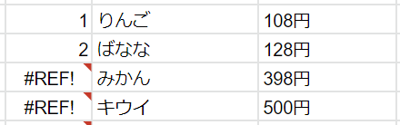
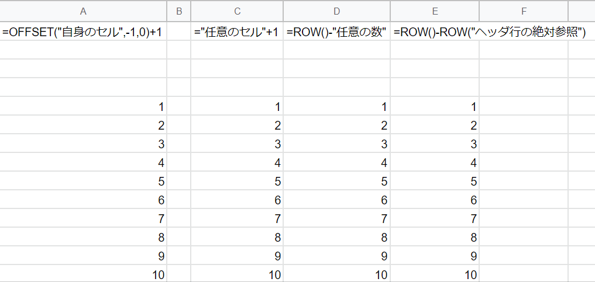
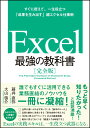

エクセル表で行に番号を表示するということはよくあると思います。オートフィルを使って番号を振ったりしても良いですが、後から行を追加や削除したときに振り直すのは面倒なのでセルに式を入力したいです。ただ、下手な式だと以下のように**参照エラーで"#REF!"**となることが発生してしまいます。

<figure>



<figcaption>

連番の式が壊れる例

</figcaption>

</figure>

### 結論：ぼくのかんがえたさいきょうのれんばんしき

以下の式が行の追加や削除をしても壊れにくく使い勝手が最も良いと思っています。

```
=OFFSET("自身のセル",-1,0)+1
```

少々複雑で覚えにくさはありますが、この式の肝は参照しているセルが自分自身ということです。なのでセルの追加や削除された際のセルの再参照をするときに参照セルが意図せずずれたり、参照エラーとなることが少ないです。

### 比較

以下のよくある式とも比較してみて、どういう時に式が壊れるかを示し、上記の式の壊れにくさをアピールできればなと思います。

#### ■よくある式(1)

```
="1つ上のセル"+1
```

至極単純なのは良いのですが、セルを削除すると参照先を失い、下全てが参照エラーになります。

#### ■よくある式(2)

```
=ROW()-"任意の数"
```

これも単純でわかりやすいですが、連番が始まるより上の列に追加や削除があると番号がずれてしまいます。

#### ■よくある式(3)

```
=ROW()-ROW("ヘッダ行の絶対参照")
```

これは比較的堅牢なのですが、唯一弱点があり、絶対参照しているヘッダ行を削除すると参照エラーになってしまいます。

### 比較まとめ

上記のそれぞれの式がある状態で、行の削除、追加などをしてみたGIFを作成しました。ね？OFFSET式強いでしょ？



[](//af.moshimo.com/af/c/click?a_id=1041250&p_id=54&pc_id=54&pl_id=616&s_v=b5Rz2P0601xu&url=https%3A%2F%2Fitem.rakuten.co.jp%2Fbook%2F14531947%2F)

[Excel 最強の教科書［完全版］--すぐに使えて、一生役立つ「成果を生み出す」超エクセル仕事術 \[ 藤井 直弥 \]](//af.moshimo.com/af/c/click?a_id=1041250&p_id=54&pc_id=54&pl_id=616&s_v=b5Rz2P0601xu&url=https%3A%2F%2Fitem.rakuten.co.jp%2Fbook%2F14531947%2F)

posted with [カエレバ](https://kaereba.com)

[楽天市場](//af.moshimo.com/af/c/click?a_id=1041250&p_id=54&pc_id=54&pl_id=616&s_v=b5Rz2P0601xu&url=https%3A%2F%2Fsearch.rakuten.co.jp%2Fsearch%2Fmall%2FExcel%2520%25E6%259C%2580%25E5%25BC%25B7%25E3%2581%25AE%25E6%2595%2599%25E7%25A7%2591%25E6%259B%25B8%2F-%2Ff.1-p.1-s.1-sf.0-st.A-v.2%3Fx%3D0)

[Amazon](//af.moshimo.com/af/c/click?a_id=1041250&p_id=170&pc_id=185&pl_id=4062&s_v=b5Rz2P0601xu&url=https%3A%2F%2Fwww.amazon.co.jp%2Fgp%2Fsearch%3Fkeywords%3DExcel%2520%25E6%259C%2580%25E5%25BC%25B7%25E3%2581%25AE%25E6%2595%2599%25E7%25A7%2591%25E6%259B%25B8%26__mk_ja_JP%3D%25E3%2582%25AB%25E3%2582%25BF%25E3%2582%25AB%25E3%2583%258A)
