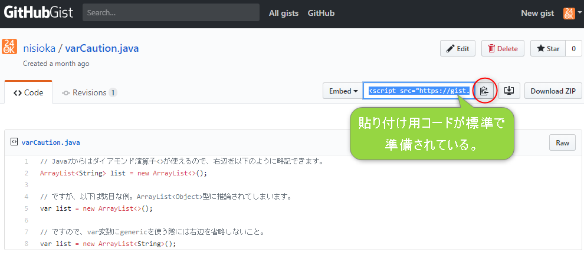
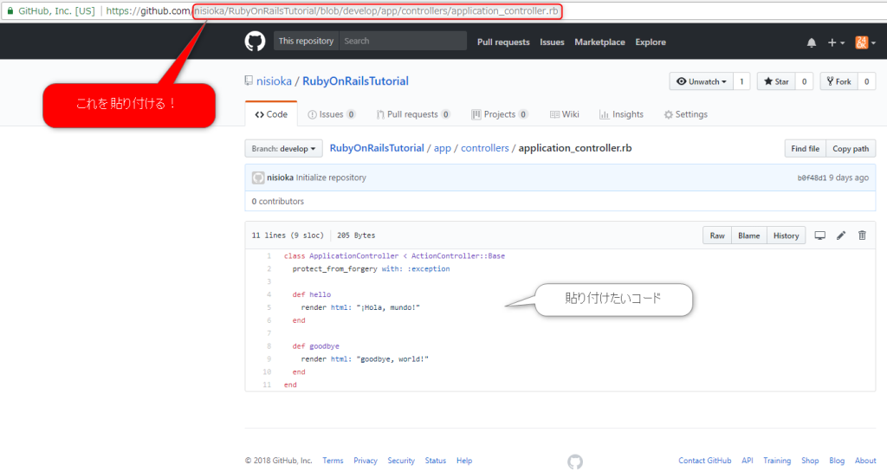
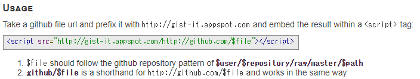

## はじめに

GitHubにあるコードをブログで紹介したい時に[gist-it](https://gist-it.appspot.com)という便利なサービスがあります。なのですが、ブログに貼り付けても上手く表示されなくてハマったので、注意点も交えつつ紹介したいと思います。

## gist-itとは

そもそもgist-itとは何かと言いますと、以下のようにGitHubのコードをブログに貼り付けて表示することができるようになる外部サービスです。GitHubとは関係のないサードパーティのサービスです。 gist-it貼付け例：

ちなみに、似たようなサービスに[GitHubGist](https://gist.github.com/)（略してgist）というものがあり、こちらはGitHubのサービスで、簡単なコード紹介を**別途**コミットすればブログ貼付けコードも出力できるので、簡単に利用できます。ただ、既にGitHubにあるコードだと、それをコピー&ペーストして作り直さなければならないので、二重管理になってしまうのでよろしくありません。 gist画面例：  gist貼付け例：

## gist-itの使い方

 

結論から言うと、以下のコードを貼ればよいです。

> 

表示させたいコードをGitHubで表示して、URLで"github.com/"以降を上記コードのgithub/以降に指定してやればよいです。 

## ハマりポイント（注意点）

英語ではありますが、以下で使用方法は説明されています。

https://gist-it.appspot.com

ここをしっかりと読みすぎたせいで、いくらやってもコードが表示されずハマりました。

① "Usage"に書いてあることが間違っている 以下、上記サイトのキャプチャです。Usage、つまり使い方として説明があるのですが、**`$user/$repository/raw/master/$path`**と指定するように書かれていますが、ここの**"raw"**というところが、**"blob"**であるべきです。騙されました。。（GitHubのURL変更があったのでしょうか？） 

② HttpとHttpsを間違えないこと 上記サイトは、httpとhttpsの両方が用意されていて、どちらも同じように使うことができます。ただし、当ブログのように、Httpsで運用している場合、HttpとHttpsが混在してはいけないので、Httpsのコードとして貼り付ける必要があります。ここで"Httpsのコード"と言っているのは"https://gist-it.appspot.com"の先頭部分のことです。 逆にHttpで運用されているサイトの場合は、HttpでもHttpsでもどちらでも良いです。ただ、Httpsとして弊害はないので、Httpsを指定するということで良いでしょう。 これも上記画像の"Usage"で示されているコードがhttpだったのでそれに合わせてしまってハマりました。

## 終わりに

注意点としては単純なものでしたが、他の人が同じハマりをしないようにここに紹介しました。サービス自体はとても便利で、見え方も好きなので今後も使っていきます。できればGitHubが公式でサポートしてくれるのが一番ラクなんですけどね。
