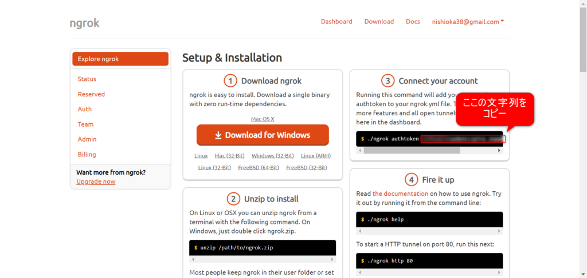
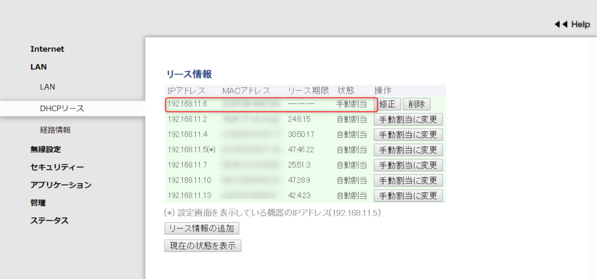
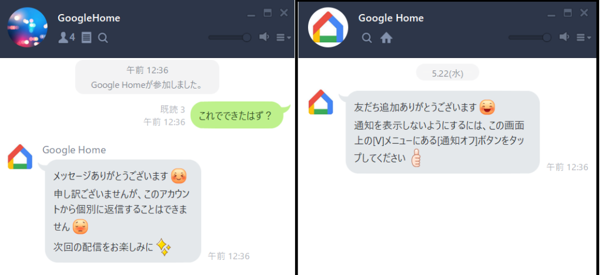
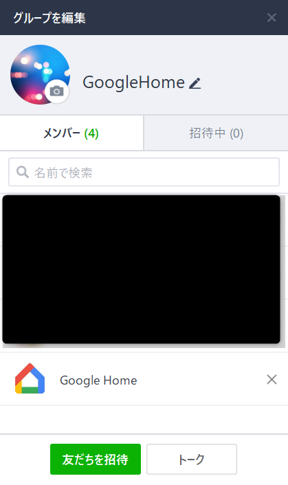

表題の通り、例えば外にいる人がLINEで「これから帰ります」と打つと、家のGoogle Homeが読み上げてくれて、LINEに気づかなくても分かるようになるという生活ハックです。

逆の、**Google HomeからLINEへの書き込み**はIFTTTなどを使うと簡単にできるので以下を参照ください。  
  
[https://qiita.com/jyoshida/items/f74afe3e421795cdd63c](https://qiita.com/jyoshida/items/f74afe3e421795cdd63c)

2019/7/5追記：ngrokのURLが一定時間で無効となってしまうやり方でした。認証トークンを指定する方法へ追記しています。

## 基本的な方針

以下の記事で紹介されている事がベースなのですが、ここで使っている「google-home-notifier」というライブラリが最近更新されておらずいくつか修正しなければなりませんでした。それらを都度やるのも面倒なので私のほうでこのリポジトリをforkし、「LINEからのメッセージを受信」「Raspberry Pi 3で動かす」向けに編集して、なるべく作業量が少なくなるようにしています。

参考URL：

https://qiita.com/daaaaaasuke/items/5e95983166667094f42f

## 動作要件

- Raspberry Pi 3
    - 常に電源が入りっぱなしの常時稼働ができること
    - Gitが入っていること（なければ入れてください）
- Google Home

## ngrokの準備

LINEという外部のサービスから自宅のGoogle Homeへ通信するためには外部へ公開するURLを用意しなければなりません。そのサービスがngrokです。アカウント登録して認証トークンを取得します。

まず、以下のURLにアクセスするとログイン画面がでますので、アカウント登録をしてください。メールアドレスでの登録か、GithubやGoogleアカウントがあればその情報で楽に登録ができます。

https://dashboard.ngrok.com/get-started

続いて、ログインした状態で上記URLにアクセスすると以下の画面が出るので、そこから認証トークンをコピーしておいてください。



## Google Home の準備

理想を言えば、自動でGoogleHomeのIPを見つけ出せればよいのですがそこまで対応できていないため、まずご自身でGoogle HomeのIPを事前に調べておいてください。後ほど指定します。

また、ルータの再起動などによってIPアドレスが変わると設定変更などをしなければならなくなってしまうので、ご自宅のルータの設定によって、GoogleHomeに"固定IP"を割り当てておくことをお勧めします。

<figure>



<figcaption>

  
例）ルータのIPアドレス情報

</figcaption>

</figure>

## Raspberry Pi 3の準備

### google-home-notifier の準備

まず「google-home-notifier」をダウンロードします。ここで指定しているのは本家版ではなく、私がフォークして修正したものです。以下のコマンドをRaspberry Piのターミナル上で実行してください。

```
git clone https://github.com/nisioka/google-home-notifier.git
```

そして、そのディレクトリに以下の設定ファイルがあるので、先に調べた以下の情報に書き換えてください。

- "ngrok\_auth\_token": ngrokの認証トークン
- "googlehome\_ip": Google HomeのIPアドレス

google-home-notifier/config/default.json

<script src="https://gist-it.appspot.com/github/nisioka/google-home-notifier/blob/master/config/default.json"></script>

### node.jsのアップデート

ここからは少々ハマった部分です。。 Raspberry Piに元から入っているnode.jsが古く更新をしたいのですが、普通に"apt-get"コマンドなどでの更新だとこの後の手順が上手くいかなかったり特定のバージョンに対する依存関係があるようなので、少し面倒な手順をいくつか踏んでいます。

```
// 古いnode.jsを削除
sudo apt-get autoremove nodejs

// インストール場所の「/.nvm」ディレクトリを作成する。
mkdir .nvm
// nvmをダウンロード
git clone https://github.com/creationix/nvm.git .nvm/
// nvmを使えるようにする。
source .nvm/nvm.sh

// node.jsをnvmを用いてインストールする。
// もう少し新しいバージョンもありますが、バージョン8系でないと上手くいかないようです。
nvm install v8.16.0

// インストール前にnpmの初期設定をします。以下コマンドを打つとこちらの入力を求められますが、デフォルトのままで良いので、Enterを繰り返し押します。
npm init
// 新たにインストールしたnode.jsでgoogle-home-notifierをインストールします。
npm install google-home-notifier --no-audit

// LINEメッセージ受信サーバを起動します。
node google-home-notifier/server_for_line.js
```

上記コマンドを実行し、以下のようになれば成功です。「Endpoints：」の後にかかれているURLがLINEのメッセージを受領するWebHookというものになるのでこれを控えておきます。  
Raspberry Pi側の作業はこれで終了で、この状態のまま放置することになります。（ディスプレイやキーボード、マウスなどは外してOKです。）


以下を参考にしました：

https://qiita.com/ktetsuo/items/8c9cd5714e231aa6ae09

### LINE developersの設定

[LINE developers](https://developers.line.me/)にご自身のLINEアカウントでログインし、「Messaging API(ボット）をはじめる」で、新規Channelを作成してください。

以下のように設定してください。名前などは任意で良いです。

- Webhook送信：利用する
- Webhook URL：上記Raspberry Piの最後で表示されたEndpointsのURL  
    必ず「接続確認」を行い、「成功しました」となることを確認してください。上手くいけば「Hello World」と喋るはずです。
- Botのグループトーク参加：利用する
- 自動応答メッセージ：利用しない
- 友だち追加時あいさつ：利用しない


ちなみに、「自動応答メッセージ」と「友だち追加時あいさつ」で利用するを選ぶと、以下のように通知がくるので、不要と判断しています。



### LINEの設定

最後に、GoogleHomeに喋らせる専用のLINEグループを作成しましょう。  
上記で作成したチャネルを含んだグループを作成してください。このグループに書き込んだメッセージをGoogleHomeが喋ってくれます。



以上で設定完了です。

[](//af.moshimo.com/af/c/click?a_id=1041250&p_id=54&pc_id=54&pl_id=616&s_v=b5Rz2P0601xu&url=https%3A%2F%2Fitem.rakuten.co.jp%2Fplus99999%2Fm0005%2F)

[Google Home グーグルホーム スマートスピーカー](//af.moshimo.com/af/c/click?a_id=1041250&p_id=54&pc_id=54&pl_id=616&s_v=b5Rz2P0601xu&url=https%3A%2F%2Fitem.rakuten.co.jp%2Fplus99999%2Fm0005%2F)posted with [カエレバ](https://kaereba.com)[楽天市場](//af.moshimo.com/af/c/click?a_id=1041250&p_id=54&pc_id=54&pl_id=616&s_v=b5Rz2P0601xu&url=https%3A%2F%2Fsearch.rakuten.co.jp%2Fsearch%2Fmall%2Fgoogle%2520home%2F-%2Ff.1-p.1-s.1-sf.0-st.A-v.2%3Fx%3D0)[Amazon](//af.moshimo.com/af/c/click?a_id=1041250&p_id=170&pc_id=185&pl_id=4062&s_v=b5Rz2P0601xu&url=https%3A%2F%2Fwww.amazon.co.jp%2Fgp%2Fsearch%3Fkeywords%3Dgoogle%2520home%26__mk_ja_JP%3D%25E3%2582%25AB%25E3%2582%25BF%25E3%2582%25AB%25E3%2583%258A)
