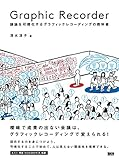
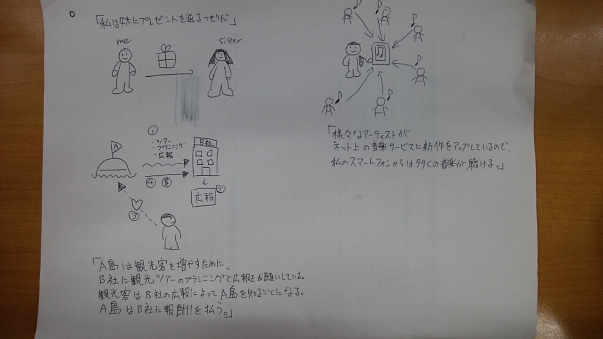

最近、TVの討論番組でグラフィックレコーディングなる"絵"や"色"をふんだんに使ってグラフィカルに表現する書紀をしているのを見ました。それがとても分かり易くて、「打ち合わせとかで意見を整理するのに使えそう！」と思ったので少し勉強してみようと思ったのがキッカケです。

ちなみに私は絵に対して得意不得意があるわけではありません。普通レベルの人と思ってください。

読んだ本はこちらです。

[Graphic Recorder ―議論を可視化するグラフィックレコーディングの教科書](//af.moshimo.com/af/c/click?a_id=1005417&p_id=170&pc_id=185&pl_id=4062&s_v=b5Rz2P0601xu&url=http%3A%2F%2Fwww.amazon.co.jp%2Fexec%2Fobidos%2FASIN%2F4802510284)

posted with [ヨメレバ](https://yomereba.com)

清水 淳子 ビー・エヌ・エヌ新社 2017-01-27

[Amazon](//af.moshimo.com/af/c/click?a_id=1005417&p_id=170&pc_id=185&pl_id=4062&s_v=b5Rz2P0601xu&url=http%3A%2F%2Fwww.amazon.co.jp%2Fexec%2Fobidos%2FASIN%2F4802510284)

[Kindle](//af.moshimo.com/af/c/click?a_id=1005417&p_id=170&pc_id=185&pl_id=4062&s_v=b5Rz2P0601xu&url=http%3A%2F%2Fwww.amazon.co.jp%2Fexec%2Fobidos%2FASIN%2FB01N5XFF4O%2F)

[楽天ブックス](//af.moshimo.com/af/c/click?a_id=1005417&p_id=56&pc_id=56&pl_id=637&s_v=b5Rz2P0601xu&url=http%3A%2F%2Fbooks.rakuten.co.jp%2Frb%2F14545732%2F)

[楽天kobo](//af.moshimo.com/af/c/click?a_id=1005417&p_id=56&pc_id=56&pl_id=637&s_v=b5Rz2P0601xu&url=https%3A%2F%2Fbooks.rakuten.co.jp%2Frk%2F7d848a4ec2323d88995ddedf606042ed)

## 感想

### 何が書かれているか

目次としては以下の通りでした。

- INTRODUCTION グラフィックレコーディングとは
- STAGE1 短い文章をグラフィックに変えてみよう
- STAGE2 話の全体をグラフィックで一枚の紙に整理してみよう
- STAGE3 グラフィックレコーディングで課題解決をしよう
- APPENDIX 場の目的に合わせてグラフィックレコーディングをアレンジしよう

導入として、そもそもグラフィックレコーディングとは何なのか～から始まり、簡単なお絵描きから一枚の絵、応用として実際の例示をしていくという流れて、とてもスムーズに入っていけました。

#### INTRODUCTION グラフィックレコーディングとは

文字通り、グラフィックレコーディングが何たるかについてわかりやすく説明してくれていました。特に効果として、「言葉だけでは齟齬が生じそうな場で、相互理解を深めるための共通言語といてはたらく。」と書かれていたところが、まさにそうだよなと思いました。

#### STAGE1 短い文章をグラフィックに変えてみよう

細かなグラフィックの描き方の指南から、実際に短文のストーリーを絵にしてみるという流れで説明されています。問題形式のように例文が提示されるので、実際に描きながら練習できます。 実際に私が描いたグラフィックレコーディングが以下です。「」書きの所が問題文です。

#### STAGE2 話の全体をグラフィックで一枚の紙に整理してみよう

続いて応用編で、もっと長いストーリーをグラフィックレコーディングしてみるというものです。どういう構成にして何を注力して描くかといったポイントを教えてくれています。一つ難しかったのは、キャッチーなグラフィックとするため、タイトルを強調したり、似顔絵を描いたりという手法が紹介されてましたが、似顔絵は厳しかったです。（練習すればできるのかな、、？）

こちらも練習問題があって、youtubeの動画をグラフィックレコーディングしてみようというものでした。話を聞いて整理しながら描くというのはやはり練習が必要だなと感じました。このあたりは実践も合わせて、いかに慣れるかですね。

#### STAGE3 グラフィックレコーディングで課題解決をしよう

ここからは練習ではなく、事例紹介といった形でした。どこかのワーキングショップだったりとかのグラフィックレコーディングが紹介されていました。こういう描き方もあるのか～という引き出しを増やすための読み物として読みました。

### 総評

全体的には、グラフィックがふんだんに使われていて大変読みやすかったです。

グラフィックレコーディング自体が難しいことはなく、実際にやってみるという一歩の勇気があれば誰でもできるなという実感です。

## 私なりのおすすめ学習方法

1. この本などを使って学習する際は、自宅よりも実際にグラフィックレコーディングを使う環境でやるといいと思います。自分（お絵描き練習中） 周りの人「何してるの？」 自分「グラフィックレコーディングというものを勉強していて～」、、、という流れを挟んでおくと、いざ実際にグラフィックレコーディングする時に、「あ、この前練習してたやつね」となって、最初にやるときのハードルが下がります。最初はやはり少し勇気がいりますからね。「こいついきなり何描きだしてるんだ？」と思われながらやるのは少ししんどい。。 私は会社の昼休みにやりました。
2. 手を動かしながらやる これは当然ではありますが、実際に色々描くことが必要なので、紙とペンを用意してやりましょう。なので通勤中に読んで～といったやりかたには向いていません。
