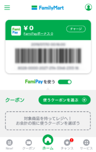
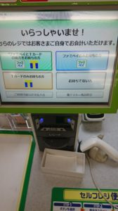
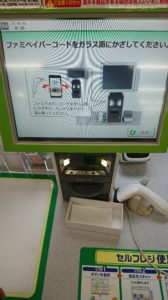

〇〇ペイが流行っていますが、コンビニエンスストア大手のファミリーマートもその事業に参入しました。その利用方法をまとめます。

## アプリ会員登録

まずは、ファミペイアプリをインストールする必要があります。  
旧ファミマアプリを使用していた方はこのファミペイアプリに置き換わります。既存アプリが更新されるのでアプリアップデートをしましょう。

### 必要なもの

- SMS受信可能な電話番号（要するに携帯電話）

### スマホOSに合わせてアプリをダウンロード

Android版

 

iOS版

## ファミペイの使用方法

### チャージ

〇〇ペイは基本的にプリペイド（事前支払い式）なので、まずはチャージして入金しておく必要があります。そのチャージ方法はファミペイでは以下の4つが用意されています。

#### レジでチャージ（現金）

「ファミペイに〇〇円チャージで」と店頭で言えば、その金額を支払うことでチャージできます。機械が苦手だったりする場合には確実ですが、レジが混んでいる場合などには少々心苦しいのが懸念かと思います。

#### クレジットカードでチャージ

こちらは、ファミマTカード（クレジット）のみ使えます。スマホやPCだけでチャージが完結しますので、できると大変便利です。  
加えて、現在「チャージ金額に対して最大15%還元」キャンペーンを行っていて大変お得です。

[https://www.family.co.jp/campaign/spot/1907\_famipay-bonus\_cp.html](https://www.family.co.jp/campaign/spot/1907_famipay-bonus_cp.html)

ファミマTカード（クレジットカード）はこちらから登録できます。

[https://ftcard.pocketcard.co.jp/card/](https://ftcard.pocketcard.co.jp/card/)

また、 ファミマTカードでのweb決済を行うために、「本人認証サービス（3Dセキュア）」に登録して有効化しておかなければなりません。その設定方法はこちらに公式の説明があります。

[https://ftcard.pocketcard.co.jp/3ds/](https://ftcard.pocketcard.co.jp/3ds/)

#### オートチャージ

こちらも、ファミマTカード（クレジット）のみ使える機能で、チャージ金額は一定金額を下回った場合に自動でクレジットカードからチャージが行われます。

#### FamiPayボーナスでチャージ

上記の「チャージ金額に対して最大15%還元」 などでもらえたりするポイントでチャージができます。

### 支払い方法

ファミペイアプリで、以下のバーコードを表示しましょう。下側のホームボタンを押せば表示されます。  
このバーコードをレジでスキャンすることで支払いをすることができます。

#### 通常レジ

通常通り商品をレジまで持っていって「ファミペイで支払います」と言えば使えます。その後上記のバーコードを、店員さんに読み取ってもらいます。

#### セルフレジ

最近ファミリーマートにはセルフレジといって、自分でお会計ができるレジ端末を置いているお店が増えています。簡単にご紹介します。

まずはファミペイをお持ちの方のボタンを押しましょう。

続いて、以下のように指示されるので、お持ちのファミペイアプリのバーコードを画面下のスキャナに読み取らせます。

その後も画面の指示に従い、商品をスキャンして購入できます。

## 終わりに

準備は多少ありますが、こうして新たな決済方法が使えるようになります。あくまで決済方法の一つではありますが、今後も利用していくかは好みです。新規参入でいろいろと怪しいところも多いですが、お得なキャンペーンもあったりしますので利用を検討してみてはいかがでしょうか。
