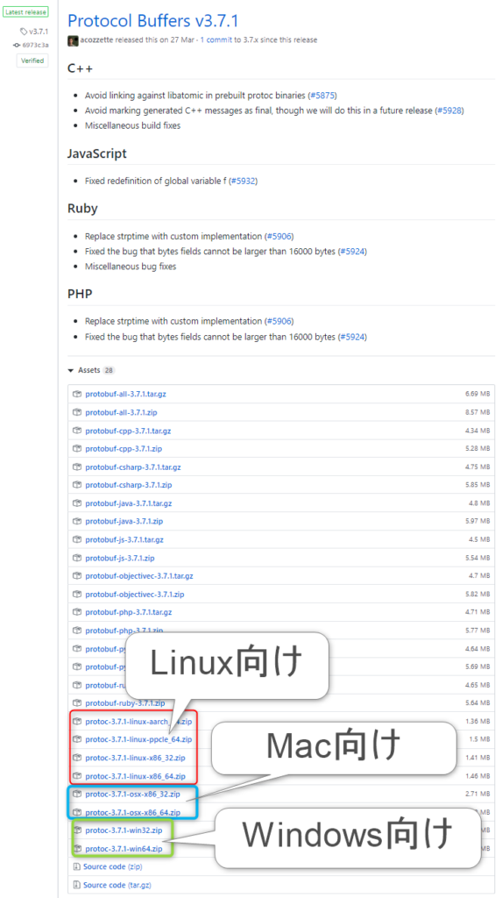
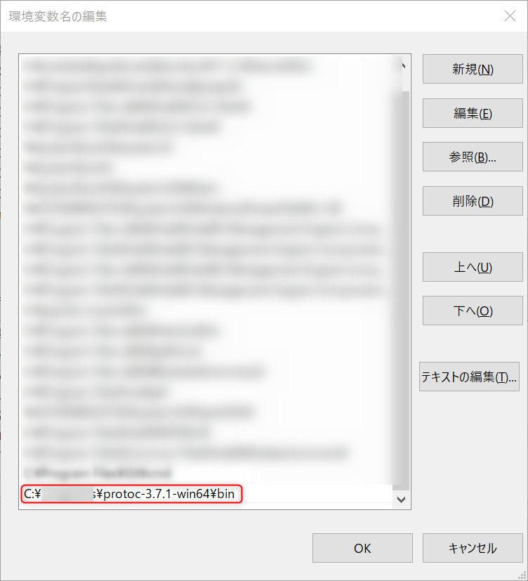
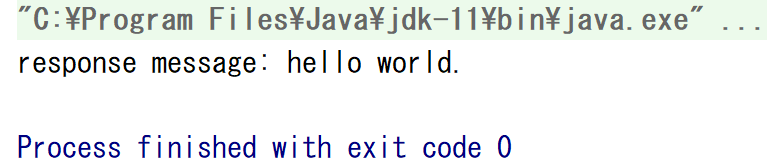
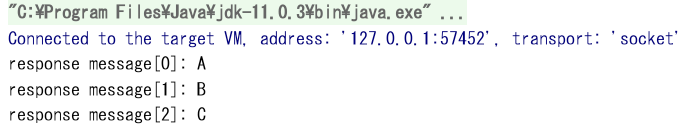
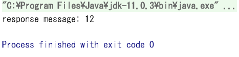
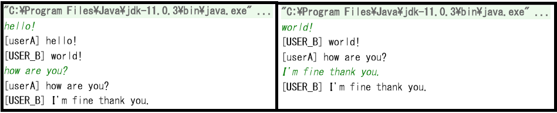

gRPCとは、Googleが開発したRPC（ Remote Procedure Call、遠隔手続き呼び出し）フレーム ワーク です。

gRPCについての日本語書籍はまだ中々少なかったのですが、2019年4月25日発売のWEB＋DB PRESS（Vol．110）にgRPC特集が組まれており分かりやすい情報だったのでご紹介です。その中でGo言語での実装サンプルがあったので、それのJava版として置き換えて実際にやってみました。

[WEB＋DB　PRESS（Vol．110（2019））](//af.moshimo.com/af/c/click?a_id=1041250&p_id=56&pc_id=56&pl_id=637&s_v=b5Rz2P0601xu&url=http%3A%2F%2Fbooks.rakuten.co.jp%2Frb%2F15835538%2F)

posted with [ヨメレバ](https://yomereba.com)

技術評論社 2019年05月

[楽天ブックス](//af.moshimo.com/af/c/click?a_id=1041250&p_id=56&pc_id=56&pl_id=637&s_v=b5Rz2P0601xu&url=http%3A%2F%2Fbooks.rakuten.co.jp%2Frb%2F15835538%2F)

[Amazon](//af.moshimo.com/af/c/click?a_id=1041250&p_id=170&pc_id=185&pl_id=4062&s_v=b5Rz2P0601xu&url=https%3A%2F%2Fwww.amazon.co.jp%2Fexec%2Fobidos%2FASIN%2F4297105330)

[Kindle](//af.moshimo.com/af/c/click?a_id=1041250&p_id=170&pc_id=185&pl_id=4062&s_v=b5Rz2P0601xu&url=https%3A%2F%2Fwww.amazon.co.jp%2Fgp%2Fsearch%3Fkeywords%3DWEB%25EF%25BC%258BDB%25E3%2580%2580PRESS%25EF%25BC%2588Vol%25EF%25BC%258E110%25EF%25BC%25882019%25EF%25BC%2589%25EF%25BC%2589%26__mk_ja_JP%3D%2583J%2583%255E%2583J%2583i%26url%3Dnode%253D2275256051)

## 環境準備

### 環境情報

- Windows 10 Home edition
- Java 11
- protoc-3.7.1
- IntelliJ : 2019.1.3  
    プラグイン : Protobuf Support v0.10.2
- gradle 5.1.1

### Protocol Buffersのインストール

.protoファイルをコンパイルするための、「protoc」コマンドをインストールします。  
[https://github.com/protocolbuffers/protobuf/releases](https://github.com/protocolbuffers/protobuf/releases)  
上記にアクセスし、該当するOSとbit数のものをダウンロードしてください。ここでは、"protoc-3.7.1-win64.zip"を選択しました。

これを解凍し、任意のディレクトリに置いてください。そしてこれをコマンドとして叩きたいのでパスを通しておきます。（Windows 10で環境変数の編集が見やすくなったのいいですよね。）  
その後「protoc --version」でバージョン番号が表示されることを確認しておいてください。

<figure>

<figcaption>

Windowsで環境変数PATHに設定しているところ。

</figcaption>

</figure>

## gRPCを使った開発フロー①（単項RPC）

このチュートリアルでは、まずクライアントからの入力値をそのままレスポンスするサーバを例に進めていきます。

### インターフェースファイル(.proto)を定義する

以下の通り、echo.protoファイルを作成します。これは単純に、 一つの文字列を受け取って、 一つの文字列を返すというインターフェースを表します。

### Javaコードの自動生成（gradle）

以下のbuild.gradleの定義をして、「gradle generateProto」コマンドを実行することで、.protoファイルからJavaのコードを自動生成してくれます。  
build.gradleで定義していることとしては（ややおまじない的ですが）、以下の通りです。

- gRPCのプラグインの依存関係と実行の定義
- Java9以降の場合向けに、javax.annotationの依存を追加。  
    （gRPCで自動生成されるアノテーションの中に、Java9でクラスパスから外されたパッケージが使用されているので、コンパイルができなくなります。なのでその依存関係を追加する必要があります。）
- IntelliJのソース格納場所定義  
    （自動生成されたJavaファイルをソースファイルとして認識させる。）

### サーバサイドのServiceを実装する。

入出力のIFが定義されたので、その中身の挙動を実装します。このサンプルでは入力値をそのまま出力（echo）するという仕様なのでそれを以下の通り表現します。

.protoファイルに従って、「EchoServiceImplBase」なるクラスが自動生成されているのでそれを継承することでIF定義にそった入出力が強制されます。

このServiceクラスの実装時のポイントとして、返却がobserver パターンで実装されています。通常の入出力をメソッドで表すとき、入力を引数として与え、出力は戻り値となるのが自然ですが、gRPCでは、入力が引数となるのはそうですが、出力も引数のStreamObserverで渡しそれに値をセットするという動きを実装することになります。

また、gRPCではリクエスト対レスポンスの組み合わせを、{1対1}、 {1対多}、 {多対1}、 {多対多}と区別します。ここでは最もシンプルな（かつ、最もよく使う） {1対1}で実装するので、responseObserver.onNextで1つだけレスポンスをセットし、responseObserver.onCompletedで完了させます。

以上を踏まえて、このメソッド内では仕様に従い、リクエストのmessageを受け取り、それをそのままレスポンスのmessageにセットするということを実装しています。

### サーバを立ち上げる

ここは特に特筆すべきことはなく、gRPCの動作確認のためにサーバを立ち上げるためのコードです。ただし、上で作成したServiceをサーバに紐づける必要はあります（#addService）。

ポート番号（50051）をclientと一致させておけば良いです。mainメソッドがあるので、単なるjavaアプリケーションとして起動すればサーバの準備は完了です。

### クライアントを実装する

ここではgRPCのstubを介して通信するクライアントアプリケーションを実装します。ManagedChanelで通信の設定を行いstubを作成します。この時の注意点は、サーバのポート番号と合わせることと、簡単のためサーバ証明書なしのローカル通信とするので"usePlaintext"をtrueで設定します。  
すると、stubのメソッドという形でリクエスト/レスポンスを扱うことができます。

こちらもmainメソッドのある単なるjavaアプリケーションなので、サーバを立ち上げている状態でクライアントを実行すると、以下のようにコンソールにレスポンスが表示されるはずです。

<figure>

<figcaption>

クライアントアプリの正常終了

</figcaption>

</figure>

ちなみにレスポンスした後のサーバアプリケーションでは、「java.io.IOException: 既存の接続はリモート ホストに強制的に切断されました。」が発生しますが、仕様です。

## gRPCを使った開発フロー②（サーバサイドストリーミングRPC）

次に、リクエスト対レスポンスの組み合わせが、 {1対多}となるケースの実装です。 ここでは、ファイルダウンロードを例に進めます。

### インターフェースファイル(.proto)を定義する

echoの時と同様に、まずインターフェースファイル(protoファイル)を作成します。echoとの大きな違いは、serviceのreturnが**stream**となっている点です。

### Javaコードの自動生成（gradle）

先程と同様に、「gradle generateProto」を実行することで、file.protoからjavaファイルが自動生成されます。

### サーバサイドのServiceを実装する。

同様にまたserviceを実装します。実際にありそうな処理ということでファイルダウンロードをイメージした実装になっていますが、ファイル読み込みのところは本質的ではないので読み飛ばしましょう。ここで大事なのは、ループ処理の中で、**responseObserver.onNextが複数回呼ばれること**です。これが多レスポンスを表しています。これだけで1対多のリクエスト/レスポンスを実装できるというのは、gRPCの直感的で強力な機能ではないでしょうか。

### サーバを立ち上げる / クライアントを実装する

ここもechoの時と対して変わらないので特筆すべきことはありません。

レスポンスがIteratorになることが違いで、クライアント側でループによりそれぞれのレスポンスを表示するようにしています。実行すると、以下のようにファイル （"src/resources/downloader/fileA.txt"） の内容が1行づつ表示されるのがわかるかと思います。

<figure>

<figcaption>

cliantMain実行結果

</figcaption>

</figure>

## gRPCを使った開発フロー③（クライアントサイドストリーミングRPC）

次に、リクエスト対レスポンスの組み合わせが、 {多対1}となるケースの実装です。 {1対多}と同じようなノリかと言えば、全くそうではなく、かなりトリッキーでかなり実装が困難になります。ただ、実際的にはあまり使用用途は少ないと思うので、ここから先は無視しても良いかもしれません。  
ここでは、ファイルアップロードを例に進めます。

### インターフェースファイル(.proto)を定義する

これまでと同様に、まずインターフェースファイル(protoファイル)を作成します。echo、fileを見てきて想像付くかもとは思いますが、違いとしてはserviceの**引数**が**stream**となっている点です。

### Javaコードの自動生成（gradle）

先程と同様に、「gradle generateProto」を実行することで、file.protoからjavaファイルが自動生成されます。

### サーバサイドのServiceを実装する。

同様にまたserviceを実装します。ここから実装が直感的でなく難しいです。  
まず、自動生成されたIFの型から直感的でないのですが、uploadメソッドの**返り値**が**FileRequest**になっています。乱暴に意味を説明すると、複数回リクエストするので、「リクエスト型をクライアント側に返すからまたリクエストしろ」というコールバックを強制するというかたちになっています。  
また、リクエストが全て完了するまでは処理できないので、onNextでもらった場合はデータを保持しておく事だけを行います。そして、全リクエストが完了した状態、つまりonCompletedでようやっと本来の処理を行えることになるのでそこに実装します。ここではアップロードされたdataの文字数を集計して返しています。

### サーバを立ち上げる

ここもechoの時と対して変わらないので特筆すべきことはありません。

### クライアントを実装する

ここはまた直感的でない困難な実装部分になるのですが、複数リクエストなので、 StreamObserverを作って送信するといったことをしなければなりません。  
また、細かいところでは、stubの種類も"BlockingStub"ではなく"Stub"しか使えないですし、非同期リクエスト管理のためCountDownLatchといったものもつかったりしています。

「requestSender.onCompleted();」を送ることで、レスポンスのonNextが返ってきて結果を表示できます。3 + 4 + 5文字のリクエストをそれぞれ送っているので、応答として合計12が返ってきています。

<figure>

<figcaption>

レスポンス結果。1度しか表示されない。

</figcaption>

</figure>

## gRPCを使った開発フロー④（双方向ストリーミングRPC）

最後に、リクエスト対レスポンスの組み合わせが、 {多対多}となるケースの実装です。 だいぶ複雑にはなりますが、{多対1}と{1対多}の組み合わせの実装です。こちらもあまり使用用途は少ないと思うので、ここから先は無視しても良いかもしれません。  
ここでは、チャットを例に進めます。

### インターフェースファイル(.proto)を定義する

これまでと同様に、まずインターフェースファイル(protoファイル)を作成します。serviceの**引数**と**戻り値**が**stream**となっています。

### Javaコードの自動生成（gradle）

先程と同様に、「gradle generateProto」を実行することで、chat.protoからjavaファイルが自動生成されます。

### サーバサイドのServiceを実装する。

同様にまたserviceを実装します。ここでは、チャットということで複数のクライアントを扱うことを考えます。onNextでresponseObserverをクラス変数に保存することで、「接続しているユーザ」を管理することができます。この保持している responseObserver にonNextをすることでチャットのメッセージを全ユーザに通知できます。プッシュ通知を行っている感覚です。  
onCompletedでは接続完了した扱いとしてクラス変数から除く処理をしています。

### サーバを立ち上げる

ここもechoの時と対して変わらないので特筆すべきことはありません。

### クライアントを実装する

これはuploaderの時と本質的には同じです。requestSenderを用意し、通信を行います。ここではチャットということで標準入力からの文字列入力もできるようにScannerを使用して、入力されたものをメッセージとして送信しています。":quit"が入力されたら切断します。  
チャットらしくするためにもう一つクライアントを作成していますが、ほぼコピペで、ユーザ名だけを変えています。

以下は、サーバと、クライアントアプリ2つを実行していくつかメッセージを入力している例です。片方のクライアントでの入力内容がもう片方にも表示されているのが分かるかと思います。

<figure>

<figcaption>

userAクライアント（左）とUSER\_Bクライアント（右）  
緑文字が入力内容で、黒文字がサーバからの表示です。

</figcaption>

</figure>

## 終わりに

gRPCの単項～双方向までの基本の通信全てを実装してみました。やや実装が難しいところもありましたが、HTTP/2を使ったREST通信の仕組みを実装できるのは強力な機構だと感じます。  
gRPCの詳細などについてもっと知りたくなったのであれば、ぜひ WEB＋DB PRESS（Vol．110） を読んでもらえるとよいと思います。電子書籍ならバックナンバーもすぐに読むことができるかと思います。

[WEB＋DB　PRESS（Vol．110（2019））](//af.moshimo.com/af/c/click?a_id=1041250&p_id=56&pc_id=56&pl_id=637&s_v=b5Rz2P0601xu&url=http%3A%2F%2Fbooks.rakuten.co.jp%2Frb%2F15835538%2F)

posted with [ヨメレバ](https://yomereba.com)

技術評論社 2019年05月

[楽天ブックス](//af.moshimo.com/af/c/click?a_id=1041250&p_id=56&pc_id=56&pl_id=637&s_v=b5Rz2P0601xu&url=http%3A%2F%2Fbooks.rakuten.co.jp%2Frb%2F15835538%2F)

[Amazon](//af.moshimo.com/af/c/click?a_id=1041250&p_id=170&pc_id=185&pl_id=4062&s_v=b5Rz2P0601xu&url=https%3A%2F%2Fwww.amazon.co.jp%2Fexec%2Fobidos%2FASIN%2F4297105330)

[Kindle](//af.moshimo.com/af/c/click?a_id=1041250&p_id=170&pc_id=185&pl_id=4062&s_v=b5Rz2P0601xu&url=https%3A%2F%2Fwww.amazon.co.jp%2Fgp%2Fsearch%3Fkeywords%3DWEB%25EF%25BC%258BDB%25E3%2580%2580PRESS%25EF%25BC%2588Vol%25EF%25BC%258E110%25EF%25BC%25882019%25EF%25BC%2589%25EF%25BC%2589%26__mk_ja_JP%3D%2583J%2583%255E%2583J%2583i%26url%3Dnode%253D2275256051)

### 参考

- [初めてのgRPC / Starting gRPC](https://speakerdeck.com/line_developers/starting-grpc?slide=44)
- [Githubリポジトリ](https://github.com/nisioka/java-grpc-basics)
