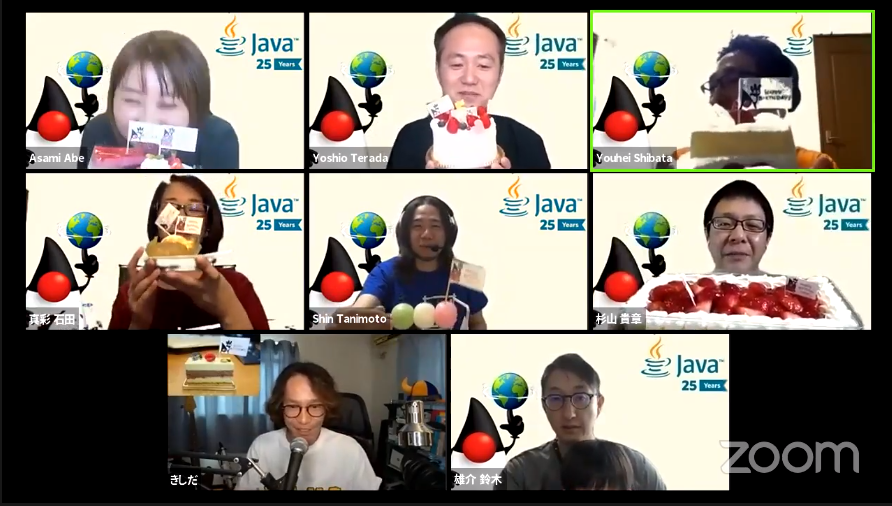

Javaは、2020年5月23日で25歳になるそうです。本来であれば、毎年2回行われているCCCのイベントで扱われるであろう催しだったのですが、新型コロナウイルス (COVID-19)の対策のために、オフラインでのイベントとなりました。

時間も3時間程度で短く、セッション数も多くはありませんが、その登壇資料をこちらにまとめています。（随時更新）  
情報元：[twitter](https://twitter.com/search?q=%23jjug)

https://jjug.doorkeeper.jp/events/106586

## タイムテーブル

| 時間 | 内容 |
| --- | --- |
| 15:00～15:30 | JJUG 総会＆Javaお誕生日おめでとうの儀 |
| 15:30～16:00 | Java 14新機能を軽くまとめてみた by きしだなおき |
| 16:10～16:40 | IDE起点で2020年代の開発環境を眺めてみる by irof |
| 16:50～17:20 | Jakarta EE/MicroProfile を利用したクラウド・ネィティブ ・アプリの開発 by 寺田佳央 |
| 17:30～18:00 | システムのモダナイズ 落ちても良いアプリの作り方 by 伊藤ちひろ |

## セッション詳細

### JJUG 総会＆Javaお誕生日おめでとうの儀

<figure>

<figcaption>

幹事たちが誕生日を祝ってくれています。

</figcaption>

</figure>

### Java 14新機能を軽くまとめてみた

**きしだ なおき [@kis](https://twitter.com/kis) (LINE Fukuoka)**

Java 14が出ていますね。  
とか言ってるうちにJava 15も近づいてきているので、いま出てるJava 15の新機能も踏まえつつ、Java 14の新機能をまとめてみます。

資料：

https://speakerdeck.com/kishida/breaf-introduction-of-java-14

https://qiita.com/nowokay/items/ec85d97a7cecaaac8123

### IDE起点で2020年代の開発環境を眺めてみる

**irof [@irof](https://twitter.com/irof)**

いまどきの開発環境をIDE起点で整理してみます。  
IDEに期待することや統合しているものを個別に確認し、開発環境に向き合います。  
この内容を一通りおさえていれば開発環境で途方に暮れたりはしないはず。  
なお、特定IDEの機能紹介やIDEの比較はしません。

資料：

https://speakerdeck.com/irof/ideqi-dian-de2020nian-dai-falsekai-fa-huan-jing-wotiao-metemiru

### Jakarta EE/MicroProfile を利用したクラウド・ネィティブ ・アプリの開発

**寺田佳央 [@yoshioterada](https://twitter.com/yoshioterada) (Microsoft Corporation)**

2020 年 6 月に新しい Jakarta EE 9 がリリースされます。Java EE から Jakarta EE になり、クラウド・ネィティブなアプリケーション開発ができるようにフレーム・ワークも進化しています。本セッションでは、実際にパブリック・クラウドで動作させるための Jakarta EE/MicroProfile アプリケーションの開発方法や運用方法について、デモを交えながらわかりやすくご紹介します。

資料：

https://www.slideshare.net/tyoshio2002/jakarta-ee-microproile-update-jjug-2020-may

セッション動画：

https://www.youtube.com/watch?v=9XAUWEBqGxQ&feature=youtu.be

### システムのモダナイズ 落ちても良いアプリの作り方

**伊藤ちひろ [@chiroito](https://twitter.com/chiroito) (Red Hat)**

昔からシステムは常に問題なく使えて当然のように思われてきました。しかし現実には、現在に至るまでアプリケーションが落ちることが想定されていないシステムも少なくありません。  
ステートレスなアプリケーションの場合、落ちることが想定されているシステムでは、アプリケーションを複数個並べることでそのうちのいくつかが落ちてしまっても、アプリケーション利用者には影響が無いように作られています。一方でHTTPセッションというステートフルな情報を持つアプリケーションはどうでしょうか？  
本セッションでは、ステートフルなアプリケーションにおいて、落ちても問題ないアーキテクチャとはどのようなものになるのかを紹介します。

資料：

https://www.slideshare.net/ChihiroIto1/ss-234535540

## 動画URL

https://youtu.be/kkyIWJcY0\_o
