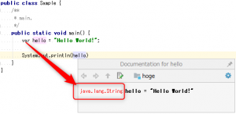

java10から新しく使えるようになったコーディングにvar記法がありますが、これには主に可読性の面で賛否両論あったりするようです。そこでJJUGナイトセミナーでまさにそのvar記法について公式にOracleの人が話してくれましたので、ここにまとめようと思います。スピーカーはDavid Buckさん (@davidbuckjp, Oracle)という方で、発表スライドは[こちら](https://www.slideshare.net/DavidBuck7/jdk-10)です。

## var記法とは

そもそもvar記法とは何かというところからです。2018/3/20にJavaの10がリリースされましたが、そこで入ってきた新しい記法です。

どういう記法かと言うと、色んな型宣言を"var"で置き換えることができます。百聞は一見に如かずということで、以下を御覧ください。

見てみると単純で、型を"var"に書き換えて宣言すれば良いだけです。後はJavaが勝手に型推論してくれるという寸法です。

### （注意）動的型付けではない

よく勘違いされることらしいので、ここでも注意喚起しておきます。あくまでJavaは静的型付けの言語であり、それが動的型付け言語に変わったということではありません。見た目がvarという型に変わって見えるだけで、内部的には型は固定です。ですので、動的型付けのようなコーディング（異なる型を変数に代入）は、コンパイルエラーになります。

例）

## varの使い所

ここからが本題です。ではこれはどういったときに使っていくといいのか。今回のvar記法は何でもかんでも置き換えればよいという類の記法ではありませんので、適材適所を見極めなければなりません。

### 1\. 読みやすくなる場合（≠書きやすさではない）

これがかなり重要な本質だと思います。var記法に限らず、Java言語としての思想として、「読みやすさ」をかなり意識しているため、スクリプト言語のように早く書けるということを重視しては駄目です。冗長さを省略して見やすく読みやすくなる場合に置き換えを検討すべきです。

### 2. ローカルコードで理解できる場合

これはvar記法に限ったことではありませんが、変数の宣言箇所と使用箇所が離れていると読みにくいのでやめましょうねという話です。

### 3\. IDEなどのツールに依存すべきではない

EclipseやIntelliJなどのIDEを使えば、たとえvar記法であっても変数にマウスオーバーすれば型が表示されます。しかし、だからと言って、それを前提にして「IDEの機能で分かるから、コードとして多少分かりにくくてもいい」というのは駄目です。例えばブラウザ上でコードを見たりという状況で困ってしまいます。

### 4\. 明示的に型を宣言するのとはトレードオフ

var記法は既存の型宣言を全て置き換えられるというわけではありません。必要に応じてあえてvarで書かずに型を明示したほうが分かりやすい場合もあるでしょうと言っていました。冗長さの削減と、正確に明示のバランスを見る必要がありますね。

### 5\. 連続の呼び出しを分解するために

ラムダ式などのメソッドチェーンで長々と書けるが、可読性向上のために途中で区切りたいという場合にvar記法は便利です。たいていそういった途中の値を変数としようとすると、型が不必要に複雑だったりします。そうした複雑な型に目を奪われてしまいますが、重要なのは型ではなかったりということも往々にしてあります。

### 6\. 意外と便利な用法（for文、try-with-resources文）

私にとっては意外だったのですが、これらの構文内の変数もローカル変数ですので、var記法が使えて便利ですし、見やすくなるためどんどん使うべきです。

### 7\. ローカル変数なのでインターフェースプログラミングは気にしない。

David Buckさんも訳に困っていましたが、インターフェースプログラミング（programing to the interface）とは、よく言われる、"ArrayListはList型の変数で受けること"というポリモーフィズム実現のための定石のことです。こうしたインターフェース型で変数を定義するということは癖になっている人も多いとは思うのですが、その書き方はvar記法では実現できません。ただ、ローカル変数ということを考えるとそうする必要がないことのほうが多いハズなので気にせずvar記法を使っていきましょうというスタンスのようです。もちろん、インターフェース型で受けたほうがいいという場合はvarを使わずに明示して書けばよいです。

### 8\. 気をつけるところ

総称型を使う場合は、宣言時にきちんと明示しなければなりません。当たり前ですが推論のしようがないので。以下のコードコメントの通りです。

## まとめ

この新記法は地味ですね。ですが、地味に便利だと思います^^。やはり物理的にコードが長いと読みにくいというのは確かなので、使えるところは使っていきたいです。
