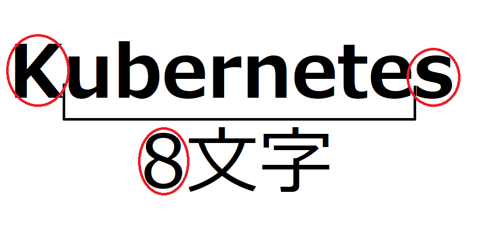

Kubernetesとは、複数コンテナを管理するコンテナオーケストレーションツールです。オープンソースソフトウェア (OSS)です。Dockerなどのコンテナ技術の成熟と、マイクロサービスの発展に伴い、近年急速に普及しています。

マイクロサービスでは小さなサービスを複数起動して連携させることで一つの大きなアプリケーションとしての機能を有しながら、高負荷時にはサービス数を増やすなどするスケールアウトが容易にでき、一部サービスが障害で落ちても起動しなおして復旧させられる障害耐性などが魅力である。この小さなサービスをDockerのコンテナとして立ち上げて、各サービスの死活管理やネットワーク連携、ローリングアップデートなどをKubernetesが管理するというのが一般的な使い方です。

ちなみに、略し方はヌメロニム (numeronym)というもので、Kubernetesの先頭**K**と末尾**s**を除いた間の文字数が**8**文字のため**K8s**となっています。同じような略し方で、internationalization = i18nなどがあります。

## 参考

https://kubernetes.io/ja/
