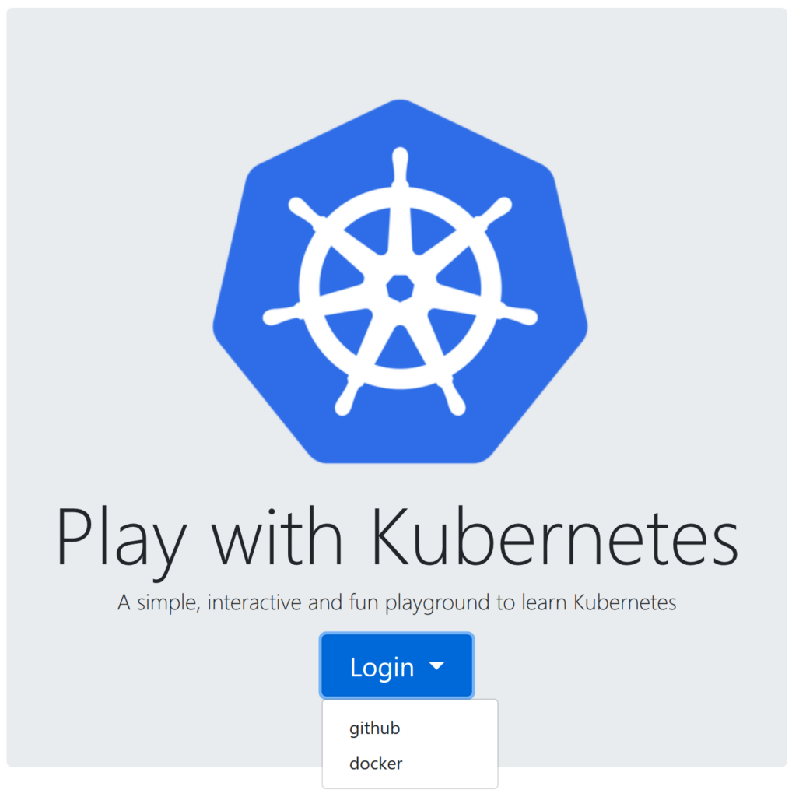
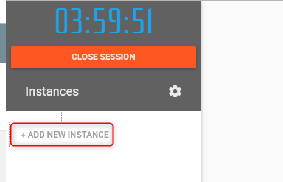
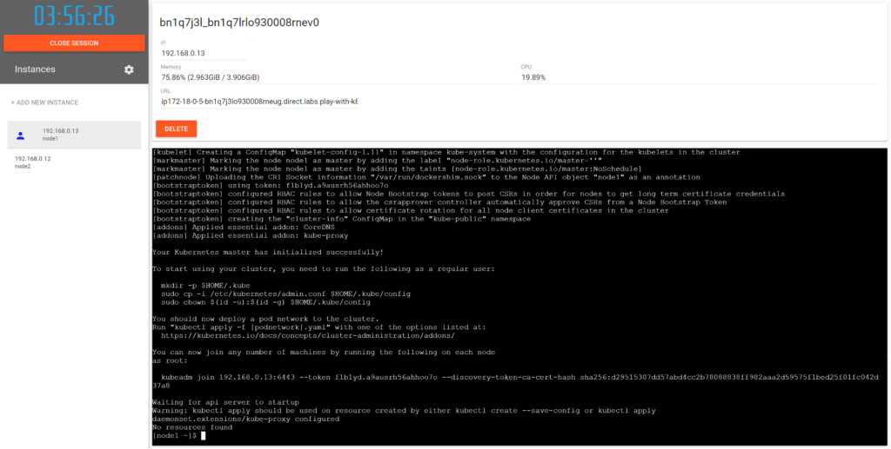
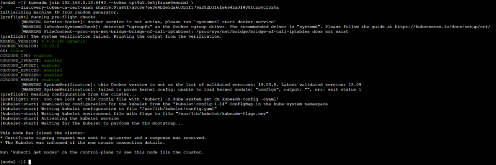
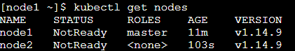
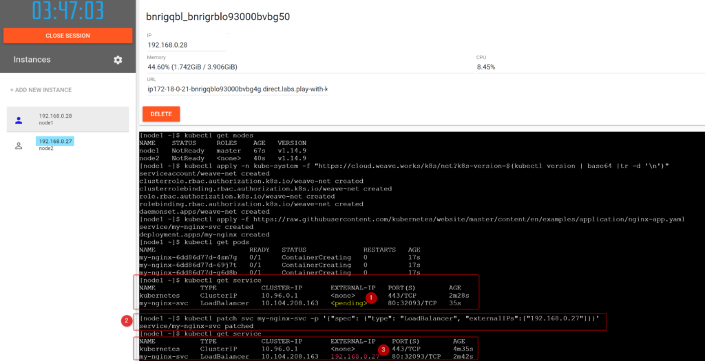
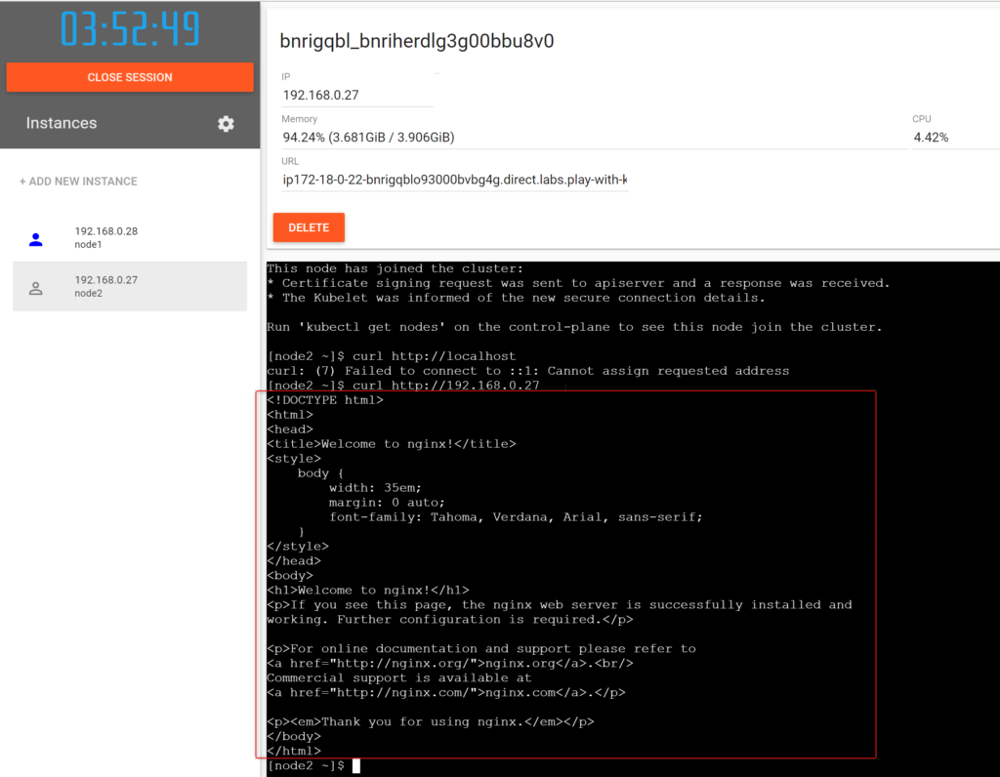

kubernatis(以降k8sと表記)を試しに使ってみたい、触って慣れたとなった時に、普通ならローカル環境に構築してあれやこれやとやるのですが、それだと環境がグチャグチャになってわけが分からない状態になったりします。(よく理解していないで試行錯誤していると特に。)

そんな時に、play-with-k8sというサイトを使うと**ブラウザだけでk8sを構築して使うことができます**。文字通りk8sで遊べます。ここでは基本的な使い方、遊び方を紹介します。

### サイトログイン

まず、[https://labs.play-with-k8s.com](https://labs.play-with-k8s.com)にアクセスします。

<figure>



<figcaption>

トップ画面

</figcaption>

</figure>

そこでLoginボタンを押すとアカウント選択画面になりますので、Github認証かDocker認証でログインしてください。もしこれらのアカウントが無いのであれば別途作成する必要があります。（各サイトで作成してください。無料です。）

#### nodeを作成する

k8sのnodeを作成します。k8sは複数node使ってこそなのですが、今回は簡単のため、主と従の最小二つ構成で説明しようと思います。

作成方法は至って簡単で、左上のボタンをクリックするだけです。数秒で出来ますので、二つ作成しましょう。

<figure>



<figcaption>

インスタンス作成ボタン

</figcaption>

</figure>

#### masterセットアップ①（必須）

主となるノードをひとつ選び、masterとして初期セットアップします。右側の黒いコンソール画面に、以下のコマンドを入力してEnterします。

```
kubeadm init --apiserver-advertise-address $(hostname -i)
```

しばらく待つ（数分）と処理が完了し、以下のような画面になります。これでk8sのmasterがまず準備されました。この時、コンソールの下のほうの、「kubeadm join」から始まる部分を探してください。そしてその行をコピーしてください（画面幅によって、"\\"で改行されている場合がありますので場合によっては複数行になるかもしれません）。



#### slaveセットアップ① （必須）

上でコピーしたものを使って、masterのk8sに紐づく形で"従"のk8sのnodeをセットアップします。

まず左側でmasterとしたのとは別のnodeを選択します。そしてそこのコンソールに上でコピーした「 kubeadm join ～」を貼り付けてEnterします。

<figure>



<figcaption>

kubeadm join 実行後

</figcaption>

</figure>

これで"従"のnodeのセットアップは完了です。試しに、masterのnodeに戻って以下のコマンドを打ってください。すると、k8sが認識している二つのnodeが表示されるはずです。

```
kebectl get nodes
```

<figure>



<figcaption>

masterで見ると、二つのnodeが管理されているのが分かる

</figcaption>

</figure>

もし、二つより多くのnodeで試したい場合は本節の「 kubeadm join ～」を各nodeで繰り返し実行してください。

#### masterセットアップ② （必須）

次にk8sのネットワーク設定を行います。k8sでは設定ファイルで設定を適用できますので、ここでは公開されている設定ファイルを用いて、設定を適用しています。

masterとしたnodeで、下記コマンドを貼り付けて実行してください。

```
kubectl apply -n kube-system -f "https://cloud.weave.works/k8s/net?k8s-version=$(kubectl version | base64 |tr -d '\n')"
```

#### masterセットアップ③ （任意）

現在は何もないただの環境なので、アプリケーションを入れて動作するのを見てみようと思います。ここではnginxというwebサーバを設定します。

これも設定ファイルのサンプルが公開されているので、それを適用しています。masterとしたnodeで、下記コマンドを貼り付けて実行してください。

```
kubectl apply -f https://raw.githubusercontent.com/kubernetes/website/master/content/en/examples/application/nginx-app.yaml
```

確認として、以下のコマンドを実行して「my-nginx-svc」が表示されていれば成功です。

```
kubectl get service
```

#### masterセットアップ④（任意）

<figure>



<figcaption>

ロードバランサに外部IPアドレスを設定している所

</figcaption>

</figure>

対象のサービスに外部IPアドレスを指定して、アクセスできるようにします。slaveのnodeに記載されているIPアドレスに以下のXX部分を書き換えてmasterのnodeで実行します。（上記画像の例だと192.168.0.27となるようにします。）

```
kubectl patch svc my-nginx-svc -p '{"spec": {"type": "LoadBalancer", "externalIPs":["192.168.0.XX"]}}'
```

確認として、以下のコマンドを実行して「my-nginx-svc」のEXTERNAL-IPに指定したIPアドレスが表示されていれば成功です。

```
kubectl get service
```

これでnginxアプリに接続できるはずなので、slaveのnodeからcurlコマンド（URLにアクセスするコマンド）を実行してみます。下記を指定したIPアドレスに変更して実行してください。するとHTMLがコンソールに出力されるはずです。

```
curl htttp://192.168.0.XX
```

<figure>



<figcaption>

nginxアプリがデフォルトのhtmlをレスポンスした状態。

</figcaption>

</figure>

### まとめ

一通り、最小限のk8sの構成方法について説明しました。masterセットアップ②まで実施してもらえれば、構築完了なので、種々のコマンドの実験や動作練習ができます。

ブラウザだけでk8sを触れる大変便利な環境なので、皆さんもぜひとも活用してください。

### URL

https://labs.play-with-k8s.com/
