## 概要

コミュニケーションツールとして、多くの方のスマートフォンに導入されているであろうLINE。それに自動的に通知を送れる仕組みがあれば便利と思い作成したので公開します。

### できること

- リマインダーのように特定の日時に通知を送る。
- 特定の曜日に通知を送る。
- 第3水曜日だけに～といったことも可能。
- 毎日繰り返し通知する。

### 必要なもの

- LINEアカウント（Web上でメールアドレスログインできること）
- Googleアカウント

そして、無料です。LINEやGoogleが提供してくれているサービスに感謝です。

## 手順

### 通知定義スプレッドシートをコピー

下記のスプレッドシートをご自身のGoogleDriveに**コピー**してください。【注意】**必ずコピー**をしてください。編集リクエストをするのでは**ありません**。よく間違えて編集リクエストを送ってくる方がいますのでご注意ください。

https://docs.google.com/spreadsheets/d/1qwfqN2qZUugmTM7jOw-Rp0TDBpcgZ2MHR9PmLaVoSFo/edit?usp=sharing

<figure>

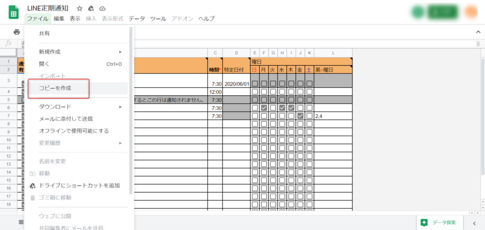

<figcaption>

ファイル＞コピーを作成を選んで、自分のGoogleDriveにコピーしてください。  
（Googleにログインしている必要があります。）

</figcaption>

</figure>

<figure>

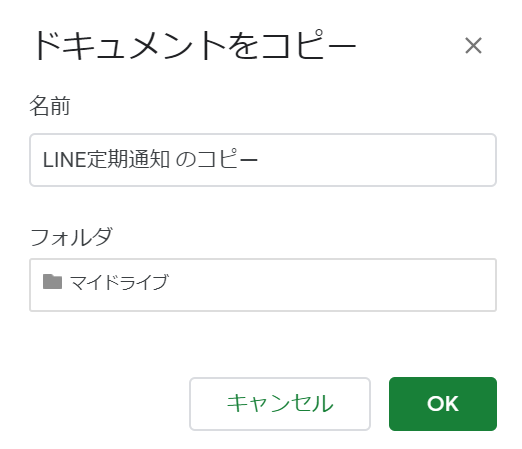

<figcaption>

名前やフォルダの場所はどこでも良いです。（後でも変えられます。）

</figcaption>

</figure>

### 通知定義を編集

いくつかサンプルを載せています。これらを参考に贈りたい通知を記載してください。（まだ通知されないのでご安心を）

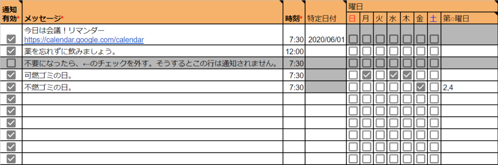

説明：  
①「通知有効」列の✔を外せば通知されません。  
②「メッセージ」に記載した内容がLINEに通知されます。（必須）  
③「時刻」に通知を送りたい時刻を記載してください。（必須）  
④「特定日付」特定の日に通知したい場合は記載してください。リマインダーとして使えます。  
⑤「曜日」特定の曜日に通知したい場合は、該当の曜日に✔をつけてください。  
⑥「第○曜日」例えば、第3水曜日のみに通知を送りたい場合は、「3」を記載して水曜日に✔をつければ良いです。「2,4」などとカンマ区切りで複数指定もできます。

### LINEの通知botを作る

下記LINEの開発者サイトにアクセスしてLINEのアカウントでログインします。

https://notify-bot.line.me/ja/

<figure>

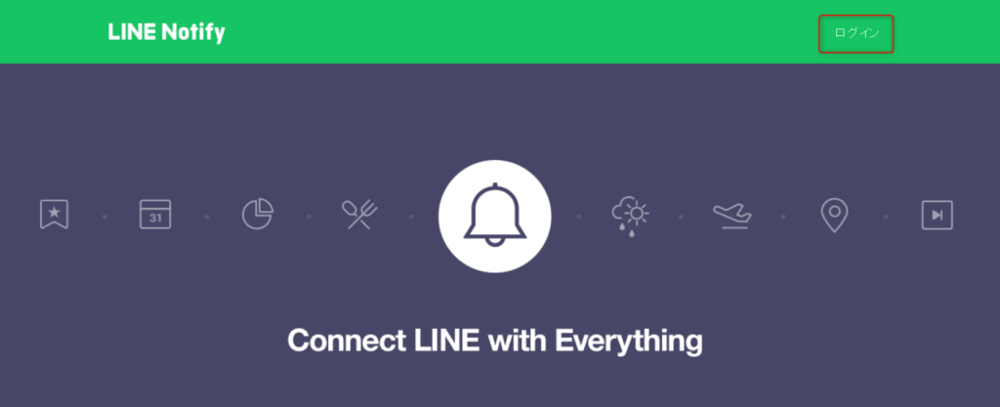

<figcaption>

右上の「ログイン」を押して、LINEのメールアドレスとパスワードでログインしてください。

</figcaption>

</figure>

<figure>

<figcaption>

「トークンを発行する」を押します。

</figcaption>

</figure>

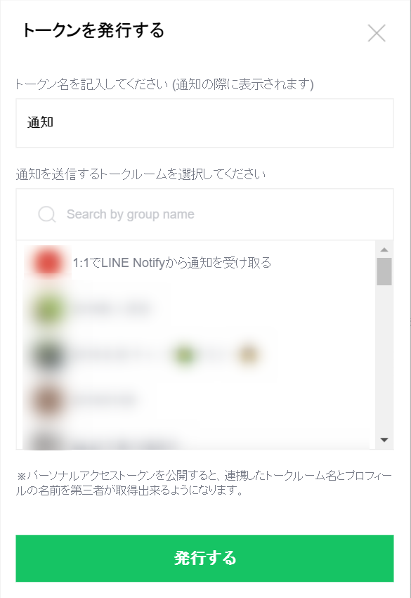

①トークン名を入力してください。  
ここで設定したものが（仮にXXとすると）、「\[XX\]通知メッセージ～」といった形で通知されます。  
②通知するトークルームを選択してください。  
そのルームに対して通知されるようになります。ここで「1:1でLINE Notifyから通知を受け取る」を選ぶと自分だけに通知されます。  
③「発行する」ボタンを押してください。

<figure>

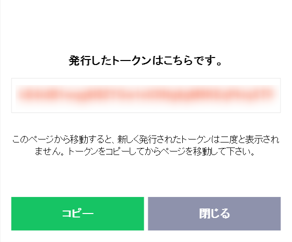

<figcaption>

ランダムなトークンが発行されるので、コピーしてください。

</figcaption>

</figure>

### 通知機能を動かす

スプレッドシートの「設定」シートを開いてください。そのB2セルにさきほどLINEで発行したトークンを貼り付けます。

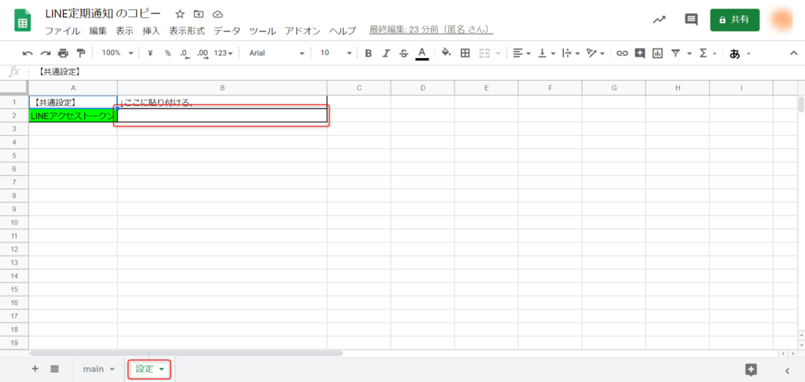

そして、ツール＞スクリプトエディタをクリックします。

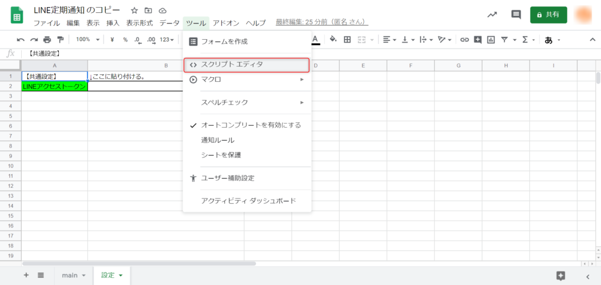

すると、こんな画面が出てきますので、以下の時計のようなアイコンをクリックします。（ちなみに、ここにLINEに通知するプログラムが書かれています。）

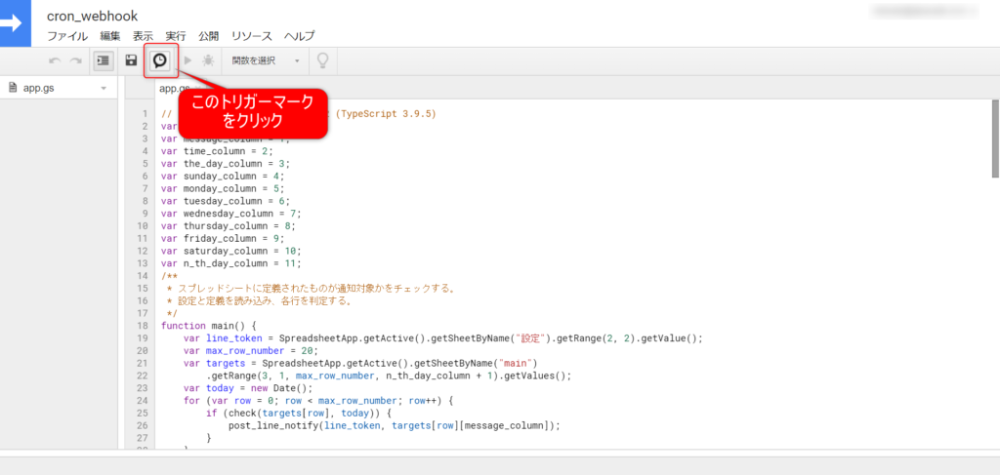

トリガー画面になるので、「トリガーを追加」ボタンを押します。

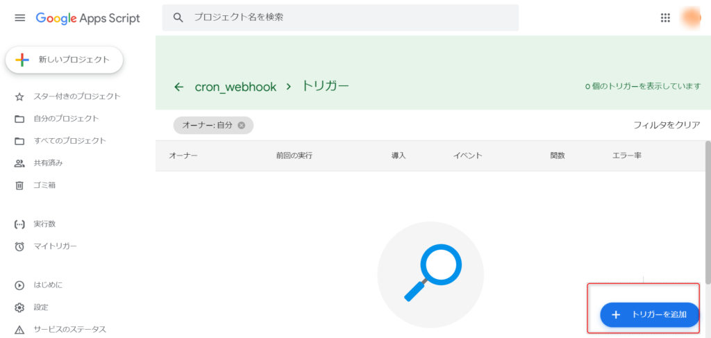

そうしたら、下記の通りに設定して、「保存」ボタンを押します。

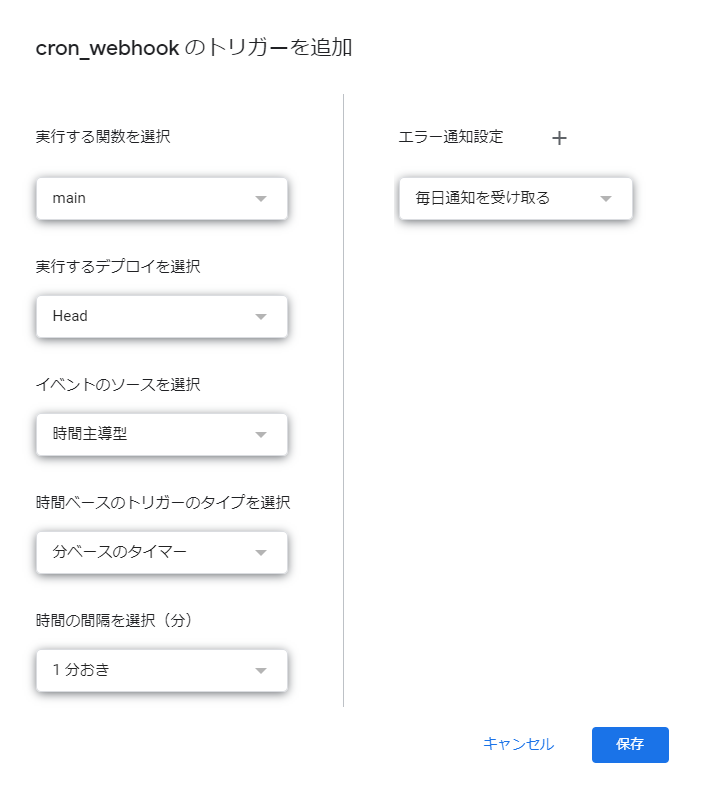

- 実行する関数を選択：　main
- 実行するデプロイを選択：　HEAD
- イベントのソースを選択：　時間主導型
- 時間ベースのトリガーのタイプを選択：　分ベースのタイマー
- 時間の間隔を選択（分）：　1分おき
- エラー通知設定：　（何でもよいです）

### 設定完了

以上で設定完了です。時間になったら通知が飛ぶようになっています。

<figure>

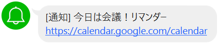

<figcaption>

こんな感じで通知が飛びます。

</figcaption>

</figure>

## 参考情報（開発者向け）

ソースコードは下記で管理しています。  
Type Script で書いており、Google謹製の [clasp](https://github.com/google/clasp) というツールで管理しています。clasp はDockerで動かせるようにしているので、ローカル環境を汚しません。

https://github.com/nisioka/line\_notify
