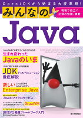
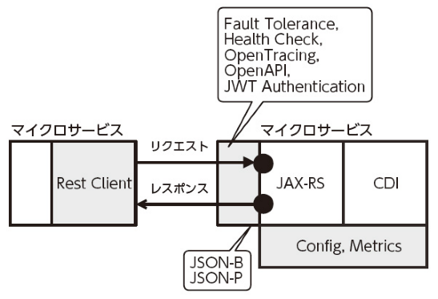
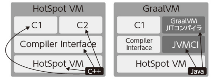
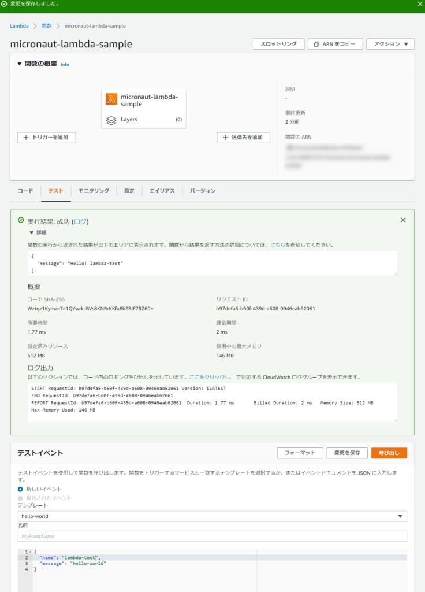
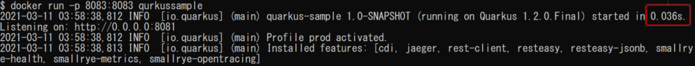
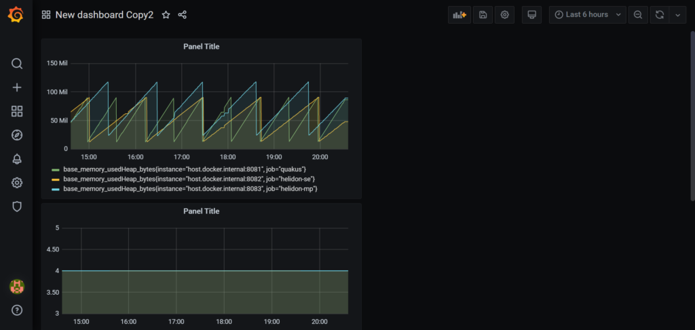

「みんなのJava OpenJDKから始まる大変革期！」を読んで要点をまとめました。

[みんなのJava　OpenJDKから始まる大変革期！](//af.moshimo.com/af/c/click?a_id=1005417&p_id=56&pc_id=56&pl_id=637&s_v=b5Rz2P0601xu&url=http%3A%2F%2Fbooks.rakuten.co.jp%2Frb%2F16206429%2F)

posted with [ヨメレバ](https://yomereba.com)

きしだ なおき、吉田 真也、山田 貴裕/蓮沼 賢志、阪田 浩一 技術評論社 2020年03月13日頃

[楽天ブックス](//af.moshimo.com/af/c/click?a_id=1005417&p_id=56&pc_id=56&pl_id=637&s_v=b5Rz2P0601xu&url=http%3A%2F%2Fbooks.rakuten.co.jp%2Frb%2F16206429%2F)

[楽天kobo](//af.moshimo.com/af/c/click?a_id=1005417&p_id=56&pc_id=56&pl_id=637&s_v=b5Rz2P0601xu&url=https%3A%2F%2Fbooks.rakuten.co.jp%2Frk%2F68e2f7d29a89304f8c97eac914a572ca%2F)

[Amazon](//af.moshimo.com/af/c/click?a_id=1005417&p_id=170&pc_id=185&pl_id=4062&s_v=b5Rz2P0601xu&url=https%3A%2F%2Fwww.amazon.co.jp%2Fexec%2Fobidos%2FASIN%2F4297111993)

[Kindle](//af.moshimo.com/af/c/click?a_id=1005417&p_id=170&pc_id=185&pl_id=4062&s_v=b5Rz2P0601xu&url=https%3A%2F%2Fwww.amazon.co.jp%2Fgp%2Fsearch%3Fkeywords%3D%25E3%2581%25BF%25E3%2582%2593%25E3%2581%25AA%25E3%2581%25AEJava%25E3%2580%2580OpenJDK%25E3%2581%258B%25E3%2582%2589%25E5%25A7%258B%25E3%2581%25BE%25E3%2582%258B%25E5%25A4%25A7%25E5%25A4%2589%25E9%259D%25A9%25E6%259C%259F%25EF%25BC%2581%26__mk_ja_JP%3D%2583J%2583%255E%2583J%2583i%26url%3Dnode%253D2275256051)

[図書館](http://calil.jp/book/4297111993)

## 第1章 Java9からJava14までに起こった変化から見るこれからのJava

著者：きしだ なおき (Twitter：[@kis](https://twitter.com/kis))

本書の出版時点(2020年)は、Javaのリリースモデルが機能基準から時間基準に変更されたさなかという大きな変化があった頃で、そのスピードアップに混乱もあったように思います。本章では最近の動向を改めて詳細に説明するという内容が中心でした。

まず、下記に各バージョンの変更内容説明を抜粋します（プレビュー機能は省きました）。

### Java9(2017年9月リリース)

#### モジュールシステム

小さなJavaランタイムを作る事ができる利点もあるが、ほとんど関係のないことが多そう。どちらかというとJDK自体の開発のしやすさに寄与するもの。

#### JShell

Javaを簡易に実行することができるようになる便利ツール。

#### コレクションの初期化用メソッド追加

MapやListといったコレクションに .of() メソッドのような初期化用メソッドが追加されています。

#### try-with-resources での変数代入

以前はtry句の中で変数定義をしなければなりませんでしたが、Java9からはtry句に別途外部で定義した変数だけを記載することでも適切にclose処理できるようになりました。

#### インターフェースでのprivateメソッド

インターフェースに、privateメソッドを定義することができるようになりました。static、インスタンスメソッド問わずです。

#### Streamのメソッド追加

.dropWhile()、.takeWhile()といったメソッドが追加されています。

### Java10(2018年3月リリース)

#### ローカル変数の型推論

**var**キーワードを用いることで、冗長な型を記載しなくて済むようになり少し記述が楽になります。あくまで静的型付けにおける型推論であって、動的型付け言語になったわけではありません。

### Java11(2018年9月リリース)

#### 最初のLTS(Long Term Support)

Oracle JDK から OpenJDK へ移行したあとの、 Java の使い方の模索が本格的に始まったと言えます。

#### Http Client API

昨今のHTTPに合わせて以下のような改善がなされています。[参考(JEP321)](https://openjdk.java.net/jeps/321)

- HTTP/2対応
- リクエスト/レスポンスの分離
- 認証、Cookie、プロキシなどへの対応
- 非同期

### Java12(2019年3月リリース)

#### システムクラスのクラスデータ自動共有

特別な起動オプションを指定しなくても起動が速くなっています。

### Java13(2019年9月リリース)

めぼしいものがないので省きます。

### Java14(2020年3月リリース)

#### switch式

switch的な条件分岐を式と簡易に表せることができました。Java12からのプレビュー機能ですが、ここで正式機能となりました。[参考(JEP361)](https://openjdk.java.net/jeps/361)

#### ZGCがWindows・Macに対応

ZGCとは、テラバイトレベル以上の巨大なヒープサイズにも対応できるのが特徴の新しいGC。[参考(JEP377)](https://openjdk.java.net/jeps/377)

#### レコード型

複数の値を格納するようなデータ型を簡単に定義できるようになりました。

#### シールド型

クラスの継承や、インターフェースの実装を限定させたりすることができる仕組みです。使い所はあまり多くなさそうですが、Pattern Matching for switch や厳格なクラス設計などで使えそうです。

#### Stringの改善

文字列を格納するStringにいくつか改善があります。

- メソッド追加(repeat():繰り返し生成、lines():開業毎にstream処理、等)
- メモリ使用量の無駄を改善
- 文字列連結のコンパイル時最適化(+演算子がStringBuilder.append()に置き換わる)

* * *

続いて、JVM関連の変更についても下記にまとめます。

### クラスデータ共有（CDS）

メモリ上に読み込んだ内部形式のクラスデータをファイルに書き出すことができ、これを使ってアプリケーションの起動を早くすることや、複数JVMで共有してメモリ使用量の少量化に役立ちます。実はJava12以降はこの機能によって何もしていなくても少し起動が早くなっています。自身でデータダンプをして読み込ませることで、手間はかかりますが起動を早く、メモリの節約することに役立てられます。

### Graal JITコンパイラ

Javaで新しく書き直されたJIT(Just In Time:実行時)コンパイラがGraal JITコンパイラです。JITコンパイラの選択肢が増えました。[5章](#section5 "#section5")でも詳説。

### AOTコンパイラ

Java9からAOT(Ahed Of Time:事前)コンパイラが導入されました。事前にコンパイルしておくことで、実行が早くなる可能性があります。ビルド時間が長くなってしまうというトレードオフもあり、実行速度もアプリによっては逆効果になることもあるため、使い所はよく検討する必要があります。選択肢が増えたことは良いことかと思います。

### ガベージコレクション(GC)

GCにも色々と変化がありました。一覧表にまとめています。

<figure>

| GC種類 | 特徴 | 導入Ver |
| --- | --- | --- |
| Serial GC | シングルスレッドでGCを行う。 | 1.3 |
| Parallel GC | マルチスレッドでGCを行う。 | 1.3 |
| CMS | アプリケーションと変更にGCの一部処理を行う。(Java9でDeprecated) | 1.4.1 |
| G1GC | 数十GBのメモリに対応したGC。   Java9以降のデフォルト。 | 1.7 |
| ZGC | 数TBのメモリに対応したGC。 | 11 |
| Epsillon | 何もしないGC(検証用)。 | 11 |
| Shenandoah | レスポンス重視のGC。 | 12 |

<figcaption>

引用: 「表1 Javaで使えるガベージコレクタ」より

</figcaption>

</figure>

* * *

## 第2章 JDKに関する疑問と不安解消！ JDKディストリビューション徹底解説

著者：山田 貴裕 (Twitter：[@yamadamn](https://twitter.com/yamadamn))

JDKには長い歴史があり本書でも詳しく説明されていますが、最も影響の大きな変更はライセンス変更かと思い、下記を抜粋します。

> JDKリリースモデルの変更やOracleJDKのライセンス変更は、OpenJDKに対するビジネスモデルの変更と考えるとすっきりします。とくに多くのJDKディストリビューションが出てきた現状は、ビジネスモデル的には他のベンダ（ディストリビュータ）に負荷分散することで、OpenJDKエコシステムを安定的に維持する狙いも大きいと筆者はとらえています。JavaはOracleがほぼ単独で無償のまま支えていくには、あまりに大きくなり、限界が来ていたとも言えるでしょう。
> 
> 引用: 2-3 OpenJDKを開発しているのは誰か

### 最新JDKディストリビューション大全

| JDK | 開発元 | 特徴 | おすすめ用途 |  |
| --- | --- | --- | --- | --- |
| [Oracle JDK](https://www.oracle.com/jp/java/technologies/javase/documentation/api-jsp.html) | Oracle | 従来からのメインベンダ。 | Oracle製品。クライアント(JRE8) |  |
| [Oracle OpenJDK](https://jdk.java.net/) | Oracle | 汎用プラットフォームで最新版に追従。ただしLTS版は無し。 | 個人学習・趣味、最新版の利用。コンテナ。 |  |
| [Red Hat OpenJDK](https://access.redhat.com/documentation/en-us/openjdk/) | Red Hat | Oracleに次ぐ貢献者。RHEL/ CentOS で豊富な実績有り。 | JBoss/Tomcat、コンテナ。 |  |
| [Azul Zulu](https://docs.azul.com/zulu/zuludocs/) | Azul Systems | Microsoft Azureでは以前から利用され、商用のZulu Enterpriseを提供 | Azure、コンテナ、組み込み。 |  |
| [Sap Machine](https://github.com/SAP/SapMachine/wiki) | SAP | サーバサイドで実行する上での診断機能が強み。もともとモニタリングに強いSAP JVMを別に持つ。 | SAP製品、サーバサイド、コンテナ。 |  |
| [BellSoft Liberica JDK](https://bell-sw.com/) | BellSoft | JavaFX/OpenJFXもバンドルしたFull版有り。 JetBrainsと提携も。 | JWSやマイクロサービス以外何でも。 |  |
| [AdoptOpenJDK](https://adoptopenjdk.net/installation.html) | London Java Community | 広範なプラットフォームに対応。ただし、Java SE準拠を認定するTCK/JCKを通せていない。 | 教育、ゲーム、自社サービス。 |  |
| [Amazon Corretto](https://docs.aws.amazon.com/corretto/) | Amazon | ドキュメントが豊富。Amazon Linux/2用に最適化していたこともあり、他のJDKと比べるととくにJDK8では独自バックポートが多め。 | AWS、サーバサイド全般 |  |

## 第3章 Java EEからJakaruta EEへ 新しいEnterprise Java

著者：蓮沼 賢志 (Twitter：[@khasunuma](https://twitter.com/khasunuma))

### Java EE/Jakaruta EEのリリース履歴まとめ

<figure>

| バージョン | リリース | 主なトピック |
| --- | --- | --- |
| J2EE 1.2 | 1999/12 | 初版(既存APIの集合体)。 |
| J2EE 1.3 | 2001/09 | JSR58: JCA導入とアーキテクチャの整理。 |
| J2EE 1.4 | 2003/11 | JSR151: SOAP Webサービス対応、JMX追加。 |
| Java EE 5 | 2006/05 | JSR244: 開発容易性向上(API近代化)。 |
| Java EE 6 | 2009/12 | JSR316: CDIおよびプロファイル導入、RESTfull Webサービス対応。 |
| Java EE 7 | 2013/05 | JSR342: HTML5対応。 |
| Java EE 8  | 2017/08 | JSR366: Security API追加、HTML5対応強化。 |
| Jakarta EE 8 | 2019/09 | Jakarta EEにて仕様策定、APIレベルではJava EE 8と同一。 |

<figcaption>

引用: 表1 Java EE/Jakaruta EEのリリース履歴

</figcaption>

</figure>

### Jakarta EE 8の主な機能の紹介

#### Jakarta Server Faces

一般に「コンポーネントベースMVC」と呼ばれるWeb UI技術の1つ。Webコンテナと合わせて利用する。

#### Bean Validation

入力値検証(バリデーション)を行うAPIです。Jakarta Server FacesやJakarta RESTfull Web Services等と組み合わせて利用します。

#### Contexts and Dependency Injection (CDI)

Jakarta EEのコンポーネント技術の基盤であるBean Managerの仕様です。

#### Webサービス技術

大きく、RESTful WebサービスをサポートするJakarta RESTful Web Servicesと、SOAP WebサービスをサポートするJakarta XML Web Servicesの2つが用意されています。

Jakarta RESTful Web Services(かつてJAX-RSと呼ばれていた仕様)は、RESTful Webサービスに留まらず、HTTPのほとんど全てを処理できる極めて優れたAPIです。

#### Enterprise Beans

将来的にはCDIに取って代わられるものと考えられますが、分散トランザクション処理の2相コミットに代表される高度な分散処理を実現するうえではまだ必要不可欠な存在です。

#### セキュリティ

Jakarta EEには高水準のセキュリティ機能としてJakarta Security、低水準のセキュリティ機能としてJakarta Authentication（旧JASPIC）とJakarta Authorization（旧JACC）が用意されています。

## 第4章 MicroProfileが拓くJavaのマイクロサービス

著者：蓮沼 賢志 (Twitter：[@khasunuma](https://twitter.com/khasunuma))

MicroProfileはJakarta EE技術を基礎としたマイクロサービス向けのAPIセットです。下図に示すように、CDI、JAX-RS、JSON-P、JSON-Bを核として、それを補うAPIから構成されています。

<figure>

<figcaption>

引用: 図1 MicroProfile APIの相互関係

</figcaption>

</figure>

他の仕様についても以降でひとめぐり紹介します。

#### Config API

Config APIでは、環境に依存する設定値をConfigソースとして定義することで、CDIを用いて取得できるようにしています。

#### Metrics API

Metrics APIではサービス状態を、デファクトスタンダードに近いOpenMetrics（Prometheus）形式またはJSONで出力できます。

#### Fault Tolerance API

これはサービス障害発生時に、縮退運転を行うなどの手助けとなる機能です。

#### Health Check API

/healthにアクセスすると、サービスの利用可否が分かるというAPIです。Kubernates(k8s)と互換性のある形で出力されるため、k8sでの冗長稼働でも死活監視にも役立ちます。

#### Open Tracing API

こちらもデファクトスタンダードに近いOpenTracing仕様に準拠したトレースのためのAPIが用意されています。

#### Open API

API仕様のドキュメンテーション機能として、OpenAPI v3仕様準拠で出力することができます。

#### JWT Authentication

JSON Web Token(JWT)認証のためのAPIも備わっており、認証の実装作業に使えます。

#### Rest Client

サービスアクセスを安全・簡単に行うための機能で、従来のJAX-RSに備わっていたものの改善版のようなものです。

## 第5章 ネイティブイメージ生成で注目！ Javaも多言語も高パフォーマンスGraalVM

著者：阪田 浩一 (Twitter：[@jyukutyo](https://twitter.com/jyukutyo))

### GraalVMとは

様々な言語のコードを実行するための仮想マシンであるユニバーサルVMとしてGraalVMは誕生しました。GraalVMをJavaのネイティブイメージ作成機能として聞いたことがある人も多いかもしれませんが、あくまでそれは一機能だそうです。それも含めて、ここではGraalVMについて詳説されています。

#### JITコンパイラ

既存のJVMであるHotSpot VMでは、「C1」と「C2」というJIT(Just In Time)コンパイラを使用しています。GraalVMでは一部を載せ替えたような構成となっており、「C2」に変わってJavaで書かれたJITコンパイラが載っているものになります。

<figure>

<figcaption>

引用: 図1 HotSpot VMとGraalVMの構造の違い

</figcaption>

</figure>

#### 多言語間での相互利用

GraalVMでは多言語のコードを簡易に呼び出すことができます。他のVMでもこうした仕組みはあったりしますが、一般に呼び出しのオーバーヘッドが大きくて十分なパフォーマンスが出ないものが多いです。GraalVMはパフォーマンスを犠牲にしないというビジョンを掲げています。

#### Truffle

GraalVMでの多言語実行を可能にしているのが、このTruffleというライブラリです。現状、下記のような実装があり、今後も増えていくでしょう。

- GraalJS：Java Script ECMA Script 2019仕様互換実装
- GraalPython：Python3.7準拠
- TruffleRuby：Ruby2.6.2ベース
- FastR：GNUR3.6.1互換実装

#### ネイティブイメージ

GraalVMで最も有名な機能は、このネイティブイメージ生成です。Java等のコードをJVM上で実行するのではなく、事前にコンパイルしてJVM無しで実行可能な形にすることができます。

そもそもGraalVMが作られた目的としては、Oracle DatabaseのSQL文で様々な言語の実装を呼び出したいというところからだそうです。以下が例ですが、たしかにSQLで各種コードが呼び出せるのは便利そうです。

> select validator.isEmail('alice@example.com') from dual;
> 
> 引用: 5-4 GraalVMの組み込みとネイティブイメージ

しかしながら、既存のJVMのままだと、初期化処理の時間やメモリ使用量の多さがネックとなって現実問題として難しいものが有りました。そこで、起動時間短縮や省メモリ化のために、ネイティブイメージの生成機能が必要となり、機能の一つとして作られました。

#### AOTコンパイラ

ネイティブイメージの生成をする場合、事前にコンパイルする都合上、JITコンパイラを使うことはできません。そこで、AOT(Ahead Of Time: 事前)コンパイラというものが必要となります。起動時間の短縮という長所などがありますが、実行時情報を使ったJITコンパイルのほうがピーク時のスループットは高い傾向にあります。

## 第6章 マイクロサービス、クラウド、コンテナ対応【新世代】軽量フレームワーク入門

著者：前多 賢太郎 (Twitter：[@kencharos](https://twitter.com/kencharos))

クラウド上でマイクロサービスアーキテクチャのアプリケーションを動かすことが最近の主流になってきています。ここではそうした時代に適応したフレームワークをMicronaut、quarkus、helidon(SE/MP)について[サンプル実装](https://github.com/kencharos/java-frameworks)しながら紹介しています。

サンプル実装としては、同じようなレスポンスを返却するマイクロサービスとしてそれぞれを実装して連結しています。また、ヘルスチェック、分散トレーシング(Jaeger)、メトリクス(Prometheus)の設定もそれぞれ行っています。

### Micronaut

コンパイル時DIにより高速起動を実現した、多機能フルスタックOSSフレームワークです。

サンプル実装は[こちら](https://github.com/kencharos/java-frameworks/tree/master/micronaut-sample)にあります。下記のようにアノテーションベースで簡潔に記述できるのが分かるかと思います。

また、実際に試したところ、私の手元の環境(Windows10、Core i7@2.4GHz、RAM@8GB)では起動時間は**約3秒**、ファイルサイズは**15.5MB**でDI機能を有しつつ高速起動されることが確認できました。

#### AWS Lambda用実装

AWSのLambdaで関数として動かす[サンプルもあります](https://github.com/kencharos/java-frameworks/tree/master/micronaut-lambda-sample)(上記から不要な依存関係を取り除いたもの)。

こちらも実際にLambdaデプロイしてテストしてみました。jarファイルのサイズは**9.7MB**と軽量で、高速にレスポンスも返ってくることを確認しました（ただし初回実行は10秒ほどかかります。LambdaでJavaランタイムを動かす際の制約）。

<figure>

<figcaption>

AWS Lambdaでのmicronaut実装のテスト結果

</figcaption>

</figure>

### Quarkus

QuarkusはRed Hat社が開発したフレームワークで、GraalVM Native Imageと親和性が高く、ホットリロードも搭載している軽量・高速起動なフレームワークです。

サンプル実装は[こちら](https://github.com/kencharos/java-frameworks/tree/master/micronaut-sample)にあります。下記のようにmicronautと似たようなコード記述になっています。

手元の環境では起動時間は**約2秒**で、ファイルサイズは**14.2MB**でした。

#### Native Image

GraalVMとの親和性を謳っているだけあってNative Image生成のためのコマンドオプションも準備されていました。docker.nativeも付属しているため、docker環境だけあればローカルに導入せずともGraalVMを利用することができます。手元の環境で実行したところ、約**0.04秒**の爆速で起動していました。

### Helidon

HelidonはOracle社が提供する軽量フレームワークです。HelidonにはSEとMPという2つのコーディングスタイルがあります。機能的には大差ありませんが、SEでは独自のAPI呼び出しベース、MPではアノテーションベースといった違いがあるようです。下記に同等のコードを並べていますが(左がSE、右がMP)、結構記述の仕方が違うことが分かるかと思います。

Helidon SE

手元の環境では、下記の通りでした。  
起動時間：**約5.5秒**  
ファイルサイズ：**13.8MB**

Helidon MP

手元の環境では、下記の通りでした。  
起動時間：**約7秒**  
ファイルサイズ：**26.3MB**

### おまけ

これらのフレームワークは、ヘルスチェック、分散トレーシング(Jaeger)、メトリクス(Prometheus)といった設定も容易に行えるということでそのサンプル環境も置いてありました。本書内で詳説はされていませんでしたが、今どきの周辺設備も触ってみることができます。下記はprometheus経由でgrafanaのダッシュボードに表示しているところです。dockerコンテナを立ち上げるだけで簡単に触って見れました。

