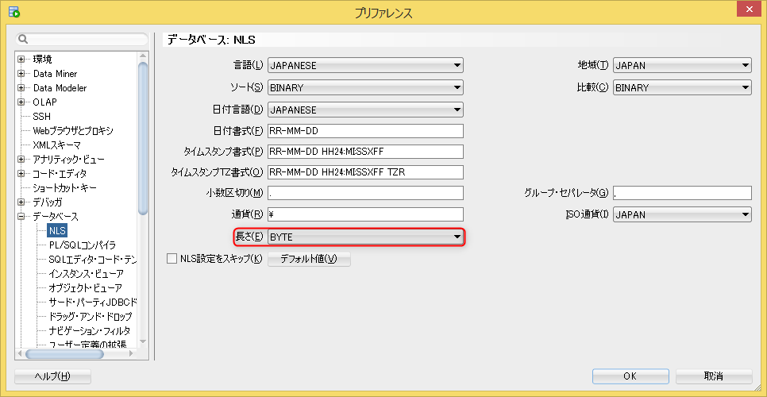

## 問題点

これはテーブル生成時の問題で、Oracle データベースのパラメータである列長セマンティクス(NLS\_LENGTH\_SEMANTICS)を正しく設定しておかないと、意図した文字数のデータを挿入することができなくなる可能性があります。  
特に、1文字≠1バイトである日本語のようなマルチバイト文字を使う環境では無視できないことと思います。  
最大桁数に近い値を入れないと気が付かないようなやや珍しめな問題ですが、発生時に原因特定がしにくかったり、 環境によっては再現しないなどの環境依存なところもあり、顕在化するとやっかいな問題です。

## 対象DB

- Oracle 9i以降

## 仕様

### Oracle データベース仕様

- 列長セマンティクスには、BYTEかCHARを指定できます。BYTEがバイト数で長さを判定し、CHARでは文字数で長さを判定します。

調査方法：以下のSQLで取得できます。

- テーブル生成時のDDLで列長セマンティクスを指定するのは以下の箇所です。3,4,5行目の型の後の括弧のなかで長さの定義と列長セマンティクスの定義をします。ここを省略した場合にNLS\_LENGTH\_SEMANTICSの値が関係します。

- テーブル生成時に列長セマンティクスが未指定の場合、デフォルト値としてNLS\_LENGTH\_SEMANTICSに設定されている値が使用されます。([https://docs.oracle.com/cd/E18283\_01/server.112/e10706/repunicode.htm](https://docs.oracle.com/cd/E18283_01/server.112/e10706/repunicode.htm\)))
- Oracleデータベースの新規構築時には、NLS\_LENGTH\_SEMANTICSがBYTEで定義されていました。

### (参考)SQL Developer仕様

SQL実行環境は色々とありますが、一例としてSQL Developerの仕様を記載します。

- SQL Developerでは、以下の設定により列長セマンティクスにデフォルト値を埋めこみます。

<figure>

<figcaption>

ツール>プリファレンス>データベース>NLS

</figcaption>

</figure>

## 対策

- テーブル生成時には、列長セマンティクスを省略せずに明示するのが安全策だと思います。  
    対象環境やツールに依らず、同一のDDLから列長セマンティクスも含めて同じテーブルが作成されることになるからです。何かしらDDL作成ツールを使用しているならば、列長セマンティクスを明示できるような設定にしましょう。
- 各環境のNLS\_LENGTH\_SEMANTICSを変更すること。多くのシステムの場合長さをどのように扱うかはほぼ統一できると思われますので、これをしておくと保険的対策となる認識です。

設定方法：以下の通りです。

## 参考

[https://docs.oracle.com/cd/E18283\_01/server.112/e10706/repunicode.htm](https://docs.oracle.com/cd/E18283_01/server.112/e10706/repunicode.html)
