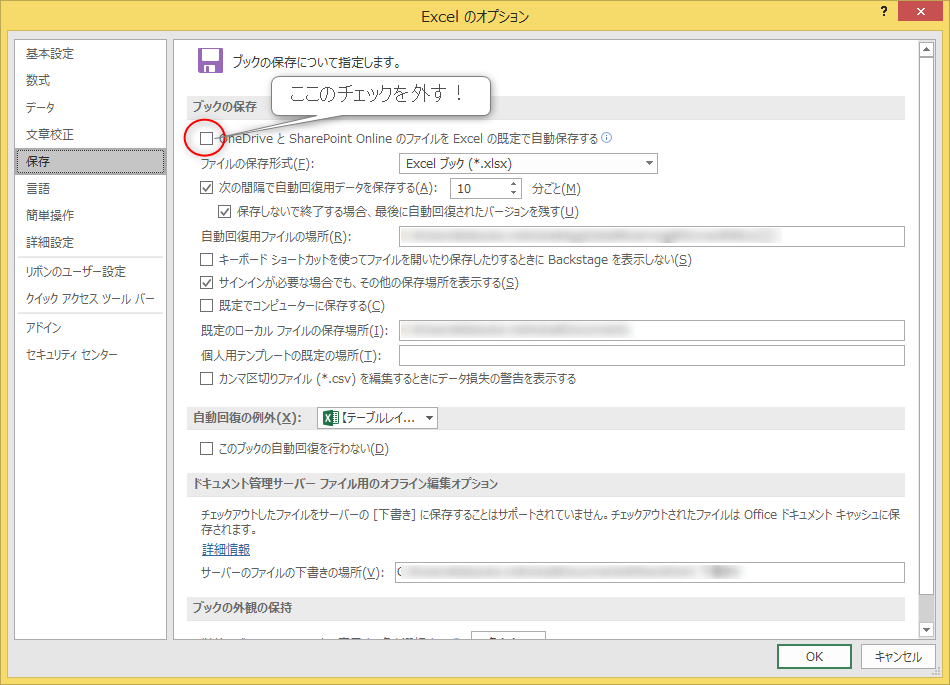

Microsoft Office 365系を使用している場合、TeamsやOneDriveなど、Microsoftのクラウド上に保存されているOfficeファイルはデフォルトで自動保存がオンになるようです。

<figure>

<figcaption>

例）Excel左上の自動保存オン状態

</figcaption>

</figure>

しかし、参照だけしたい場合も多く、勝手に保存されてしまうのは個人的に改悪機能です。ただし、設定で変更することができました。

  
ファイル>オプション>保存

#### (小言)

Microsoft的には、データをクラウド保存させて利便性を高めようという試みのさなかだとは思うのですが、結構な頻度でバージョン履歴が壊れたり、ファイル共有が上手く行かなかったりと、トラブルがまだまだ多いです。

そのような状況の中で、勝手に自動保存されるのは恐怖でしかなく、「勝手なことするな」と思う心情のほうが強いです。転換期なのでしょうがないところはあると思いますが、早めの改善が期待されます。
