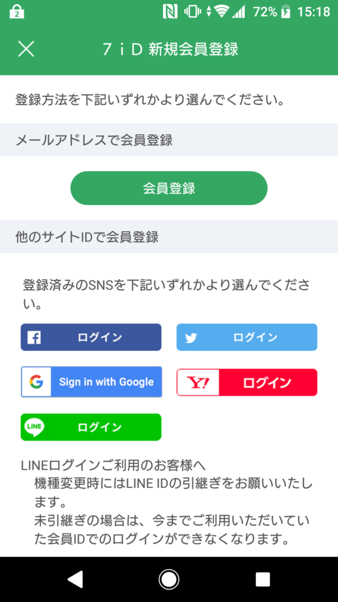
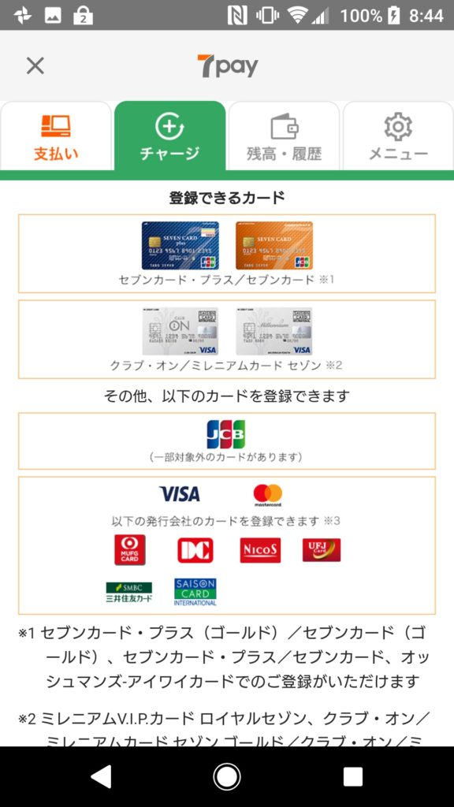
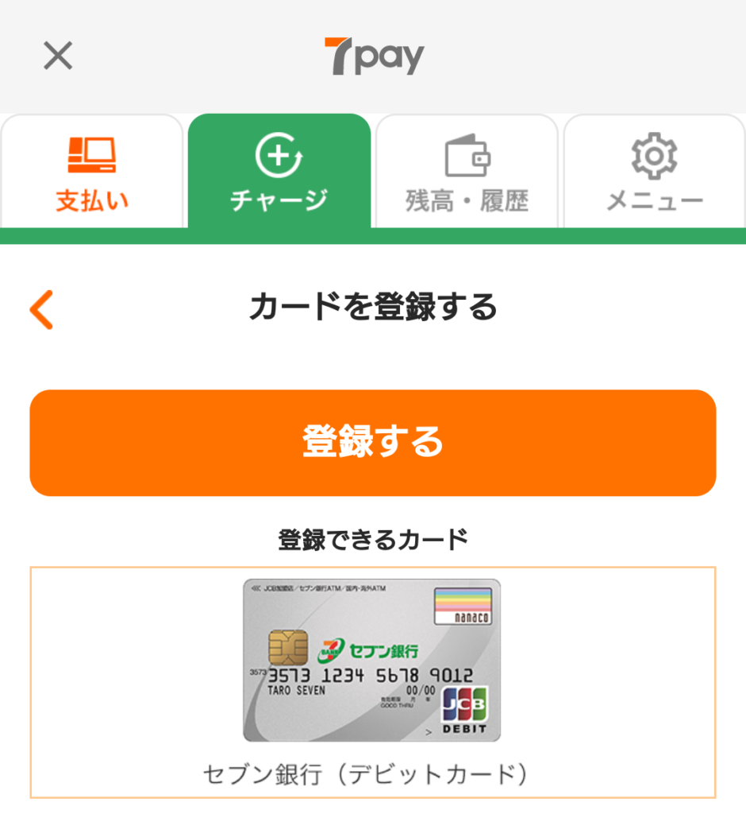
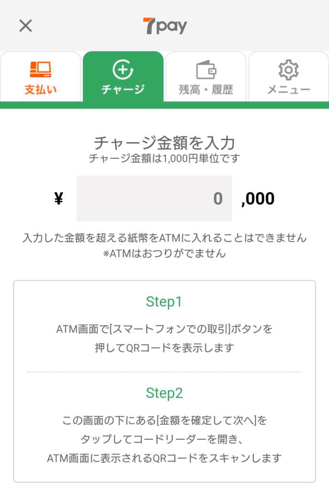

〇〇ペイが流行っていますが、コンビニエンスストア大手のセブンイレブンも7pay（セブンペイ）として2019年7月1日から参入しました。その利用方法をまとめます。

せっかく書いたので公開しましたが、**このアプリのパスワードリセット仕様に重大な脆弱性がありまして、チャージや現在新規受付を停止しています。さらに言えばアカウント乗っ取りが可能な脆弱性なのでチャージ済みのお金も使えるべきではないです。それを対策できていないのも組織としてNG。つまり7payは使ってはダメ。**大々的なニュースになっているのでご存じの人も多いと思いますが、[この件](https://www.sej.co.jp/company/important/20190703.html)です。

## アプリ会員登録

まずは、セブンイレブンアプリをインストールする必要があります。

### 必要なもの

以下のいずれかでログインできるので、何かしらのアカウントを持っていると楽です。

- メールアドレス
- facebook
- twitter
- Google
- Yahoo
- LINE

### スマホOSに合わせてアプリをダウンロード

Android版

 

iOS版

## 7payの使用方法

### チャージ

〇〇ペイは基本的にプリペイド（事前支払い式）なので、まずはチャージして入金しておく必要があります。そのチャージ方法は7payでは以下の5つが用意されています。

#### クレジット/デビットカード

使えるカードは限られますが、スマホやPCだけでチャージが完結しますので、できると大変便利です。

使用可能カードは、「セブンカード」系と「クラブ・オン」系のカード、それ以外は詳細に明かされていませんが、セキュア3D対応で、ユーザがそれを有効にしているカードが使えます。

- 
    

#### セブン銀行（デビットカード）

セブン銀行のデビットカードを持っていれば、それを使用できます。

#### セブン銀行ATM

こちらは現金でチャージができます。セブン銀行ATMはセブンイレブンには基本的にありますし、それ以外の場所にもあったりするので便利です。  
チャージ手順は以下の通りです。

1. セブン銀行ATMの端末で、 「スマートフォンでの取引」ボタンを押下
2. セブンイレブンアプリで、チャージ金額を入力し「金額を確定して次へ」ボタンを押下
3. セブンイレブンアプリにQRコードが表示されるので、セブン銀行ATMにスキャンさせる。
4. 現金を入金します

#### nanacoポイントでチャージ

セブンイレブンだけあって、nanacoからのチャージも出来ます。

#### レジで現金チャージ

「セブンペイに〇〇円チャージで」と店頭で言えば、その金額を支払うことでチャージできます。機械が苦手だったりする場合には確実ですが、レジが混んでいる場合などには少々心苦しいのが懸念かと思います。

### 支払い方法

通常通り商品をレジまで持っていって「セブンペイで支払います」と言えば使えます。

以下の通り、セブンイレブンアプリからバーコードを表示させて、店員さんに読み取ってもらいます。

## 終わりに

準備は多少ありますが、こうして新たな決済方法が使えるようになります。あくまで決済方法の一つではありますが、今後も利用していくかは好みです。

ただ、特に最初期は赤字覚悟なお得なキャンペーンが多いので是非利用するのをオススメします。

↑新しいものを初めるにはよくよく注意して利用せねばですね。自衛の意識は大事です。
