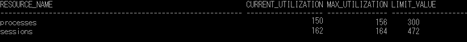
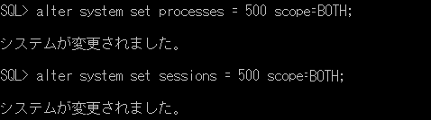

ここでは、Oracle DBのセッションを強制終了する手順を説明します。

強制終了しなければならない状況は色々とあるとは思いますが、以下のエラーが発生した場合なんかもそうかと思います。

> **ORA-12516: TNS: リスナーは、一致するプロトコル・スタックが使用可能なハンドラを検出できませんでした。**

このエラーメッセージはかなりわかりにくいですね。意訳すると、「接続可能なリスナーが見つかりません」ぐらいでしょうか。基本的に処理が完了したら接続は開放されるのですが、異常終了した場合など、ゾンビ化して残り続けることがたまにあるようです（ただし1~2時間で切れるよう）。もし、頻発するようであれば切断処理に何かしらの問題があるやもしれません。

## 手順

### Ⅰ. sqlplusでsysdba権限でOracleにログインする

DBがどこにあるかによるので、以下のいづれかの方法でsqlplusにログインしてください。

1. ローカルにDBがある場合  
      
    `sqlplus sys/パスワード as sysdba`

3. 外部サーバにDBがある場合  
    `sqlplus sys/パスワード@データベース接続子 as sysdba`  
      
    ここで、データベース接続子の記述方法についてもパターンがあります。
    1. 「ホスト名:ポート番号/サービス名」の直接指定  
        例）`@192.168.1.1:1521/orcl`
    
    3. tnsnames.oraに接続定義されている場合  
        例）`` `@SAMPLE` ``

```
# tnsnames.ora
SAMPLE =
  (DESCRIPTION =
    (ADDRESS = (PROTOCOL = TCP)(HOST = 192.168.1.1)(PORT = 1521))
    (CONNECT_DATA =
      (SERVICE_NAME = orcl)
    )
  )
```

### Ⅱ. V$RESOURCE\_LIMITを検索して、セッション数を確認する

以下をsqlplusで実行します。

##### 1\. 表示幅を増やす

場合によっては必要ないかもしれませんが、表示幅が長くなって表が崩れる可能性があるため、行サイズをとりあえず500にします。

```
set linesize 500
```

##### 2\. V$RESOURCE\_LIMITを検索します

```
select * 
from v$resource_limit
```

すると以下のような検索結果が出てきます。  
  
  
  
ここで、列説明をすると（英語の通りですが）、

- RESOURCE\_NAMEは**リソース名**（おそらく、processes:プロセスとsessions:セッションが出てくるはずです）

- CURRENT\_UTILIZATIONは**現在使用数**

- MAX\_UTILIZATIONは**最大使用数**

- LIMIT\_VALUEは**上限値**です。

##### 3\. 検索結果を確認

このとき、セッション数の現在使用数または最大使用数が上限値と同じもしくは近い場合は、セッション数不足ということがわかります。もし、そうでない場合は別の要因が考えられますので、残念ながらここでは解決できません。  
  
セッション数不足の対応としては、当たり前ではありますが、セッション上限を増やすか/不要なセッションを消す（終了させる/殺す）という手段があります。どちらを選択すべきかはサーバ性能などにも依りますので一概には言えません。しかし、あくまで方針として言えば、以下を判断基準としてもよいと思います。

- 定常的に使用するセッション数よりも過小に設定されてたり、サーバの性能（特にメモリ）に余裕があるのであればセッション上限を増やす[↓](#sessionIncrement)

- アプリが異常終了してしまったことによる不要なセッションが大量に発生してしまったのが分かっていたり、取り急ぎアプリをDBアクセスしたい場合などはセッションを消す[↓](#sessionDelete)

### Ⅲ-a. セッション上限を増やす

##### 1\. セッション上限のパラメータがどこで定義されているか

Oracleのインスタンスを起動するときにこのセッション上限が決められるわけですが、その設定情報がどう定義されるかは2パターンあるため、まずどちらで定義されているかを確認する必要があります。

- pfile：テキスト形式の初期化パラメータファイル

- SPFILE：バイナリ形式のサーバパラメータファイル

##### 2\. 定義情報の確認方法

sqlplusで以下を実行し、結果のVALUE列に、nullであればpfile、パスの情報があればSPFILEということがわかります。

```
show parameter spfile
実行例：
```

- pfileの場合  
    Oracle公式の[こちら](https://docs.oracle.com/cd/E49329_01/server.121/b71301/create.htm#i1014287)を参照してください。

- SPFILEの場合  
    以下のDDLを実行します。ここでは"500"を指定していますので、適宜必要な数字に変更してください。  
    また、ロールバックができないことに留意してください。

```
alter system set processes = 500 scope=BOTH;
```

実行例：  
  
  
  
これで完了です。scopeにBOTHを指定していますので、SPFILEにも現在実行中のDBインスタンスにも即時反映されていますので、DB再起動は不要です。

### Ⅲ-b. 不要なセッションを削除する

##### 1\. 詳細なセッション一覧を検索する  

以下のSQLを実行して、削除に必要な情報を取得します。

```
select MACHINE, LOGON_TIME, SID, SERIAL#, USERNAME, OSUSER
from V$SESSION
```

以下のような結果が取得されると思います（一部抜粋&マスキングしてます）  
  
  
  
これらの中から削除対象を選びます。これらは自己責任でお願いします。判断基準としては、ログイン日時が古かったり、対象のユーザで特定したりなどかと思われます。  
  
削除に必要な情報は、\`SID\`と\`SERIAL#\`です。

##### 2\. セッションを削除する

上記で削除したいセッションが特定できていれば、以下のSQLで削除します。繰り返しになりますが、自己責任で。  
  
また、DDL文でもありますので、ロールバックができないことにも留意してください。

```
alter system kill session 'ここに対象のSIDを指定'
```

実行例：  
  
  

## 参考

[http://out2dev.blogspot.jp/2012/03/ora-12516.html](http://out2dev.blogspot.jp/2012/03/ora-12516.html)

[https://sql-oracle.com/?p=395](https://sql-oracle.com/?p=395)

[http://at-j.co.jp/blog/?p=5468](http://at-j.co.jp/blog/?p=5468)
