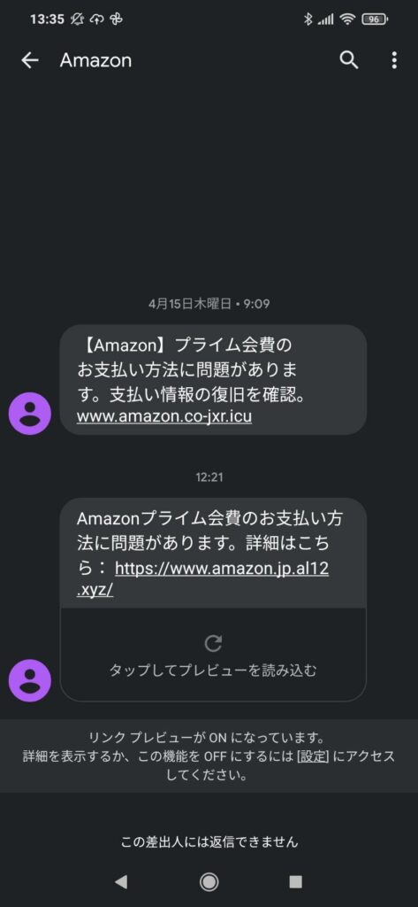
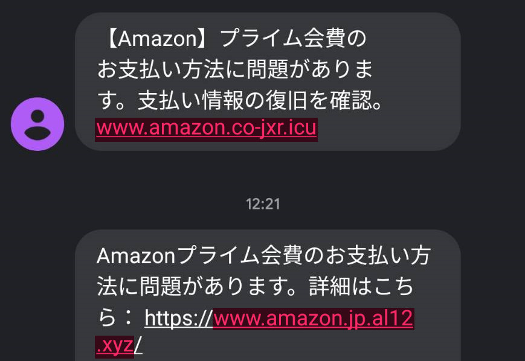
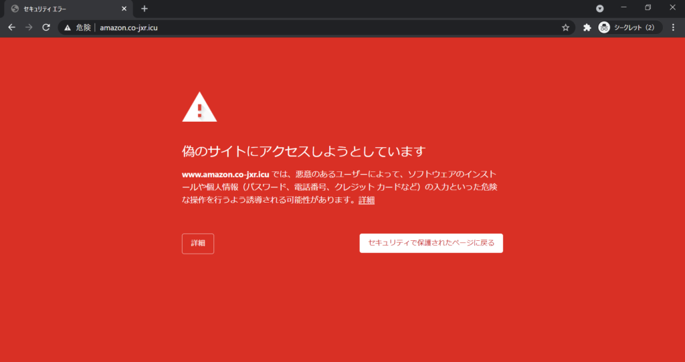
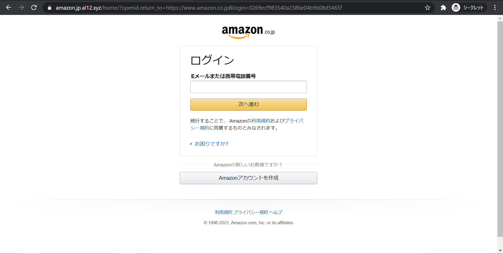
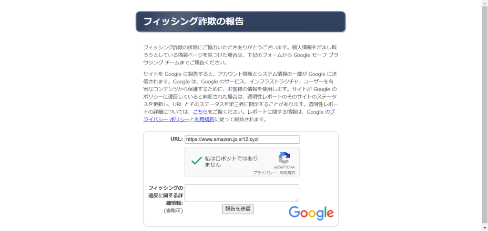

こんなSMSが来ました。Amazonプライムに加入しているので、一瞬ハッと思ったのですが、すぐにフィッシング詐欺だと気づいて無視していました。

しかし、ご覧の通り二度に渡って連絡して来たので、構ってほしいのだと思い、遊んであげることにしました。

本記事ではフィッシング詐欺に引っかからないようにする注意点も紹介しながら、引っかかるとどうなるかを説明しようと思います。

（本記事には「Amazon」がたくさん出てきますが、全くの無関係です。成りすまされた被害者ということをご認識ください。）

## チェック1：文面の内容を確認

フィッシング詐欺の実行者は外国人が多いのか、変な日本語で送られてくることも多いです。まず最も分かりやすいところで、怪しい文章で送られてくるメッセージは詐欺等であることが多いです。また、見に覚えのない内容かどうかも重要です。ただ、いかがわしいサイトを閲覧しただとか、クレカの滞納をしてしまった事があるだとか、そうした後ろめたい所に刺さる文言だと心理的に引っかかりやすくなるので、まずは落ち着きましょう。本当のことだったとしても、多くの場合に**即座**に対応が必要ということは殆どありません。何事にも一呼吸置く心持ちでいましょう。

しかしながら、今回の場合、日本語に特に不自然なところもなく、私がたまたまAmazonプライム会員だったことで、このチェックポイントはすり抜けてしまいます。

## チェック2：URLを確認

### ①ドメイン確認

メッセージの中に貼られているリンクのドメインを見てみます。ドメインとは、サイトの住所のようなものだとよく例えられるもので、サーバがどこにあるかというのを英数字の文字列で一意に特定するものです。今回の例で言うと下記で色付けしたところのような、「https://」以降で、「/」より前の部分です。Amazon（日本法人）の正しいドメインは「amazon.co.jp」です。フィッシングメールに記載のはAmazonぽいですが、ちょっと違って気持ち悪いですよね。ドメイン名は本物を見分ける時に大事なのでそれで分かるようになるとベターです。

ただし、注意していただきたいのは、見た目のURLは偽装することもできるので過信しすぎてはいけません。実際に開いたら別のドメインだったということもあるので開く前だけ確認して安心することの無いように。例えば、以下のリンクは実際に偽装したもので、amazonのドメインですが、実際にはgoogleにアクセスしてしまうものにしています。  
[https://amazon.co.jp/](https://www.google.com/)

### ②プロトコル確認

例えばAmazonなどのEC（通販）サイトでは、決済が出来てお金が動きます。クレジットカード情報だったり個人情報だったりを扱ったりする場合は必ずssl/tlsという技術によって暗号化通信が行われます。Amazonも例に漏れずこの暗号化通信がされています。見分け方としては、細かいのですが先頭に http**s**:// と、sが付いているかどうかで分かります。http:// (sが無い)始まりだったり、そもそも省略されている場合は、この暗号化通信ではありません。

### ③そもそもアクセスしない

元も子もない話ではありますが、メールなどに貼られているURLリンクにはアクセスしないのが一番の防衛策にはなります。ブラウザのブックマークやgoogleなどの検索エンジンから都度アクセスするように普段からしておくという手立てもあります。

## 引っかかってみた1

では、上記チェックの確認を無視して、この怪しいURLにアクセスしてフィッシング詐欺に引っかかってみます。まず一つ目にアクセスすると下記の画面になりました。

明らかにアクセスしては駄目なことが分かる画面が出てきました。これは、googleなどブラウザベンダー企業がこうしたフィッシング詐欺サイトをブラックリストで保持していて、サイトにアクセスする前にユーザを守るために警告を出してアクセスを止めてくれています。こうしたセキュリティの強化には感謝です。しかしながら、イタチごっこではあるので、必ずしもこれにより安全が保たれるわけではないので、ユーザ自身の自衛も大事です。

## 引っかかってみた2

もう一つのURLにもアクセスしてみました。するとこちらはフィッシング詐欺のブラックリストにまだ登録されていないようで、表示ができました。実際に表示されたのが下記左の画像で、比較のために本物のAmazonのページも右に並べました。違いが分かるでしょうか？

<figure>

<figcaption>

偽サイト(左)と本物サイト(右)

</figcaption>

</figure>

ここでの本質的な差異は、先にもチェックポイントとして挙げた**ドメインが異なること**で、レイアウトが縦方向に少しずれていることは重要ではありません。レイアウトのズレは詐欺サイト作成者の技術力が無いだけであり、全く同一のレイアウトで偽サイトを作ることは容易です。また、ここでは左右に並べたので違いが分かりましたが、見た目だけでは見抜くのが難しいということが分かっていただけたでしょうか。見た目に騙されず、冷静にドメインを確認しましょう。  
逆に、詐欺サイト作成者さんは、こんな簡単なこともできないなら詐欺など辞めて、真っ当に働いて技術力を磨いていって貰えればと思います。

## 終わりに

本当は、もっと深くまでアクセスするつもりだったのですが、存外早くにフィッシング詐欺サイトが閉じてしまっていて、これ以上引っかかってみることができなくなってしまいました。またフィッシング詐欺メールが来ることを楽しみに待つことにします。

また、フィッシング詐欺サイトを発見したら、下記のGoogle セーフ ブラウジング チームなどに報告すると良いでしょう（実際、2つ目のURLは報告しました）。  
[https://safebrowsing.google.com/safebrowsing/report\_phish/](https://safebrowsing.google.com/safebrowsing/report_phish/)

