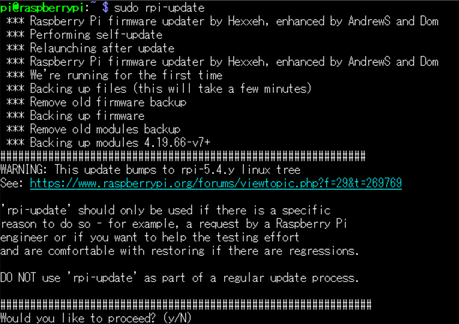
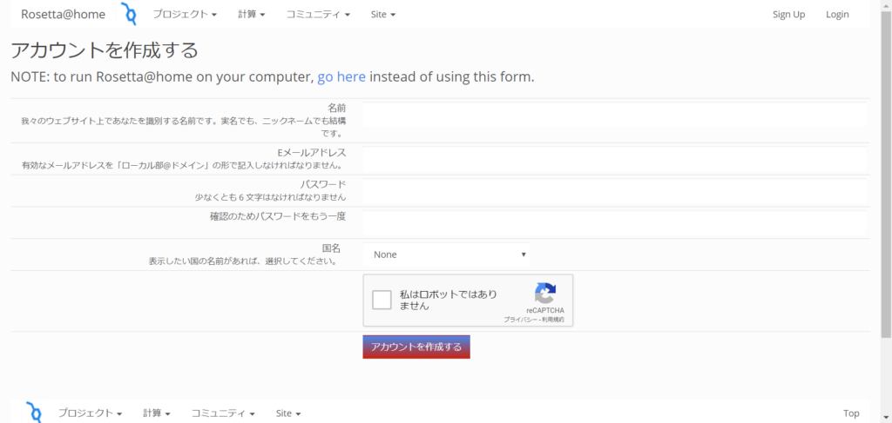
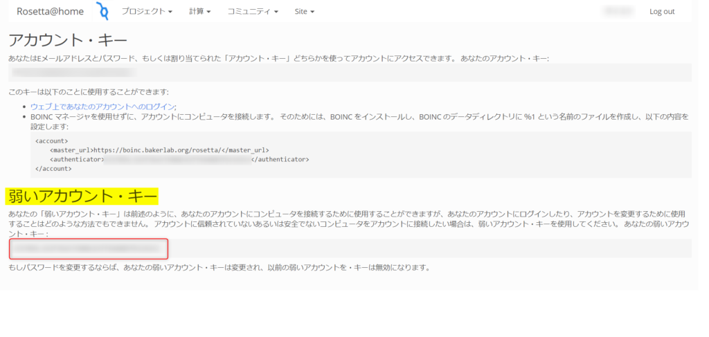

## はじめに

2019年末より、新型コロナウイルス(COVID-19)のパンデミックで世界中が大打撃を受けています。  
この感染拡大を防ぐべく、エンジニアとして何かできることは無いかと思い、「分散コンピューティングにRaspberryPiで参加する」ことで貢献できればと思い紹介させていただきます。

### 要件

RaspberryPi のバージョン**4**以降であること。

### 分散コンピューティングとは

例えるなら、ドラゴンボールの元気玉です。みんなから少しずつ力を分けてもらい、集まった強大なエネルギーを敵に打つ技です。（今どきドラゴンボールネタは通じないのかな、、この元気玉という技は皆から少しずつエネルギーを集めて巨大な力で相手を倒します。主人公の孫悟空が魔人ブウを倒したりしました。）


分散コンピューティングとは、多数のコンピュータをネットワークを介して繋げて巨大な計算機としてスーパーコンピュータを凌ぐほどの計算力とする方法のことです。各コンピュータには小さく切り分けられたタスクと呼ばれるものが割り当てられ、それを計算して結果をアップロードします。

一つ一つのマシンが少しずつの計算能力を提供して、それらが合わさって多大な計算能力となるので、先に元気玉の例を挙げました。

ウイルスのタンパク質の解析やシミュレートには多大な計算が必要なので、こうした分散コンピューティングの技術が使われていたりします。

### 方針

分散コンピューティングに参加するには、クライアントソフトを端末に導入する必要があります。なので対応するCPUであること、64bit OSであることなどが条件です。なので、公式に64bitのOSRaspberryPi に通常インストールしているであろう OSはRaspbian 32bitです。これに対する手立てとして、UbuntuServerという別のOSに入れ替えたりということもできるのですが、そうするとこれまでのRasbianが消え去ることになり、今までやっていたことが全くできなくなってしまいます。

また、分散コンピューティングのプロジェクトですが、RaspberryPiのarmアーキテクチャのCPUを使える「[Rosetta@home](http://www.oruoru.jp/rosetta_japan.html)」に参加する方針です。分散コンピューティングで最も巨大なプロジェクトは「[Folding＠home](https://foldingathome.org/covid19/)」ですが、armアーキテクチャに対応していないため、参加できません。

## 手順

### RaspberryPi の準備

まず、今回の作業の対象であるかを確認します。下記コマンドを実行します。

```
getconf LONG_BIT
```

「32」と出力された場合は、64bitで動作させるために下記の対応が必要です。「64」と出力された場合は下記は実施不要です。

#### バックアップ

これから行う作業はOSのアップデートですので、最悪データが壊れたりする可能性もあります。なので念の為バックアップを取得します。使用するPCがWindowsかMacかで手順が異なります。以下のサイトでそれぞれ説明されているのでご参照ください。Windowsマシンで16GBのメモリーカードでは30分ほどかかりました。

https://gloria.cool/blog/20200209-raspberrypi-backup

OSアップデート

下記コマンドを実行してアップデートします。

```
sudo rpi-update
```

<figure>



<figcaption>

このように実行するか訊かれたら「y」を入力します。5分ほど待ちます。

</figcaption>

</figure>

完了したら、続いて設定ファイルに64bit モードで動作する設定を書き加えます。「arm\_64bit=1」という設定を「/boot/config.txt」に加えれば良いので、下記のコマンドを実行します。

```
echo 'arm_64bit=1' | sudo tee -a /boot/config.txt
```

これらの設定が完了したら再起動してOSのアップデートと設定を反映させます。そして、再度下記コマンドを実行してバージョンとbit数を確認しましょう。

```
getconf LONG_BIT
```

「64」と表示されるようになればOKです。

### Rosseta@home のアカウント登録

下記にアクセスして、右上の「Sign Up」からアカウント登録を行います。

http://boinc.bakerlab.org/rosetta

<figure>


<figcaption>

右上の「Sign Up」を押す。

</figcaption>

</figure>

<figure>



<figcaption>

このページを埋めるだけ。

</figcaption>

</figure>

登録して、ログインした状態で、下記にアクセスします。そして、「弱いアカウント・キー」をコピーしておいてください。  
[https://boinc.bakerlab.org/rosetta/weak\_auth.php](https://boinc.bakerlab.org/rosetta/weak_auth.php)

<figure>



<figcaption>

「弱いアカウント・キー」をコピペできるようにしておきます。

</figcaption>

</figure>

### BOINCの準備

BOINCとは、クライアントで実際に分散コンピューティングの処理をするアプリケーションです。下記でインストールと設定をします。

```
sudo apt install boinc-client
```

設定ファイルの修正が必要なので、「**/var/lib/boinc-client/cc\_config.xml**」というファイルを下記のように「aarch64-unknown-linux-gnu」を入れ込む形で修正します。

```
<cc_config>
  <log_flags>
    <task>1</task>
    <file_xfer>1</file_xfer>
    <sched_ops>1</sched_ops>
  </log_flags>
  <options>
    <alt_platform>aarch64-unknown-linux-gnu</alt_platform>
  </options>
</cc_config>
```

設定ファイルの反映のために、下記コマンドを実行します。

```
boinccmd --read_cc_config
```

Rosseta@home のサイトでコピーした「弱いアカウント・キー」の情報を付けて、下記コマンドでプロジェクトに対する紐付けを行います。

```
boinccmd --project_attach http://boinc.bakerlab.org/rosetta/ 弱いアカウント・キー
```

これで完成です。  
あとは何もしなくても勝手にRaspberryPiが計算してくれて、分散コンピューティングに貢献してくれます。Rosseta@homeのサイトを見て進捗状況など確認してみてください。

### 参考URL

- [Rosseta@home](https://boinc.bakerlab.org/rosetta/)

- [「Rosetta@home」ならラズパイでも新型コロナの解析に協力可能](https://pc.watch.impress.co.jp/docs/news/yajiuma/1245497.html)
