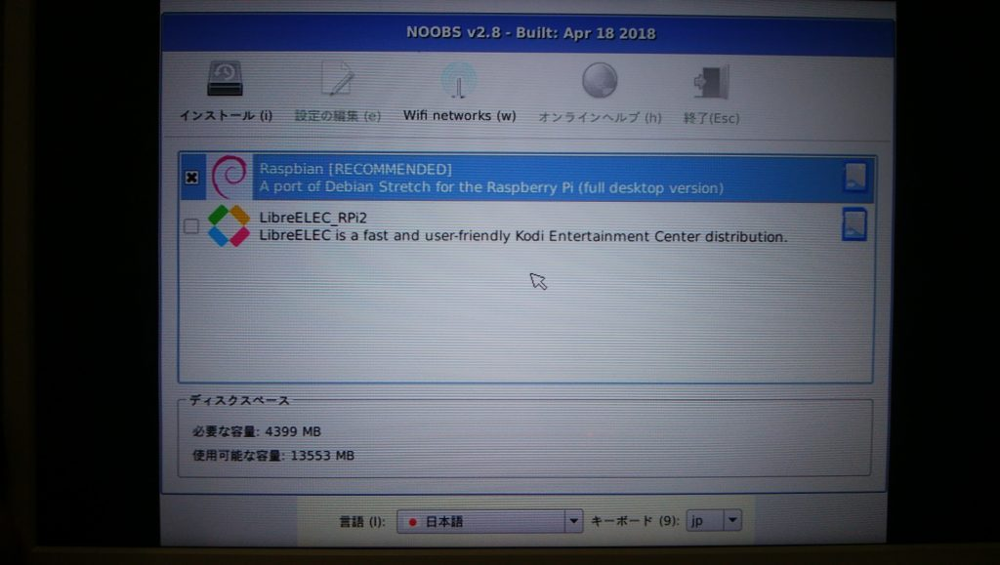
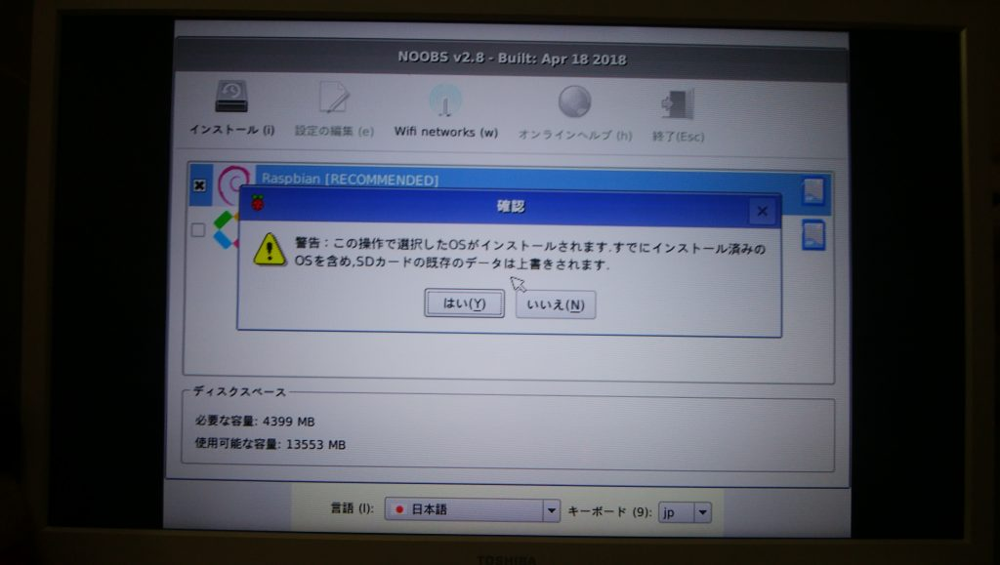
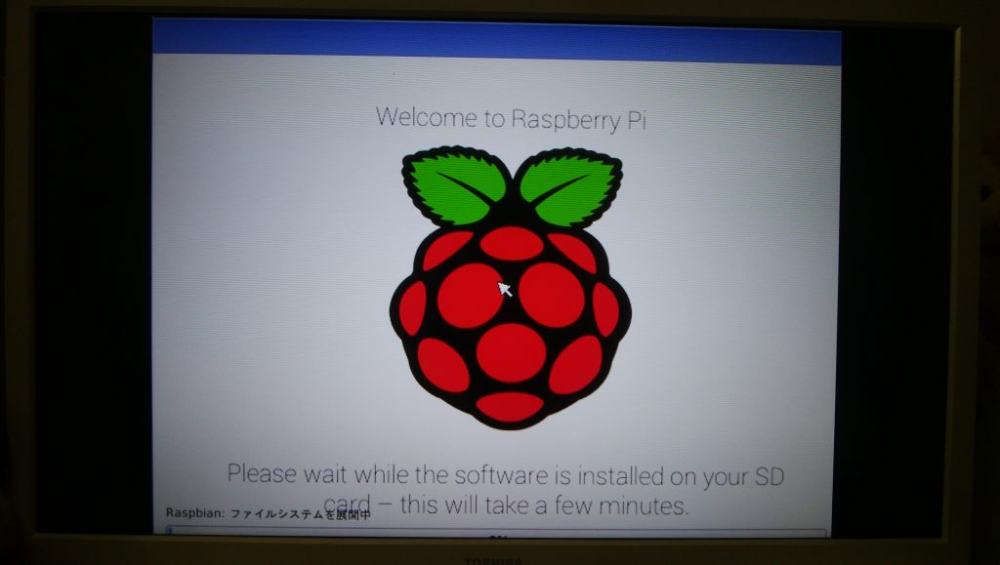
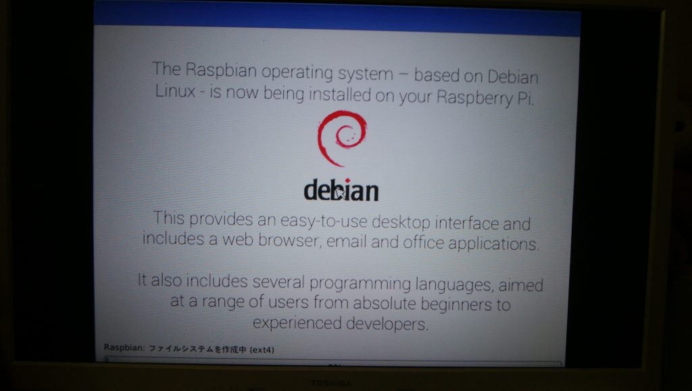

Raspberry Pi3のインストールに初っ端からハマりました。インストールが全然進まず、エラーメッセージも無くすぐに初期画面に戻り、無限ループを繰り返すしかなくなります。原因が気付きにくかったのでここに残しておきます。

## 環境

ハードウェア：Raspberry Pi 3 Model B+

OS：NOOBS 2.8.2

## 事象

NOOBSの標準インストール方法を実施するだけです（ディスプレイを写真で撮ったので画像が少し見辛いです）。

1. インストール対象（推奨されているRaspbian）を選択し、インストールを実行します。  
2. インストールが始まる。  
3. しばらくすると画面が切り替わり、最初の1の画面に戻ります。 

## 原因

結論としては、原因は電源の供給不足でした。インストール時には電力をかなり消費するようで、途中で電力不足による強制シャットダウンが起こっていました。ただし、それが画面上わかりにくく、ただただ初期画面に戻ってきたように見えますので、気付きにくかったです（再起動が早すぎるゆえ）。

## 対策

単純に、十分な電力を供給できる電源ケーブルに変更することです。

その際、一度インストールに失敗しているのであれば、SDカードの初期化とOSファイルのコピーをやり直しておいた方が安全と思われます。インストール中に強制シャットダウンされているので、破損したデータが残ってしまっている可能性があるためです。

上記事象と同様のことが起こっていたのであれば、電源供給に問題がある可能性が高いと思いますので、試してみてください。

## 補足（試したこと）

最初はSDカードのデータのほうを疑いました。セットアップが上手くいかないのは何かしらデータが破損していたり、はたまた書き込みが上手くいかないからではと考えたからです。 なので、試したこととしては、

- SDカードの再フォーマット
- OSファイルの再ダウンロード&SDカードへのコピーし直し
- 別OS（Raspbian Lite）のインストール

です。ただ、もちろん事象は解決せずでした。
