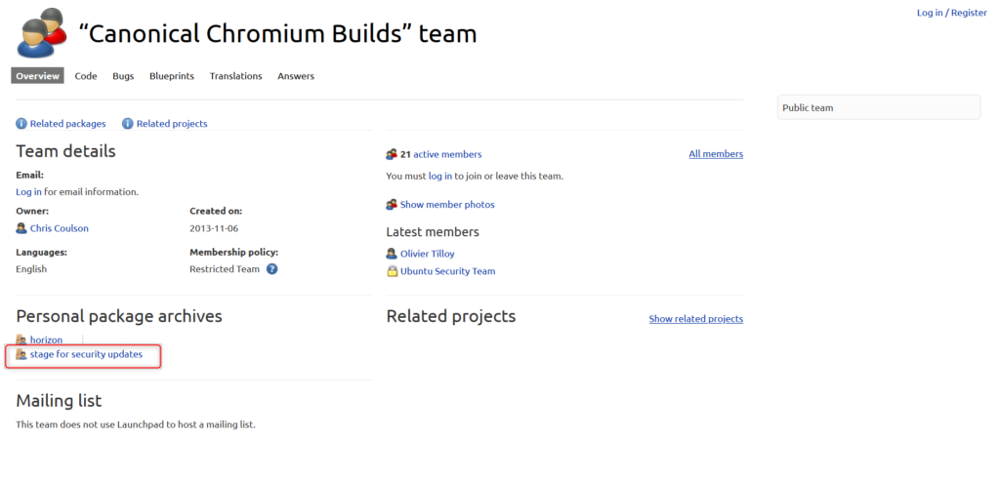
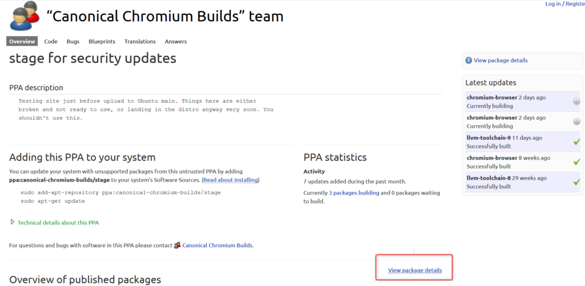
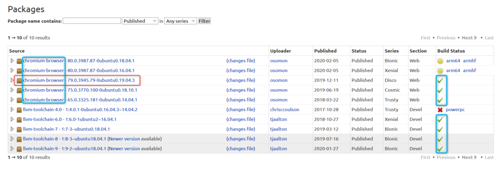
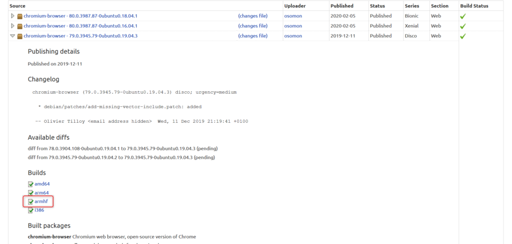
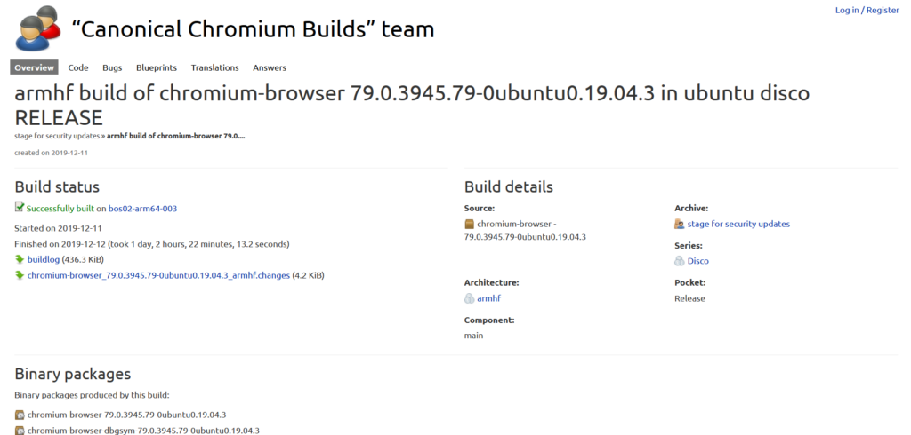
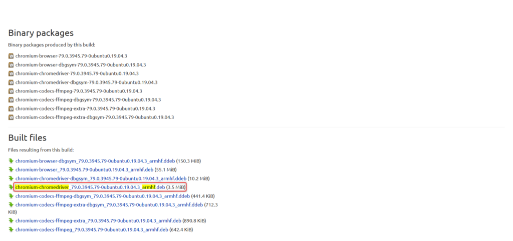
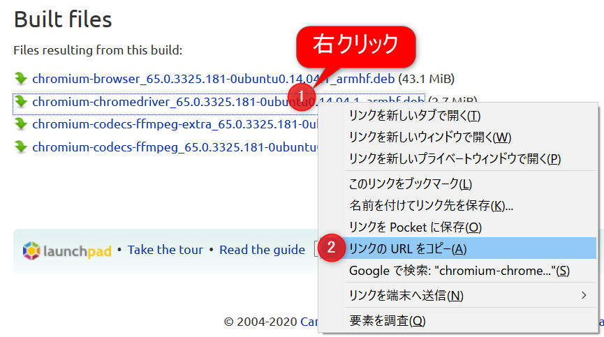
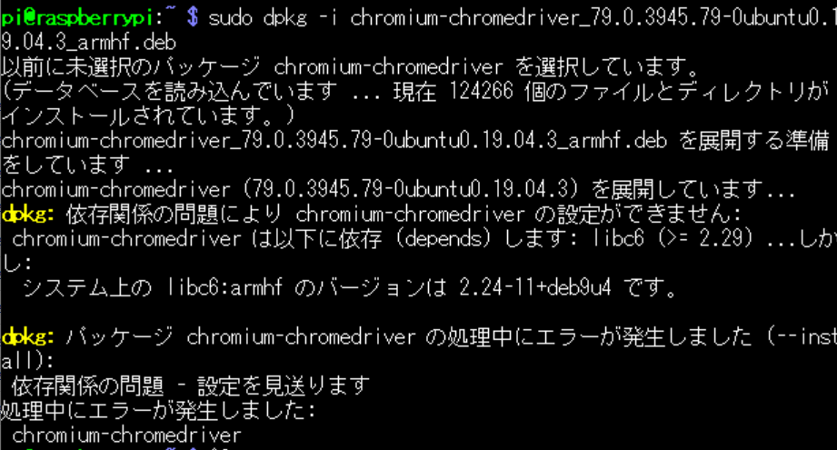

最新の情報を探せず、大変苦労したのでここに残します。この先も使えるやりかたとなるように記載します。

## やりたいこと

- Raspberry pi(Raspbian)上でseleniumを動かしたい。
- そのために、ChromeのWebドライバが必要なので取得したい。

## 障壁

しかし、問題なのはChromeドライバが Raspberry pi （Raspberry piで使われているCPUであるarmhfアーキテクチャ） 向けには公式から提供されていないこと。なので各種パッケージ管理ツールから落としてきても上手く動きません。

また、Chromeの更新頻度が早いので、以前はできていたものも今は出来なくなっていたりします。そうした過去の情報に惑わされて四苦八苦しました。

## 手順

以下のサイトで Raspberry pi向け(armhfアーキテクチャ)のChromiumドライバを配布してくれています。ですが、目的の場所に遷移するのが非常に大変です。ブラウザでこのサイトから該当ファイルのリンクを取得しましょう。

### 該当ドライバを探す

[https://launchpad.net/~canonical-chromium-builds](https://launchpad.net/~canonical-chromium-builds)

<figure>



<figcaption>

stage for security updatesをクリック

</figcaption>

</figure>

<figure>



<figcaption>

View package detailsをクリック

</figcaption>

</figure>

遷移した先のページの下のほうにいろいろなパッケージが一覧化されているはずです。それらの中で、

- chromium-browserとあるもの（下記青枠で囲っているような）
- Build Statusが「✔」となっているもの （下記青枠で囲っているような）
- まずはよりバージョン番号が大きいもの

を選びましょう。

<figure>



<figcaption>

今回の例では「chromium-browser - 79.0.3945.79-0ubuntu0.19.04.3 」を選択します

</figcaption>

</figure>

それを選択するとアコーディオンメニューが開くので、そこから「armhf」というリンクを探しクリックします。

<figure>



<figcaption>

armhfをクリック

</figcaption>

</figure>

すると、以下のような画面に遷移しますので、下へスクロールして「Built files」という項目を探します。そこで、

- chromium-chromedriverとだけあるもの（dbgsymなどの余計な名称がついていないもの）
- 改めて「armhf」向けであることを確認

上記を満たすものを見つけてください。

<figure>



<figcaption>

ここから下へスクロール

</figcaption>

</figure>

<figure>



<figcaption>

今回の例では「chromium-chromedriver\_79.0.3945.79-0ubuntu0.19.04.3\_armhf.deb」を選択

</figcaption>

</figure>

該当ドライバを右クリックしてリンクのURLを取得してください（OSやブラウザによって操作は少し異なるかもしれません）。  
また、別の手段として一旦ダウンロードしてから、FTP等でRaspberry piに送ってもよいです。



### ドライバ取得とインストール

ここからはRaspberry pi上での操作です。  
上記で取得したURLを使って、Raspberry piの「wget」コマンドでファイルを取得します。単純にwget の後にリンクを貼り付けるだけでダウンロードされます。（以下は今回の例。コピーしたリンクによってhttps以降の部分は変わります。）

```
wget https://launchpad.net/~canonical-chromium-builds/+archive/ubuntu/stage/+build/18233993/+files/chromium-browser_79.0.3945.79-0ubuntu0.16.04.1_armhf.deb
```

続いてこれをインストールします。拡張子が「.deb」とありますが、これはパッケージ管理システムで解釈できる形式なので、コマンド一発でインストールできます。「dpkg -i」として引数にダウンロードしたファイルの名称を指定してください。（"chromi"くらいまで入力してtabキーを押せば補完されるはずです。）

```
sudo dpkg -i chromium-browser_79.0.3945.79-0ubuntu0.16.04.1_armhf.deb
```

#### インストールできない場合

上記の手順を行っても、下記のエラーなどでインストールできないと言われる可能性があります。（実際今回の例で使用していたバージョンは以下のエラーがでます）

```
dpkg: 依存関係の問題により chromium-chromedriver の設定ができません: chromium-chromedriver は以下に依存（depends）します: libc6(>= 2.29) ...しかし:  システム上の libc6:armhf のバージョンは 2.24-11+dev9u4 です。
```

<figure>



<figcaption>

インストール時に依存関係エラーが発生

</figcaption>

</figure>

こうした場合の対処としては色々とありますが、別のドライババージョンを試すというのが良いかと思います。上記の**該当ドライバを探す**で他のバージョンを探してみましょう。今回バージョン79系がダメでしたが、実は75系もダメで、65系ならばインストールできました。  
参考までに以下リンクです。

[https://launchpad.net/~canonical-chromium-builds/+archive/ubuntu/stage/+build/14482955/+files/chromium-chromedriver\_65.0.3325.181-0ubuntu0.14.04.1\_armhf.deb](https://launchpad.net/~canonical-chromium-builds/+archive/ubuntu/stage/+build/14482955/+files/chromium-chromedriver_65.0.3325.181-0ubuntu0.14.04.1_armhf.deb)

他の解決方法としては、該当の依存ライブラリを更新するといったことが挙げられますが、ドツボにはまる可能性はあります。

## Seleniumの動作確認

これでChromeドライバの準備は整ったので、簡単なプログラムを動かしてみます。

### 前提

pythonがインストールされていること

### 手順

Seleniumをインストールする必要がありますので、pipでインストールします。

```
pip installl selenium
```

下記コードを貼り付けたpythonファイルを作成して（例えばsample.py）、実行します。このコードでは、yahooのトップページにアクセスして、そのスクリーンショットを画像保存しているだけです。

```
from selenium import webdriver
from webdriver_manager.chrome import ChromeDriverManager
import traceback
def main():
    try:
        chrome_option = webdriver.ChromeOptions()
        chrome_option.add_argument('--headless')
        chrome_option.add_argument('--disable-gpu')
        chrome_option.add_argument('--no-sandbox')
        chrome_option.add_argument('--disable-setuid-sandbox')
        driver = webdriver.Chrome(executable_path="/usr/lib/chromium-browser/chromedriver", options=chrome_option)
        driver.get("http://www.yahoo.co.jp")
        driver.save_screenshot('screenshot.png')
        driver.quit()
    except:
        print(traceback.format_exc()) 
        driver.quit()

if __name__ == '__main__':
    main()
```

実行方法は、以下の通りです。（ファイル名は適宜変更してください。）

```
python sample.py
```

エラーが発生せずに終了し、同ディレクトリにscrrenshot.pngというファイルが作成されていれば成功です。（試しにその画像を見てみてください。）

## 最後に

これで、SeleniumがRaspberry piで動くようになるので、ここからSeleniumを使った開発ライフを送りましょう。
