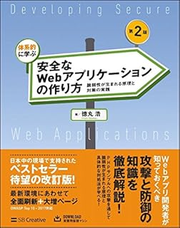
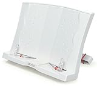

こちらは[技術的ポエム Advent Calendar 2018](https://qiita.com/advent-calendar/2018/poem)の3日目の記事です。  
  
今年一年、色々と多忙で全然アウトプットができていませんでしたが、読書の習慣は続けられたので、そのことについて書き綴ろうかと思います。  
やや技術的なところから外れているかもしれませんが、空いていたので入れさせてもらいました。

## 前書き

まず、私自身は元々読書を食わず嫌いしていました。  
ですが、良書に出逢ってからは本というものの素晴らしさに気づき、それ以来継続して本は読むようになりました。そういった本嫌いの方は少なからずいるとは思いますが、**知識欲の多いエンジニア**であれば良書を読めば意外と面白いという気付きにつながるかと思いますので、是非！  
  
例えば私は、以下の本との出逢いで、セキュリティというものに強く興味を持つことになりました。この本はKindle版(自分で読む用)も書籍版(布教用)をそれぞれ持ってますし、何度も読み直した、自分にとってのバイブルとなっています。IPAのセキュリティスペシャリスト（現：情報処理安全確保支援士）の資格取得するにも至りました。セキュリティの知識にはかなりの自信を持っていますし、まさにエンジニアとしての方向性を変える一冊だったと思っています。

[体系的に学ぶ 安全なWebアプリケーションの作り方 第2版 脆弱性が生まれる原理と対策の実践](//af.moshimo.com/af/c/click?a_id=1041250&p_id=170&pc_id=185&pl_id=4062&s_v=b5Rz2P0601xu&url=https%3A%2F%2Fwww.amazon.co.jp%2Fexec%2Fobidos%2FASIN%2F4797393165)

posted with [ヨメレバ](https://yomereba.com)

徳丸 浩 SBクリエイティブ 2018-06-21

[Amazon](//af.moshimo.com/af/c/click?a_id=1041250&p_id=170&pc_id=185&pl_id=4062&s_v=b5Rz2P0601xu&url=https%3A%2F%2Fwww.amazon.co.jp%2Fexec%2Fobidos%2FASIN%2F4797393165)

[楽天ブックス](//af.moshimo.com/af/c/click?a_id=1041250&p_id=56&pc_id=56&pl_id=637&s_v=b5Rz2P0601xu&url=http%3A%2F%2Fbooks.rakuten.co.jp%2Frb%2F15472730%2F)

[楽天kobo](//af.moshimo.com/af/c/click?a_id=1041250&p_id=56&pc_id=56&pl_id=637&s_v=b5Rz2P0601xu&url=https%3A%2F%2Fbooks.rakuten.co.jp%2Frk%2F6f16ce442c4b3b9aba19416d6d1ab6e0)

[図書館](http://calil.jp/book/4797393165)

## おすすめの読書習慣

運命の一冊と出逢うためには、たくさん本を読んでいく必要があります。  
そこで、私がお勧めしたいのは、昼ご飯を食べながら読書するということです。  
  
ご飯は外食派と言われるとそれまでなのですが、私の周りは割と自席で弁当を食べる人が多いので、そういった方にお勧めです。毎日習慣的に訪れて、"目"も空いているイベントなので、これを使えると結構習慣づけとしては最適です。

## おすすめツール

ツールと言ってよいか分かりかねますが、広義のということで、読書する上であると便利なものをご紹介します。

### 電子書籍

手軽さ、持ち運びの便利さは半端ないです。数クリックですぐ買えるので、本屋に行かずに読みたいときに読め、どんなに分厚くて重い本もスマホ一台あればどこでも手軽に読めます。  
Kindleやkoboなど色々とあるのでお好きなものを。私はKindle派ですが他のものとあまり比べたことはないので何が良さそうかは語れません。

### 図書館+カーリル

技術書って正直結構お値段が張ります。自己投資としてある程度はお金を出すべきだとは思いますが、 現実的な話として、 たくさん本を読もうとすると金銭的にキツイというのは確かにあります。。  
こういう時の図書館です。古めの本だと特にですが、意外と借りられる本は多いので助かります。本当に充実しているので、こうした福利厚生が充実している日本に生まれたことを感謝しつつ、どんどん活用すべきです。ただし、図書館を利用する場合の欠点は、貸出期限があることです。分厚い本なんかを期間内に読むのは結構辛かったりします。逆に、期限があることで積読防止になるという利点も少なからずあると思います。  
そして図書館を利用する上で便利なのがカーリル([https://calil.jp/](https://calil.jp/))というサービスです。複数の図書館にまたがって、蔵書検索が出来るので、近所や学校/職場近辺で本が借りられるか分かります。

[https://calil.jp/](https://calil.jp/)

### ブックスタンド

電子書籍を紹介しましたが、そもそも電子書籍化されていなかったり、図書館で借りた本だったりと、物理本で読まなければならないことも往々にしてあります。そんな時でもハンズフリーで読書ができるツールとして、ブックスタンドをお勧めします。

[actto BST-02 ブックスタンド](//af.moshimo.com/af/c/click?a_id=1041250&p_id=170&pc_id=185&pl_id=4062&s_v=b5Rz2P0601xu&url=https%3A%2F%2Fwww.amazon.co.jp%2Fexec%2Fobidos%2FASIN%2FB00JJHAT5G%2Fref%3Dnosim)

posted with [カエレバ](https://kaereba.com)

actto corp.

[Amazon](//af.moshimo.com/af/c/click?a_id=1041250&p_id=170&pc_id=185&pl_id=4062&s_v=b5Rz2P0601xu&url=https%3A%2F%2Fwww.amazon.co.jp%2Fgp%2Fsearch%3Fkeywords%3D%25E3%2583%2596%25E3%2583%2583%25E3%2582%25AF%25E3%2582%25B9%25E3%2582%25BF%25E3%2583%25B3%25E3%2583%2589%26__mk_ja_JP%3D%25E3%2582%25AB%25E3%2582%25BF%25E3%2582%25AB%25E3%2583%258A)

[楽天市場](//af.moshimo.com/af/c/click?a_id=1041250&p_id=54&pc_id=54&pl_id=616&s_v=b5Rz2P0601xu&url=https%3A%2F%2Fsearch.rakuten.co.jp%2Fsearch%2Fmall%2F%25E3%2583%2596%25E3%2583%2583%25E3%2582%25AF%25E3%2582%25B9%25E3%2582%25BF%25E3%2583%25B3%25E3%2583%2589%2F-%2Ff.1-p.1-s.1-sf.0-st.A-v.2%3Fx%3D0)

### ブクログ

読んだ本や読みたい本の管理ができます。  
個人的な意見かもしれませんが、自分の読んだ本が本棚にずらっと並ぶ感じにある種の達成感を感じます。狭い家や電子書籍だと難しい事がブクログだとできます。

https://booklog.jp/

## 終わりに

世の中はどんどん便利になっていって、読書一つとっても昔とはスタイルがかなり変わってきています。是非自分なりのスタイルを見つけてたくさんの良書に出逢っていきましょう。  
エンジニアとして、良質なインプットをして、良質なアウトプットを出していきましょう（自戒）。
