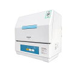
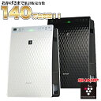
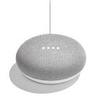

現在、育休をとりながら育児に勤しんでいるエンジニアです。夫婦二人で頑張っていますが、まぁ大変です。私の気質的に出来るだけ自動化したいので、その観点で便利な家電というくくりでまとめてみました。育児中に限らず、日々の家事が時短されて大変おすすめできます。

## 食洗機

最高に楽！特に皿洗いが嫌いな人には絶対におすすめで、食後の憂鬱がなくなります。育児はただでさえストレスが溜まるので余計な家事は一切しないようにしましょう。特に育児では哺乳瓶の洗浄・殺菌という手間が増えますが、それも食洗機で解決です。哺乳瓶の乳首が水圧で飛ばないようにネットに入れるなどの工夫が必要ですが、他の食器と一緒に洗えてなおかつ熱湯での洗浄なので殺菌もされます。

我が家では下記のプチ食洗機という安価なものを使用していますが、これでも最低限楽になります。親子三人でギリギリ足りないくらいの容量で、乾燥機能もないため洗浄後に開けて乾きやすいようにしたりといった手間はあるので、値段が安い以外におすすめはしません。二人以下か入門用と割り切っての使用がおすすめです。

[【1月25日限定 全商品ポイント3倍】パナソニック 食器洗い機 プチ食洗 NP-TCB4-W 洗浄のみ乾燥機能なし](//af.moshimo.com/af/c/click?a_id=1041250&p_id=54&pc_id=54&pl_id=616&s_v=b5Rz2P0601xu&url=https%3A%2F%2Fitem.rakuten.co.jp%2Fd-shop1one%2F4549077893437%2F)

posted with [カエレバ](https://kaereba.com)

[楽天市場](//af.moshimo.com/af/c/click?a_id=1041250&p_id=54&pc_id=54&pl_id=616&s_v=b5Rz2P0601xu&url=https%3A%2F%2Fsearch.rakuten.co.jp%2Fsearch%2Fmall%2FNP-TCB4%2F-%2Ff.1-p.1-s.1-sf.0-st.A-v.2%3Fx%3D0)

[Amazon](//af.moshimo.com/af/c/click?a_id=1041250&p_id=170&pc_id=185&pl_id=4062&s_v=b5Rz2P0601xu&url=https%3A%2F%2Fwww.amazon.co.jp%2Fgp%2Fsearch%3Fkeywords%3DNP-TCB4%26__mk_ja_JP%3D%25E3%2582%25AB%25E3%2582%25BF%25E3%2582%25AB%25E3%2583%258A)

## 空気清浄機&加湿器

小さな子供がいると清潔さについては多少なりとも敏感になります。また、感染症やインフルエンザなどの対策としても、加湿ができるというのは大事だと思っています。子供が罹患するのも大変ですが、親がかかっても育児は病欠できるものでもないので、念を入れるに越したことはないと思います。

我が家では、下記を常時つけっぱなしでフル稼働しています。

[空気清浄機 シャープ プラズマクラスター 空気清浄機 加湿空気清浄機 ウイルス対策 加湿器 プラズマクラスター7000 KC-30T7 楽天最安値に挑戦中！ 空気清浄器 KC-30T6の後継機種！](//af.moshimo.com/af/c/click?a_id=1041250&p_id=54&pc_id=54&pl_id=616&s_v=b5Rz2P0601xu&url=https%3A%2F%2Fitem.rakuten.co.jp%2Ftokado-tv%2F4689_4690%2F)

posted with [カエレバ](https://kaereba.com)

[楽天市場](//af.moshimo.com/af/c/click?a_id=1041250&p_id=54&pc_id=54&pl_id=616&s_v=b5Rz2P0601xu&url=https%3A%2F%2Fsearch.rakuten.co.jp%2Fsearch%2Fmall%2F%25E7%25A9%25BA%25E6%25B0%2597%25E6%25B8%2585%25E6%25B5%2584%25E6%25A9%259F%2520%25E5%258A%25A0%25E6%25B9%25BF%25E5%2599%25A8%2F-%2Ff.1-p.1-s.1-sf.0-st.A-v.2%3Fx%3D0)

[Amazon](//af.moshimo.com/af/c/click?a_id=1041250&p_id=170&pc_id=185&pl_id=4062&s_v=b5Rz2P0601xu&url=https%3A%2F%2Fwww.amazon.co.jp%2Fgp%2Fsearch%3Fkeywords%3D%25E7%25A9%25BA%25E6%25B0%2597%25E6%25B8%2585%25E6%25B5%2584%25E6%25A9%259F%2520%25E5%258A%25A0%25E6%25B9%25BF%25E5%2599%25A8%26__mk_ja_JP%3D%25E3%2582%25AB%25E3%2582%25BF%25E3%2582%25AB%25E3%2583%258A)

## お掃除ロボット

空気清浄機と同様に、子供がいると家の中をより清潔に保っておきたい気持ちが強まります。自動で勝手に掃除してくれるのはやはり便利です。子供の世話をしつつ、別の部屋を掃除させるといったことができます。家の外からもネットワークを通じて起動させたりもできるので、外出中に掃除をさせることも可能です。  
副次的効果として、ロボットが掃除しやすいように部屋を散らかさないような意識になるのも良いかと。

我が家では「ルンバ e5」という機種を使用しています。廉価版なので、部屋の構造を把握できず、もっと効率の良いルートで掃除してほしいとヤキモキもしますが許容範囲で使えています。吸引力は十分で使用感としては満足しています。  
掃除機ロボットは初めてだったため、[Rentio](https://www.rentio.jp/?invite=69835802) という家電レンタルサービスを使用しています。家の広さに合っているか？このカーペットを越えられるのか？などが分からずに購入に踏み切れなかったので、レンタルで試せてよかったです。

[【P10倍】公式店 人気NO.1『ルンバ e5』アイロボット ロボット掃除機 ルンバ 洗える ダストボックス WiFi アプリ対応 吸引力 ブラック irobot 掃除機 クリーナー 【送料無料】【日本正規品】【メーカー保証】P10 1/21 10:59まで](//af.moshimo.com/af/c/click?a_id=1041250&p_id=54&pc_id=54&pl_id=616&s_v=b5Rz2P0601xu&url=https%3A%2F%2Fitem.rakuten.co.jp%2Firobotstore%2Froomba515060%2F)

posted with [カエレバ](https://kaereba.com)

[楽天市場](//af.moshimo.com/af/c/click?a_id=1041250&p_id=54&pc_id=54&pl_id=616&s_v=b5Rz2P0601xu&url=https%3A%2F%2Fsearch.rakuten.co.jp%2Fsearch%2Fmall%2F%25E3%2583%25AB%25E3%2583%25B3%25E3%2583%2590%2520e5%2F-%2Ff.1-p.1-s.1-sf.0-st.A-v.2%3Fx%3D0)

[Amazon](//af.moshimo.com/af/c/click?a_id=1041250&p_id=170&pc_id=185&pl_id=4062&s_v=b5Rz2P0601xu&url=https%3A%2F%2Fwww.amazon.co.jp%2Fgp%2Fsearch%3Fkeywords%3D%25E3%2583%25AB%25E3%2583%25B3%25E3%2583%2590%2520e5%26__mk_ja_JP%3D%25E3%2582%25AB%25E3%2582%25BF%25E3%2582%25AB%25E3%2583%258A)

## ウォーターサーバー

キレイな水で、温かいお湯がすぐ出せるのは便利です。ミルクを作るのに一々お湯を沸かす数分は地味に辛いものです。そして冷たい水も出るわけなので、慣れればお湯と水を適度に混ぜてミルクにちょうど良い温度のお湯にすることができます。もちろん、赤ん坊だけでなく大人がコーヒーなどを飲んだりする時も楽で、一度体験してしまうと戻れないです。

我が家では[プレミアムウォーター](http://premium-water.net/lp_introduced?remark=1731113&utm_source=mypage&utm_medium=mail&utm_campaign=introduced)を利用しています。以前はコスモウォーターを利用していましたが、それよりも水の値段とサーバーの電気代とが少しだけ安かったです。[プレミアムウォーター](http://premium-water.net/lp_introduced?remark=1731113&utm_source=mypage&utm_medium=mail&utm_campaign=introduced)の使い辛い点としては、チャイルドロックが強制なところで、掴まり立ちすらしていない子供しかいない場合は不要で一々ロック解除ボタンを押すのは面倒です。しかしながら、褒められたやり方ではありませんが、ロックボタンはテープで止めて押しっぱなしにできるのでそれで対処するのが楽だと思います。

## スマートスピーカー&スマートリモコン

育児中は、両手がふさがっていることがザラにあるので、ニュースを聞いたり子供向け音楽を再生したり、スマートリモコンを連携させてのエアコン付けたりTVを声で操作できるのは非常に便利です。

我が家にはスマートスピーカーは「Google Home Mini」と「Alexa Echo Show 8」とが、スマートリモコンは「Nature Remo mini」があります。Echo Showはディスプレイが付いており、祖父母に孫をビデオ通話で見せられるように買いました（祖父母にもプレゼント）。が、正直乳児期には早いかなと思いました。スマホでLINEのビデオ通話で見せるほうが楽ですね。子供が大きくなって自分で祖父母に話しかけられるようになっているのならばよいかと思いました。

[GOOGLE (グーグル)スマートスピーカー Google Home Mini チョーク GA00210JP (沖縄・離島は発送不可)](//af.moshimo.com/af/c/click?a_id=1041250&p_id=54&pc_id=54&pl_id=616&s_v=b5Rz2P0601xu&url=https%3A%2F%2Fitem.rakuten.co.jp%2Fkenyu-shop%2F0842776102461%2F)

posted with [カエレバ](https://kaereba.com)

[楽天市場](//af.moshimo.com/af/c/click?a_id=1041250&p_id=54&pc_id=54&pl_id=616&s_v=b5Rz2P0601xu&url=https%3A%2F%2Fsearch.rakuten.co.jp%2Fsearch%2Fmall%2Fgoogle%2520home%2520mini%2F-%2Ff.1-p.1-s.1-sf.0-st.A-v.2%3Fx%3D0)

[Amazon](//af.moshimo.com/af/c/click?a_id=1041250&p_id=170&pc_id=185&pl_id=4062&s_v=b5Rz2P0601xu&url=https%3A%2F%2Fwww.amazon.co.jp%2Fgp%2Fsearch%3Fkeywords%3Dgoogle%2520home%2520mini%26__mk_ja_JP%3D%25E3%2582%25AB%25E3%2582%25BF%25E3%2582%25AB%25E3%2583%258A)

[Echo Show 5 (エコーショー5) スクリーン付きスマートスピーカー with Alexa、チャコール](//af.moshimo.com/af/c/click?a_id=1041250&p_id=54&pc_id=54&pl_id=616&s_v=b5Rz2P0601xu&url=https%3A%2F%2Fitem.rakuten.co.jp%2Fnexusonline%2F0421-003907%2F)

posted with [カエレバ](https://kaereba.com)

[楽天市場](//af.moshimo.com/af/c/click?a_id=1041250&p_id=54&pc_id=54&pl_id=616&s_v=b5Rz2P0601xu&url=https%3A%2F%2Fsearch.rakuten.co.jp%2Fsearch%2Fmall%2FAlexa%2F-%2Ff.1-p.1-s.1-sf.0-st.A-v.2%3Fx%3D0)

[Amazon](//af.moshimo.com/af/c/click?a_id=1041250&p_id=170&pc_id=185&pl_id=4062&s_v=b5Rz2P0601xu&url=https%3A%2F%2Fwww.amazon.co.jp%2Fgp%2Fsearch%3Fkeywords%3DAlexa%26__mk_ja_JP%3D%25E3%2582%25AB%25E3%2582%25BF%25E3%2582%25AB%25E3%2583%258A)

[Nature スマートリモコン Nature Remo mini 2 ネイチャーリモ 家電コントロール Amazon Alexa / Google Home / Siri 対応 GPS連携 温度センサー Remo-2W2](//af.moshimo.com/af/c/click?a_id=1041250&p_id=54&pc_id=54&pl_id=616&s_v=b5Rz2P0601xu&url=https%3A%2F%2Fitem.rakuten.co.jp%2Fnature-remo%2Fremo-2w2%2F)

posted with [カエレバ](https://kaereba.com)

[楽天市場](//af.moshimo.com/af/c/click?a_id=1041250&p_id=54&pc_id=54&pl_id=616&s_v=b5Rz2P0601xu&url=https%3A%2F%2Fsearch.rakuten.co.jp%2Fsearch%2Fmall%2Fnature%2520remo%2520mini%2F-%2Ff.1-p.1-s.1-sf.0-st.A-v.2%3Fx%3D0)

[Amazon](//af.moshimo.com/af/c/click?a_id=1041250&p_id=170&pc_id=185&pl_id=4062&s_v=b5Rz2P0601xu&url=https%3A%2F%2Fwww.amazon.co.jp%2Fgp%2Fsearch%3Fkeywords%3Dnature%2520remo%2520mini%26__mk_ja_JP%3D%25E3%2582%25AB%25E3%2582%25BF%25E3%2582%25AB%25E3%2583%258A)

## ドラム式洗濯乾燥機

子供が居ると明確に増えるのが洗濯物。溢乳だったりオムツから汚物がこぼれたりして着替えたりもするので毎日1着以上洗濯物が出ます。それに子供を抱えながらの洗濯物干しはかなり大変です。乾燥機だとシワが気になる方もいらっしゃるかと思いますが、そうした服だけは乾燥前に取り出して干せば良いと思います。基本的にほとんどの機種で、洗濯可能量 > 乾燥可能量でもあるため乾燥前に一部取り出すという動きは自ずと必要になるかと思います。下着やタオル、子供の服といった細々したものを乾燥してくれるのだけでだいぶ負担が変わります。

[東芝　TOSHIBA ドラム式洗濯乾燥機 ZABOON（ザブーン） グランホワイト TW-127X9R-W \[洗濯12.0kg /乾燥7.0kg /ヒートポンプ乾燥 /右開き\]](//af.moshimo.com/af/c/click?a_id=1041250&p_id=54&pc_id=54&pl_id=616&s_v=b5Rz2P0601xu&url=https%3A%2F%2Fitem.rakuten.co.jp%2Fbiccamera%2F4904530404429%2F)

posted with [カエレバ](https://kaereba.com)

[楽天市場](//af.moshimo.com/af/c/click?a_id=1041250&p_id=54&pc_id=54&pl_id=616&s_v=b5Rz2P0601xu&url=https%3A%2F%2Fsearch.rakuten.co.jp%2Fsearch%2Fmall%2F%25E3%2583%2589%25E3%2583%25A9%25E3%2583%25A0%25E5%25BC%258F%25E6%25B4%2597%25E6%25BF%25AF%25E4%25B9%25BE%25E7%2587%25A5%25E6%25A9%259F%2520zaboon%2F-%2Ff.1-p.1-s.1-sf.0-st.A-v.2%3Fx%3D0)

[Amazon](//af.moshimo.com/af/c/click?a_id=1041250&p_id=170&pc_id=185&pl_id=4062&s_v=b5Rz2P0601xu&url=https%3A%2F%2Fwww.amazon.co.jp%2Fgp%2Fsearch%3Fkeywords%3D%25E3%2583%2589%25E3%2583%25A9%25E3%2583%25A0%25E5%25BC%258F%25E6%25B4%2597%25E6%25BF%25AF%25E4%25B9%25BE%25E7%2587%25A5%25E6%25A9%259F%2520zaboon%26__mk_ja_JP%3D%25E3%2582%25AB%25E3%2582%25BF%25E3%2582%25AB%25E3%2583%258A)

## 終わりに

以上です。どれもコストがかかるものではありますが、貴重な時間をお金で買うことができる素晴らしいものだと思っています。  
是非ご参考に。
