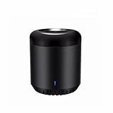

以下の記事で、Google Homeを導入して我が家をスマートホーム化してみたわけですが、率直な感想をまとめようと思います。もちろん、あくまで主観なので悪しからず。 http://localhost/life/google-home-mini-rm-mini3

総合的に言えば、大変満足している、むしろ無い生活が考えられない体になってしまっています（笑）。

## 良かった点

### 声での操作は思っている以上に便利！

ライトやTVのon/offをよく使っていますが、便利極まりないです。

夜寝るときなんかは、ベッドに入って横になる動作中に「OK Google ライトを消して」と言って、完全に横になった時に電気が消えるという完璧なタイミングになっています。無いときは、消してからベッドに行ったり（一瞬見えなくなるのが地味に不便）、横になってからリモコンでライトを消したり（横になった後の無駄な動作）と、音声操作に変えたからこそ不便さを感じるようになりました。旅行に行った際にとても顕著に感じました。

想像してみてください。皆さんもTVはリモコンで操作していると思いますが、わざわざ本体側のボタンで操作しますか？TVのほうまで行ってボタンを押すなんてものの数秒でできますけど、しないですよね？人間はほんのちょっとだろうと不便さにストレスを感じるものです。

同じことがスマートスピーカーでも言えるわけで、便利さは、

> 音声操作 > リモコン

なのは私の行動から確実です。日常の行動パターンが変わるのは結構な**革新**だと思います。

### 「今、何時？」

頻度で言えば、これが一番よく使います（笑）。朝の身支度で忙しいとき、特に着替え中です。口と耳は空いているので、着替えながら時間も把握できます。

場所を選ばず（声さえ届けば）、いつでも時間を確認できるのはメリットでした。壁掛け時計が我が家にないせいというのもありますが、賃貸だと壁に穴を開けられなくて設置できないという家庭も多いのでは？

### 音声操作のアラーム

Google Homeにはアラーム機能もついています。普通、目覚まし時計やスマホのアラームで起きてたりするかと思われますが、それらと違うのは音声操作ということです。どういうことかと言うと、止めるには（少し声を張って）「OK Google ストップ」と言わなければなりません。つまり、ちょっとエネルギーが要るため、目覚めにはちょうどよいのです。

また、もう一つよく使ったのが、料理中のアラームです。湯で時間なんかを図りたいときも料理しながら、「OK Google 3分後にアラームかけて」と言えば、"手を使わずに"時間を測れます。これは料理する上では非常に便利でした。

### 音質は気にならない（主観）

Google Homeシリーズにはスピーカーの種類に応じて、mini、(無印)、Max（日本では未販売）の三種類がありまして、私は一番廉価で低性能のminiを購入しました。ですので音質は少し心配してはおりましたが、私にとってはとても綺麗に聴こえています。ここは個人の感じ方なので何とも言えませんが、BGMとして頻繁にかける使い方をしていてもスピーカーの性能には満足しています。

ちなみに、Google Play Musicでのプレイリスト登録の方法はこちらに詳しく記載がありました。 https://yuki-no-yabo.com/how-to-add-music-to-googleplaymusic/

### ちょっとした調べ物ができる

何かわからない単語があったとき、「OK Google、〇〇とは？」というと教えてくれます。Wikipediaの情報なんかを返してくれるので、本当にちょっとしたことならば十分、わざわざPCやスマホで調べるほどでもない小さな疑問がパッと解決できます。知的好奇心の向上にも役立つ！？

## 悪かった点

### 「OK Google」が長い

ホットワードと呼ぶのですが（ウェイクワードとも）、Google Homeに何か命令するには、「OK Google」と初めに付ける必要があります。これが少し煩雑なのと、愛着が湧きにくいと感じました。例えば、某社のスマートスピーカーだとこのホットワードが「Alexa(アレクサ)」と短くて、名前のようなので愛着も生まれやすそうです。

ただ、これについてはゆくゆく変更可能になる可能性もあります。Google assistantのプログラム内に変更できるようになるコードがあったそうで、要望も多いと思いますので、信じて待ちましょう。 https://9to5google.com/2018/01/29/google-app-7-20-assistant-apk-insight-teardown/

### 多少気を遣って話しかける必要がある

たまにGoogle Homeがうまく聞き取ってくれないことがあります。なので、結構はっきりとした発音で、少し声の大きさも意識したりする必要があります。また、TVがついていたりと、ノイジーな状況でも聞き取り性能は下がります。

でも、たまにであって、1回言い直せばほぼ大丈夫ではあります。「はっきり話せよ」という話なのですが、2回言うのはちょっとしたストレスではあったので、ここで述べておきます。

## 総評

メリット・デメリット両方挙げていますが、総評としては「買ってよかった」と思っていますので、皆さんも是非お試しあれ。

[Google Home Mini](//ck.jp.ap.valuecommerce.com/servlet/referral?sid=3397016&pid=885197291&vc_url=https%3A%2F%2Fstore.shopping.yahoo.co.jp%2Fsokuteikiya%2Fgh-ch-mini.html&vcptn=kaereba)

posted with [カエレバ](http://kaereba.com)

測定器屋 ヤフー店

[Yahooショッピング](//ck.jp.ap.valuecommerce.com/servlet/referral?sid=3397016&pid=885197291&vc_url=http%3A%2F%2Fsearch.shopping.yahoo.co.jp%2Fsearch%3Fp%3DGoogle%2520Home%2520mini&vcptn=kaereba)

[楽天市場](//af.moshimo.com/af/c/click?a_id=1041250&p_id=54&pc_id=54&pl_id=616&s_v=b5Rz2P0601xu&url=https%3A%2F%2Fsearch.rakuten.co.jp%2Fsearch%2Fmall%2FGoogle%2520Home%2520mini%2F-%2Ff.1-p.1-s.1-sf.0-st.A-v.2%3Fx%3D0)

[Broadlink Wifi 赤外線 学習 リモコン RM mini3 \[並行輸入品\]](//af.moshimo.com/af/c/click?a_id=1041250&p_id=170&pc_id=185&pl_id=4062&s_v=b5Rz2P0601xu&url=https%3A%2F%2Fwww.amazon.co.jp%2Fexec%2Fobidos%2FASIN%2FB075RRVWBD%2Fref%3Dnosim)

posted with [カエレバ](http://kaereba.com)

Broadlink

[Amazon](//af.moshimo.com/af/c/click?a_id=1041250&p_id=170&pc_id=185&pl_id=4062&s_v=b5Rz2P0601xu&url=https%3A%2F%2Fwww.amazon.co.jp%2Fgp%2Fsearch%3Fkeywords%3DBroadlink%2520RM%2520mini3%26__mk_ja_JP%3D%25E3%2582%25AB%25E3%2582%25BF%25E3%2582%25AB%25E3%2583%258A)

[楽天市場](//af.moshimo.com/af/c/click?a_id=1041250&p_id=54&pc_id=54&pl_id=616&s_v=b5Rz2P0601xu&url=https%3A%2F%2Fsearch.rakuten.co.jp%2Fsearch%2Fmall%2FBroadlink%2520RM%2520mini3%2F-%2Ff.1-p.1-s.1-sf.0-st.A-v.2%3Fx%3D0)

[Yahooショッピング](//ck.jp.ap.valuecommerce.com/servlet/referral?sid=3397016&pid=885197291&vc_url=http%3A%2F%2Fsearch.shopping.yahoo.co.jp%2Fsearch%3Fp%3DBroadlink%2520RM%2520mini3&vcptn=kaereba)

### ちょっとした小ネタをまとめました。

http://localhost/life/tricks
