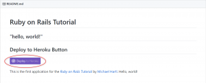

## 第1章の実績

[第1章 ゼロからデプロイまで](https://railstutorial.jp/chapters/beginning?version=5.1#cha-beginning) を実施しました！ 実施時間: 2時間（色々と余計なことをしての時間なので、普通はここまでかからないはず。詳細は[後述](#originality)）

### 学べたこと

- Webアプリケーションの仕組み（の基礎的なイメージ）
- 開発環境の構築方法（Croud9） ただし、ほとんどできているものを使うので実作業はほぼなし。
- ソフトウェア開発における基本的な開発ツール
    - Git（バージョン管理ツール） バージョン管理ツールとしては現在のメジャーなので良し。今後もチュートリアルで使っていくようなので、自ずと使い慣れることができるのは初学者にとっても良し！
    - Heroku（デプロイ環境） いわゆるクラウドの環境に自分で作ったアプリケーションを置くことができるようになるサービスで、しかも無料で使える！そして無料とは思えないほど色々できる。こちらもかなりメジャー。
- 動くアプリケーションを作る喜び（最重要） プログラミングの面白さはやはり、「作ったものが動く」ということだと私は強く思っています。Railsというフレームワークの強力さによって、いとも簡単に動くアプリケーションが作れてしまいました。特に初学者にはこの喜びを感じてもらいたいです。また、Herokuによってリリース（要はインターネットを通じてどこからでも見れる）もできるわけで、一昔前はこんな簡単にはいかなかったわけですから、時代の進歩にも感動を味わってほしいです。

この段階では、rubyやrailsの仕組みについてはほとんどわかりませんが、railsというフレームワークの強力さが伝わる章でした。

### 独自にやったこと

#### 1\. ローカル環境に開発環境を構築

##### 経緯

チュートリアルでは、AWS（Amazon Web Service）の無料枠を利用して、クラウド上の開発環境を使うようになっていました。各拠点のPC環境を気にせずに利用できるのはとても魅力的で、「環境構築がうまくいかない……」といった長年の問題から解消されるため、今後のソフトウェア開発の現場でもどんどん増えていくのではと思っています。私も実際に触ってみて、ローカルの開発環境と大差ないレスポンスでサクサクコーディングができて、便利さに大変驚きました。 だがしかし、私の個人的な理由ですが、AWSですでに無料枠を使ってしまっており、少し月額料がかかってしまうことが分かりました。といってもチュートリアルをやる程度では1$/月くらいしかかかりませんが。それでも私はケチってローカルマシン上に開発環境を構築することにしました。

##### ローカル環境構築方法

幸い、railsチュートリアルの凄いところは、ローカル環境構築のやり方も載っていました（別リンクですが）。それに則り、問題なく構築できました。

ローカル環境構築手順：[Rails Girls インストール・レシピ](http://railsgirls.jp/install)

#### 2\. ソースコードのホスティング先をGitHubにしました

チュートリアル内ではBitBucketをホスティング先としていますが、私はGitHubにしました。「[コラム 1.4. GitHubとBitbucket](https://railstutorial.jp/chapters/beginning?version=5.1#aside-github_bitbucket)」で違いなども述べられていますが、使い慣れていて、パブリックなリポジトリとすることに大きなデメリットを感じなかったため、GitHubにしています。これは個人の好みで変えて良いかなと思います。あくまでホスティング先を変えているだけなので、Gitというツールは同じためコマンドは変わらず、混乱もないと思います。

#### 3\. Herokuへのデプロイを（ほんのちょっと）簡単にする小技

ソースコードをコミットした後に、Herokuにデプロイをしようという時に、（ほんのちょっと）楽にするためのボタンを設置しました。Herokuにログインした状態で、BitBucket（GitHub）上で表示されるこのボタンを押すと、Herokuに移動してアプリデプロイがされます。 ↓ボタンはこんなものです。

##### 設置方法

1. 1. README.mdに以下の記述を追記してください。
        
        
        
    2. app.jsonというファイルをディレクトリのトップに置いてください。 
        
        
        
        **name**には、任意のアプリケーション名をつけてください。半角英数と一部記号(ハイフンなど)のみ使えます。 **description**は、説明を書けますが、何も書かなくてもいいです。 **repository**には、GitホスティングされているリポジトリのURLを記載してください。 **keywords**はこのままで。
    3. 上記をプッシュします。

## 参考

### 環境

- ruby: 2.3.3
- ruby on rails: 5.1.4
- OS: Windows 10 (64bit)
- IDE: IntelliJ ULTIMATE 2018.1
- リポジトリ: GitHub

https://github.com/nisioka/RubyOnRailsTutorial

### リンク

- [第1章 ゼロからデプロイまで](https://railstutorial.jp/chapters/beginning?version=5.1#cha-beginning)
- [Rails Girls インストール・レシピ](http://railsgirls.jp/install)

【スポンサードリンク】

