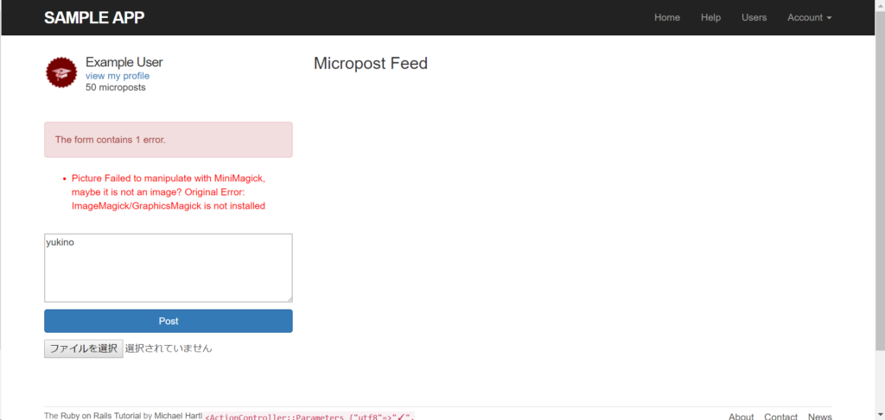

## 第13章の実績

[第13章 ユーザーのマイクロポスト](https://railstutorial.jp/chapters/user_microposts?version=5.1#cha-user_microposts) を実施しました！  
実施時間: 4.5時間

### 学べたこと

- モデルの関連付け  
    「rails generate model Micropost content:text user:references」とするだけで、"Micropost"と"User"のモデルが１対１の関係であることを関連づけられました。コード上では、Micropostクラスに"belongs\_to :user"と表現されています。
- 1対多のモデルの関連付け  
    上記とは逆に、1対多の関係の関連付けは、「has\_many」をモデルに記述することで表現します。ただしこれは上記と違ってコマンドで自動生成されないので手入力が必要なようです。
- デフォルトスコープ  
    次の記述をすることで、DBからの取得時の標準の出力結果を指定できます「default\_scope -> { order(created\_at: :desc) }」。この記述は、"  
    created\_at"列を降順（descending）の順序（order）で取得することを表します。
- dependent: :destroy  
    この記述をすることで、依存しているモデルが削除された時に紐づくモデルも連なって削除されます。チュートリアルの例では「ユーザーが削除されたときに、そのユーザーに紐付いたマイクロポストも一緒に削除される」こととなります。

- （おまけ）それっぽいテストデータを作ってくれるFakerというライブラリが面白い。何章か前からユーザ名や今章ではマイクロソフトの投稿のサンプルとして使っていますが、他にも色々な種類のテストデータがあります。 [Fakerのドキュメント](https://github.com/stympy/faker) (英語) を見ると、[Japanese Media](https://github.com/stympy/faker#japanese-media)にはDragonBallやOnePiece、SwordArtOnlineがあり、ドラゴンボールやワンピースは分かりますが、ソード・アート・オンラインが並ぶというのは中の人に好きな人でもいるのでしょうか？（笑）

### 独自にやったこと

#### ImageMagickインストール

Windowsについての導入手順が載っておらず、以下のURLリンクが貼ってあるのみでした。  
[http://www.imagemagick.org/script/download.php#windows](http://www.imagemagick.org/script/download.php#windows)

しかも、簡単には上手くいかず、上記を単純にインストールしただけだと、以下のように「Picture Failed to manipulate with MiniMagick, maybe it is not an image? Original Error: ImageMagick/GraphicsMagick is not installed」というエラーが発生して画像のアップロードが上手くいきません。

けれど、先人で解決している人がおり、こちらの方法で上手くいきました。

http://tomokiit.hatenablog.jp/entry/rails-curriewave-rmagick

## 参考  

### 環境

- ruby: 2.3.3
- ruby on rails: 5.1.4
- OS: Windows 10 (64bit)
- IDE: IntelliJ ULTIMATE 2018.1
- リポジトリ：GitHub

https://github.com/nisioka/RubyOnRailsTutorial/tree/static-pages

### リンク

- [第13章 ユーザーのマイクロポスト](https://railstutorial.jp/chapters/user_microposts?version=5.1#cha-user_microposts)
- [http://tomokiit.hatenablog.jp/entry/rails-curriewave-rmagick](http://tomokiit.hatenablog.jp/entry/rails-curriewave-rmagick)

【スポンサードリンク】

