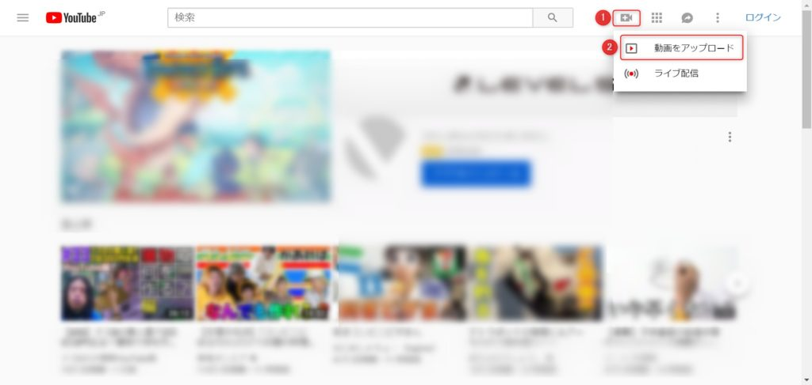
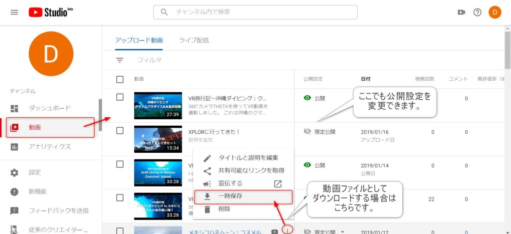

昨今、高画質なカメラで動画を撮るのが普通になっていますが、それに伴いファイルサイズが大きくなり保存場所に困るという課題も増えているかと思います。私自身、360°カメラのTHETA Vを使っていますが、5分の動画で2GBほど消費するので、保存場所に困っていました。  
　そうした重たい動画の保存方法についての提案です。それがタイトルにある通り、YouTubeに保存する方法です。

## 実例

　少し宣伝も兼ねてですが、実際 YouTubeにアップロードした動画をご紹介します。ほんの少しだけ画質は落ちている気はするのですが、元画質とほぼ同等で見ることができます。

<figure>

https://www.youtube.com/watch?v=11GdZOh5rHY

<figcaption>

実際にアップロードした動画

</figcaption>

</figure>

参考までに、以下がGoogleフォトに保存した場合の動画です。上記動画の冒頭部分や1:20～と同じ動画なのですが、少し画質の低下が見受けられます。

https://photos.app.goo.gl/pXMVx69vc2xsuB2S6

## メリット

- 容量を気にせず、いくらでも動画を保存しておくことができる。
- 画質の低下はあまりない。
- 観たい時にいつでも観られる。ダウンロードも可能。

## デメリット

- 完全なオリジナル画質にはならない。
- 少し手間がかかる。

## やり方

YouTubeの右上のアイコンから、「動画をアップロード」を選択します。

<figure>

<figcaption>

YouTubeトップ

</figcaption>

</figure>

後は動画をドラッグ&ドロップします（複数同時アップロードも可能）。この時、公開状態を「公開」、「限定公開(リンクを知っている人のみ閲覧可能)」、「非公開(自分しか観られない)」を選ぶことができます。後からも変更出来ますが、忘れずに選択してからアップロードすることをお勧めします。

<figure>

<figcaption>

アップロード画面

</figcaption>

</figure>

その後の操作は割愛しますが、タイトルなど任意に入力してください。  
動画アップロード処理完了後は、 YouTube Studioにて動画の管理が出来ます。各種変更や、ダウンロードも出来ます。

<figure>

<figcaption>

YouTube Studio(ベータ版なのでレイアウトなど変更される可能性が大いに有り。)

</figcaption>

</figure>

## その他の方法との比較

### Googleフォトに保存

#### メリット

- 容量を気にせず、いくらでも動画を保存しておくことができる。（  
    オリジナル画質でなければ容量制限がない。）
- 観たい時にいつでも観られる。ダウンロードも可能。
- 登録やアルバム作成を手軽にすることが出来る。
- 画像ファイルも登録することが出来る。
- 容量は限られるが、オリジナル画質で保持することも可能。

#### デメリット

- 元のサイズにしないと、画質が大きく落ちる。

### クラウドストレージに保存

#### メリット

- 登録を手軽にすることが出来る。
- 画像ファイルも登録することが出来る。

#### デメリット

- 容量に限りがある。
- ダウンロードは可能だが、すぐにストリーミング再生出来るとは限らない。

### 関連記事

[360°カメラの「RICOH THETA V」がすごい！](/life/theta360)
