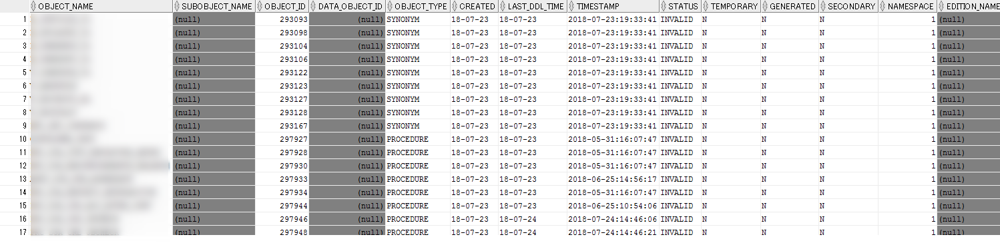

## 背景

DBインスタンスのダンプを取得して移行を行ったのですが、なぜか無効なオブジェクトがいくつか発生してDBが上手く動かなくなってしまったためです。 原因究明はできていませんが、もし同様にDBのオブジェクトが無効になってしまった場合の調査方法と対処方法を以下に示します。

### 環境

バージョン：Oracle Database 12c

OS：Windows（サーバ/クライアントとも）

## 調査方法

下記のSQLを流すだけです。権限も特に不要のはずなので、どのユーザでも大丈夫です。また、SQL\*Plusである必要もありません。

SQLDeveloperでの出力例：（オブジェクト名を隠しています） 

## 対処方法

上記SQLで取得された各オブジェクトに対して再コンパイルを施します。

以下、プロシージャとシノニムの例です。

