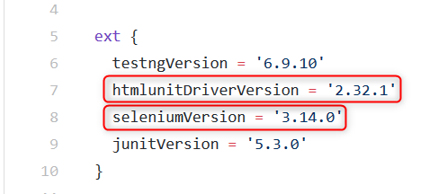

曖昧なタイトルですが、使用しているSelenide/Spring Bootそれぞれのバージョンに依存する問題のため、組み合わせによって動かない"場合がある"のでこう表現しています。

## 事象

問題の事象もバージョンの組み合わせによって様々です。 エラーが起こったり、何かしら例外が出るはずですが、私のほうで発生したのは以下のようなものです。

- org.openqa.selenium.WrapsDriverにアクセスできません org.openqa.selenium.WrapsDriverのクラス・ファイルが見つかりません
- java.lang.IllegalArgumentException: java.lang.ClassNotFoundException: internet explorer

etc.

## 原因

原因は依存関係の衝突です。

SelenideはSeleniumのラッパーですが、Spring Bootも内部でSeleniumに依存関係があるようで、その依存バージョンに差異があると上手く動きません。最近はGradleやMavenで依存関係を管理している方は多いと思うので、それらが上手いことやってくれて依存関係解決に苦労しなくなっていることで偶にそれらが解決してくれないと苦労しますね。

## 解決方法

内部依存関係である、Seleniumのバージョンを指定してあげれば良いです。

幸い、Spring BootにはSeleniumのバージョンを外部から設定できるプロパティが設けられているのでそれを利用します。Selenideに必要なバージョンにSpring Bootを合わせるのが楽だと思います。

### 1\. Selenideの依存関係を調べる

Selenideがどのバージョンを前提としているかを調べます。一番見やすく確実なのはGithubだと思います。OSS（オープンソースソフトウェア）なので、ソースコードが公開されており、依存関係も以下のファイルにまさしく明記されています。 https://github.com/selenide/selenide/blob/v4.14.1/gradle/dependencies.gradle 

  上記はバージョン4.14.1ですが、任意のバージョンの依存関係を知りたければ、URLの"v4.14.1"の部分を書き換えるか、GitHubのブランチ切り替え機能で移動できます。

### 2\. バージョン管理ツールにプロパティ定義を記載する

上記で調べたバージョンをSpring Bootに設定します。

Spring Bootにはこれらを指定する専用プロパティがあるので、以下の定義を追記します。Maven(pom.xml)の定義

 

以上です。

これでSelenide × Spring Bootの依存関係の衝突が解決されて正しく動作するはずです。
