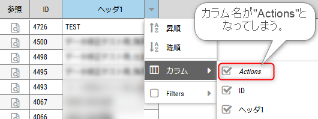
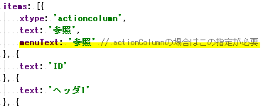
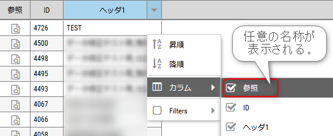

## 事象

Sencha Ext JSというJavaScriptフレークワークで、表題の事象が起きました。ヘッダメニューでカラム選択をする際の細かな点ではありますが、それゆえ少し見つけにくい不備になり得ます。表題で言っているのは以下のような画面表示です。

## 原因

"actionColumn"コンポーネントの仕様です。たいていのgrid部品は、text要素に指定した文字列が、ヘッダにも、メニュー内のカラム要素にも同じ名称で表示されるのですが、"actionColumn"は別の要素で指定をする必要があり、未指定だとデフォルトの"Actions"が表示されてしまうというわけです。

## 対応方法

menuText要素にも名称を指定する必要があります。"actionColumn"コンポーネントのみの対応となりますので、直感的な実装方法ではないのですが、正しく表示させるようにすることは可能です。

実装例）

対応後の表示）

### 参考

https://stackoverflow.com/questions/36779566/actioncolumn-xtype-column-header-is-showing-actions-in-column-hide-show-list
