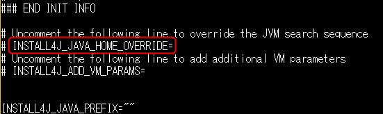
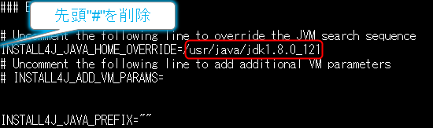

表題の通り、アーティファクト(Maven)リポジトリであるSonatype NEXUSは、OracleのJava 8 Runtime Environment（JRE）が必要だそうです。  
  
以下で公式にガイディングされている通り、OpenJDKでは動きません。

> OpenJDK or other Java distributions or older Java versions are not supported.
> 
> （訳：OpenJDKやその他(Oracle意外)のディストリビューション、古い(Java7以前)のJavaバーションはサポートされていません。）  
>   
> 引用：https://help.sonatype.com/repomanager3/installation/java-runtime-environment

## 困ったこと

- 環境のJAVA\_HOMEがOpenJDKなど、別のランタイムが導入されている。→対処方法は後述
- 他のJREで動かそうとするとゾンビプロセスとなる可能性がある。→再現性は不明ですが、私の環境では当該事象が発生して、killコマンドでも殺せずにサーバ再起動するはめに。
- NEXUSの情報収集がし辛い→スマートフォンのNEXUSが検索に多数引っかかるので、ちゃんと「Sonatype NEXUS」と指定したほうが良い。

## OpenJDKが使われている場合の対処法

### Oracle Javaを導入する

OracleJavaでないと動かないのはしょうがないので、インストールします。ことなるディストリビューションのJavaが混在する環境となります。  
導入手順はここでは省きます。

### NEXUSで使用するJavaのパスを個別指定する

NEXUSの起動シェルにJREのパスをオーバーライドできる部分があるので、それを書き換えます。  
対象ファイルパスは、「（NEXUSホーム）/bin/nexus」です。

「INSTALL4J\_JAVA\_HOME\_OVERRIDE」という変数がどこか（割と上の方）にあるので、それのコメントアウトを外し（先頭の"#"を削除）、"="の後にOracle Javaのパスを指定します。

<figure>

<figcaption>

（変更前）  

</figcaption>

</figure>

<figure>

<figcaption>

（変更例：Oracle Javaが「/usr/java/jdk1.8.0\_121」にある場合）

</figcaption>

</figure>

### NEXUS再起動

これで、NEXUSを起動させればOKです。  
「（NEXUSホーム）/bin/nexus start」など。

## 参考

[https://help.sonatype.com/repomanager3/installation/java-runtime-environment](https://help.sonatype.com/repomanager3/installation/java-runtime-environment)

http://localhost/information-technology/adopt-open-jdk9
