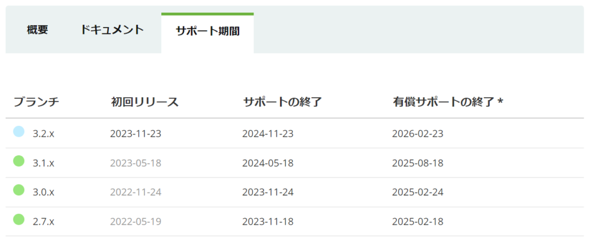

Spring Bootのバージョンアップに際して、一部ソースコード修正などの対応が必要になる部分が少なからずあります。私がハマったところベースでいくつか対応方法を説明していきたいと思います。

サポート期間が、2.7.xと3.0.xとでほとんど変わらないため、多くは3.1.xまで一気に上げるかと思われます。メジャーバージョンアップである「2.7.x→3.0.x」が、破壊的変更もあって、対応としてはかなり大変ですが、マイナーバージョンアップである「3.0.x→3.1.x」のほうは影響がないことがほとんどだと思います。



大まかな流れは下記の公式の移行ガイド(英語)を読みながら進めていくのが良いかと思います。

[https://github.com/spring-projects/spring-boot/wiki/Spring-Boot-3.0-Migration-Guide](https://github.com/spring-projects/spring-boot/wiki/Spring-Boot-3.0-Migration-Guide)

## Spring Security 6系への対応

SecurityConfigurationの実装の仕方を変える必要があります。WebSecurityConfigurerAdapterを継承して構築していたかと思われますが、これが非推奨となり、SecurityFilterChainを@Beanで定義する実装に修正する必要があります。3.0.x

### 【2.7.xまでのコード例】

```
import org.springframework.beans.factory.annotation.Autowired;
import org.springframework.context.annotation.Configuration;
import org.springframework.security.config.annotation.authentication.builders.AuthenticationManagerBuilder;
import org.springframework.security.config.annotation.web.builders.HttpSecurity;
import org.springframework.security.config.annotation.web.configuration.WebSecurityConfigurerAdapter;

@Configuration
public class SecurityConfiguration extends WebSecurityConfigurerAdapter {
  @Autowired
  public void configure(AuthenticationManagerBuilder auth) throws Exception {
    auth.inMemoryAuthentication();
  }

  @Override
  protected void configure(HttpSecurity http) throws Exception {
    http.authorizeRequests()
        .antMatchers("/health/**")
        .permitAll()
        .anyRequest()
        .authenticated();
    http.csrf().disable();
  }
}
```

### 【3.0.xでのコード修正例】

```
import org.springframework.context.annotation.Bean;
import org.springframework.context.annotation.Configuration;
import org.springframework.security.config.annotation.web.builders.HttpSecurity;
import org.springframework.security.provisioning.InMemoryUserDetailsManager;
import org.springframework.security.web.SecurityFilterChain;

@Configuration
public class SecurityConfiguration {
  @Bean
  public InMemoryUserDetailsManager userDetailsService() {
    return new InMemoryUserDetailsManager();
  }

  @Bean
  public SecurityFilterChain securityFilterChain(HttpSecurity http) throws Exception {
    http.authorizeHttpRequests()
        .requestMatchers("/health/**")
        .permitAll()
        .anyRequest()
        .authenticated();
    http.csrf().disable();
    return http.build();
  }
}
```

### 修正ポイント

- WebSecurityConfigurerAdapter の継承を辞める。

- configure(HttpSecurity)のOverrideではなく、public SecurityFilterChain securityFilterChain(HttpSecurity)を@Bean定義する。
    - その中で、HttpSecurity.authorizeRequests()ではなく、HttpSecurity.authorize**Http**Requests()を使うように変更。（非常に視認性が悪いですが、authorize**Http**Requestsという異なる名称のものがあります。）

- LDAP認証、JDBC認証、インメモリ認証を使う場合はそれぞれ対応が必要。何れも下記のページを参照して対応するのがわかりやすい。

[https://spring.io/blog/2022/02/21/spring-security-without-the-websecurityconfigureradapter](https://spring.io/blog/2022/02/21/spring-security-without-the-websecurityconfigureradapter)

## javax → jakarta置換

商標権の都合で、java EE系のパッケージが、jakarta EEというパッケージに変わっています。基本的に中身が変わる類のものではないので、ソースコードの置換をしていく対応となります。

ただし、引き続きjavaxパッケージとして使われるものも多いので、javaxをjakartaに全て一括置換はNGです。コンパイル時にClassNotFoundが発生すると思うので、それらを何度か適宜置換していく対応していってください。「javax.annotation → jakarta.annotation」の置換でそれなりに充足すると思います。

## httpClientが 4.x -> 5.x に変更

SpringBootの内部依存しているhttpClientのメジャーバージョンが変わっており、その変更に対応する必要があります。RestTemplateで使っている人も多い部分かと思います。それなりにガッツリ変わっているので、頑張って移行ガイドを読んでいく必要があります。

### 【2.7.xまでのコード例】

```
  @Bean
  public RestTemplate restTemplate() throws NoSuchAlgorithmException {
    HttpClientBuilder httpClientBuilder = HttpClientBuilder.create();
    httpClientBuilder.setSSLContext(SSLContext.getDefault());

    HttpComponentsClientHttpRequestFactory requestFactory =
        new HttpComponentsClientHttpRequestFactory();
    requestFactory.setHttpClient(httpClientBuilder.build());
    requestFactory.setConnectTimeout(5000);
    requestFactory.setReadTimeout(5000);

    return new RestTemplate(requestFactory);
  }
```

### 【3.0.xでのコード修正例】

```
  @Bean
  public RestTemplate restTemplate() throws NoSuchAlgorithmException {

    try (PoolingHttpClientConnectionManager connectionManager = PoolingHttpClientConnectionManagerBuilder.create()
        .setSSLSocketFactory(SSLConnectionSocketFactoryBuilder.create()
            .setSslContext(SSLContext.getDefault())
            .setTlsVersions(TLS.V_1_3)
            .build())
        .setDefaultSocketConfig(SocketConfig.custom()
            .setSoTimeout(Timeout.ofSeconds(5L))
            .build())
        .setPoolConcurrencyPolicy(PoolConcurrencyPolicy.STRICT)
        .setDefaultConnectionConfig(ConnectionConfig.custom()
            .setConnectTimeout(Timeout.ofSeconds(5L))
            .build())
        .build()) {
      HttpClientBuilder httpClientBuilder = HttpClientBuilder.create();
      httpClientBuilder.setConnectionManager(connectionManager);
      HttpComponentsClientHttpRequestFactory requestFactory =
          new HttpComponentsClientHttpRequestFactory();
      requestFactory.setHttpClient(httpClientBuilder.build());

      return new RestTemplate(requestFactory);
    }
  }
```

### 修正ポイント

ポイントと言えるほど要点があるわけではなく、、下記リンク先の移行ガイド(英語)を参考にがっつり書き換えていく必要があります。ReadTimeoutというのが非推奨となって、SoTimeoutに変えるなど、かなりしっかりと読まないとなりません。

[https://hc.apache.org/httpcomponents-client-5.2.x/migration-guide/preparation.html](https://hc.apache.org/httpcomponents-client-5.2.x/migration-guide/preparation.html)

[https://hc.apache.org/httpcomponents-client-5.2.x/migration-guide/migration-to-classic.html](https://hc.apache.org/httpcomponents-client-5.2.x/migration-guide/migration-to-classic.html)

## hibernate の5.x → 6.xの対応

ORMである、hibernateのメジャーバージョンアップがなされています。hibernateを利用している場合は、これに対応する必要がありますが、破壊的変更が非常に多く、おそらく大多数の方が多大な対応を必要とすると思われます。Type systemという根幹がかなり変わっているため、影響が大きいです。変更内容も広範になるため、別記事にまとめようと思います。

下記がhibernate公式の移行ガイド(英語)です。

[https://docs.jboss.org/hibernate/orm/6.0/migration-guide/migration-guide.html](https://docs.jboss.org/hibernate/orm/6.0/migration-guide/migration-guide.html)
