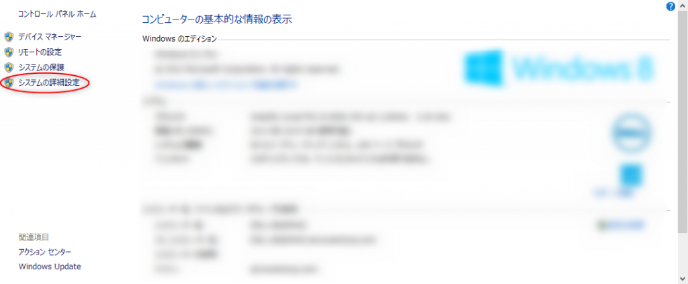
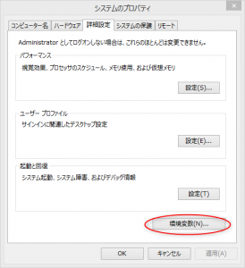
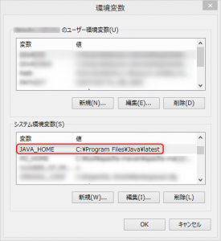
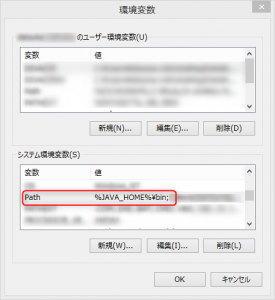
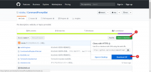

Javaのバージョンを一時的に変えたいというニーズがあると思います。私も、普段はJava8で開発していて、たまに少し動作確認のためにJShell（\[note\]Java9以降の機能。コマンドライン上でJavaを実行することができ、簡単な確認がすごくしやすい。\[/note\]）を使いたいと思うことがあります。そのための切替バッチを作りました。

### 環境制約

- Windows 日本語版
- 管理者権限をもつこと
- Javaが既にインストールされていること

### 参考

https://qiita.com/spamoc/items/635e1f9f26afddf3ad21

参考というか、やり方は全く同じです。batファイルを改良して実際に作ってみましたという話です。

 

# 手順

## 準備

1. 1. Javaのインストールディレクトリを調べる 基本は、「C:\\Program Files\\Java」のハズですが、もし別の場所にインストールしている場合はそのパスに読み替えてください。
    2. システム環境変数を編集する システム環境変数のJAVA\_HOMEを以下とします。（上記Javaのインストールディレクトリが異なる場合は、そのパス+末尾に「\\latest」をつけてください。）
        
        > C:\\Program Files\\Java\\latest
        
        システム環境変数のPATHの"先頭"に以下を加えます。
        
        > %JAVA\_HOME%\\bin;
        
        ＜具体的なシステム環境変数の設定の仕方＞
        1. "システム"を開きます 「Windowsキー」+「Pause」ボタンを押します。
        2. "システムの詳細設定"を押します。
        3. "環境変数"を押します。 
        4. JAVA\_HOME設定  上記のように、システム環境変数で「JAVA\_HOME」を探し、編集します。（もし無ければ"新規"作成です） 変数：JAVA\_HOME 値：C:\\Program Files\\Java\\latest ※↑はJavaのインストールディレクトリ+\\latest
        5. PATH設定  上記のように、システム環境変数で「Path」を探し、編集します。（こちらは無いことはないです） **※既に入力されているものを消さずに以下を追記すること。既存のものを消してしまうと最悪システムが動かなくなることもあるので、厳重に注意して実施してください。** 変数：Path 値：%JAVA\_HOME%\\bin; ※↑先頭に**追記**すること。末尾の";"を忘れずに。
    3. バッチをダウンロードする https://github.com/nisioka/CommandPromptBat/tree/mySample上記リンクが作成したバッチのURLです。  "Clone or download"をクリックし、"Download ZIP"をクリックするとダウンロードできます。zipを解凍し、「switchingJava」ディレクトリに格納されているものが今回使用するバッチです。
    4. バッチ編集
        1. switchinJava.bat Javaのインストールディレクトリが「C:\\Program Files\\Java」でない場合、switchingJava.batを編集します。
            
            
            
        2. JavaX.bat 次はインストールされているJavaのバージョンに合わせて、切り替えたい分だけコピーして編集します。JavaX.batをコピーしてもいいですし、Java8～.batなどを編集してもよいです（名前も変更可）。 "XXX"の部分をJavaのインストールディレクトリの各バージョンに書き換えます。 以下はバージョン1.8.0\_131の例です。ディレクトリ名の命名パターンはバージョンによって違うので、Javaインストールディレクトリを直接見てください。
            
            
            

### 使用方法

編集した各バージョン対応のバッチを実行するだけです。 バッチを実行すると、実行確認ダイアログがでるので、”はい”です。 
