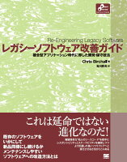
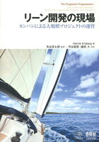

今日（2018/4/26　これを書いている時点で日付は変わってしまいましたが）、自社にテスト駆動開発（TDD）でお馴染みの@t\_wadaさんがいらして、タイトルにあるとおり、「組織にテストを書く文化を根付かせる戦略と戦術」というテーマで話してくれる機会があったので聴いてきました。

ググったら同じ資料が出てきましたので、以下に貼っておきます。

## （余談）ちょっと内省。。

内輪な話ですが、色々と運営がグダグダでした。2点ありまして、一つは会場設営。参加人数を把握できていないし、椅子などの会場設営も準備不足、ディスプレイ接続のごたごたで開始も5分くらい遅れました。 もう一つは集客。メールでしれっと募集をしてたみたいで、私はたまたま見つけて、周りに「”あの”@t\_wadaさんが来るんだって！」と集客はかけましたが、もっとたくさんの人を惹き付ける努力はすべきと思いました。10人で聴くのも100人で聴くのも同じなんだから、申し訳ないし、もったいない。

## さっそくですが、感想

スライドが結構わかりやすくて、上記を見てもらえれば分かると思うので、内容については割愛。さすが、とっっても説得力があって、改めてテストの大切さを考えさせられたし、今の自分の開発チームの現状としてはまだまだテストを書きたいところがあるので、もっと進めていこうと思いました。ただ、特に感じたのは、「テストを全部書こう」なんて**思わないこと**です。テストはあくまで品質向上のきっかけであって、思考停止でやればいいっていうものではなく、コストパフォーマンスを考えながら改善のサイクルを回していくものなんだなぁと。

## 参考書籍

スライドにも書かれていますがここにも掲載。私も読めてないものが多いので、のちのち読書感想文は書きたいと思っています。

以下が今回の内容にだいぶ近いものかと。このテスト駆動開発は、原著は古くからあるのですが別の日本語訳が絶版となったそうで、@t\_wadaさんが監訳しなおしての出版だそうです。（これは前々から読もう読もうと積読してた本。良書らしい。）

[テスト駆動開発](//af.moshimo.com/af/c/click?a_id=1041250&p_id=170&pc_id=185&pl_id=4062&s_v=b5Rz2P0601xu&url=http%3A%2F%2Fwww.amazon.co.jp%2Fexec%2Fobidos%2FASIN%2F4274217884)

posted with [ヨメレバ](https://yomereba.com)

Kent Beck/和田 卓人 株式会社オーム社 2017年10月14日

[Amazon](//af.moshimo.com/af/c/click?a_id=1041250&p_id=170&pc_id=185&pl_id=4062&s_v=b5Rz2P0601xu&url=http%3A%2F%2Fwww.amazon.co.jp%2Fexec%2Fobidos%2FASIN%2F4274217884)

[Kindle](//af.moshimo.com/af/c/click?a_id=1041250&p_id=170&pc_id=185&pl_id=4062&s_v=b5Rz2P0601xu&url=http%3A%2F%2Fwww.amazon.co.jp%2Fexec%2Fobidos%2FASIN%2FB077D2L69C%2F)

[楽天ブックス](//af.moshimo.com/af/c/click?a_id=1041250&p_id=56&pc_id=56&pl_id=637&s_v=b5Rz2P0601xu&url=http%3A%2F%2Fbooks.rakuten.co.jp%2Frb%2F14869144%2F)

[図書館](http://calil.jp/book/4274217884)

また、以下の二冊は今回の話でよく引用されていたもので、実践的なことが書かれていそうです。合わせて読みたいです。ちなみに、この二冊はタイトルが似ていますが、続編というわけではなく、以前にヒットしたものに寄せるというマーケティング的なアレらしいです。

[レガシーコード改善ガイド](//af.moshimo.com/af/c/click?a_id=1041250&p_id=170&pc_id=185&pl_id=4062&s_v=b5Rz2P0601xu&url=http%3A%2F%2Fwww.amazon.co.jp%2Fexec%2Fobidos%2FASIN%2F4798116831)

posted with [ヨメレバ](https://yomereba.com)

マイケル・C．フェザーズ/ウルシステムズ株式会社 翔泳社 2009年07月

[Amazon](//af.moshimo.com/af/c/click?a_id=1041250&p_id=170&pc_id=185&pl_id=4062&s_v=b5Rz2P0601xu&url=http%3A%2F%2Fwww.amazon.co.jp%2Fexec%2Fobidos%2FASIN%2F4798116831)

[Kindle](//af.moshimo.com/af/c/click?a_id=1041250&p_id=170&pc_id=185&pl_id=4062&s_v=b5Rz2P0601xu&url=http%3A%2F%2Fwww.amazon.co.jp%2Fexec%2Fobidos%2FASIN%2FB01AN97W08%2F)

[楽天ブックス](//af.moshimo.com/af/c/click?a_id=1041250&p_id=56&pc_id=56&pl_id=637&s_v=b5Rz2P0601xu&url=http%3A%2F%2Fbooks.rakuten.co.jp%2Frb%2F6121689%2F)

[楽天kobo](//af.moshimo.com/af/c/click?a_id=1041250&p_id=56&pc_id=56&pl_id=637&s_v=b5Rz2P0601xu&url=https%3A%2F%2Fbooks.rakuten.co.jp%2Frk%2Fa313bf6ce8f336d59d15aec76d3f380f)

[図書館](http://calil.jp/book/4798116831)

[レガシーソフトウェア改善ガイド](//af.moshimo.com/af/c/click?a_id=1041250&p_id=170&pc_id=185&pl_id=4062&s_v=b5Rz2P0601xu&url=http%3A%2F%2Fwww.amazon.co.jp%2Fexec%2Fobidos%2FASIN%2F4798145149)

posted with [ヨメレバ](https://yomereba.com)

クリス・バーチャル/吉川 邦夫 翔泳社 2016年11月10日

[Amazon](//af.moshimo.com/af/c/click?a_id=1041250&p_id=170&pc_id=185&pl_id=4062&s_v=b5Rz2P0601xu&url=http%3A%2F%2Fwww.amazon.co.jp%2Fexec%2Fobidos%2FASIN%2F4798145149)

[Kindle](//af.moshimo.com/af/c/click?a_id=1041250&p_id=170&pc_id=185&pl_id=4062&s_v=b5Rz2P0601xu&url=http%3A%2F%2Fwww.amazon.co.jp%2Fexec%2Fobidos%2FASIN%2FB01MSLAFPT%2F)

[楽天ブックス](//af.moshimo.com/af/c/click?a_id=1041250&p_id=56&pc_id=56&pl_id=637&s_v=b5Rz2P0601xu&url=http%3A%2F%2Fbooks.rakuten.co.jp%2Frb%2F14511805%2F)

[楽天kobo](//af.moshimo.com/af/c/click?a_id=1041250&p_id=56&pc_id=56&pl_id=637&s_v=b5Rz2P0601xu&url=https%3A%2F%2Fbooks.rakuten.co.jp%2Frk%2Ff1cd19a1c83836b3a91ae349a7bf8d93)

[図書館](http://calil.jp/book/4798145149)

そして、テスト作成をどこから手を付けるべきかといった悩ましい事柄に、指標を示してくれる本のようです。タイトルからして本のテーマとしてはプロジェクト運営が主かなと。

[リーン開発の現場](//af.moshimo.com/af/c/click?a_id=1041250&p_id=170&pc_id=185&pl_id=4062&s_v=b5Rz2P0601xu&url=http%3A%2F%2Fwww.amazon.co.jp%2Fexec%2Fobidos%2FASIN%2F427406932X)

posted with [ヨメレバ](https://yomereba.com)

ヘンリック・クニバーグ/角谷信太郎 オーム社 2013年10月

[Amazon](//af.moshimo.com/af/c/click?a_id=1041250&p_id=170&pc_id=185&pl_id=4062&s_v=b5Rz2P0601xu&url=http%3A%2F%2Fwww.amazon.co.jp%2Fexec%2Fobidos%2FASIN%2F427406932X)

[Kindle](//af.moshimo.com/af/c/click?a_id=1041250&p_id=170&pc_id=185&pl_id=4062&s_v=b5Rz2P0601xu&url=http%3A%2F%2Fwww.amazon.co.jp%2Fexec%2Fobidos%2FASIN%2FB01IGW5IIW%2F)

[楽天ブックス](//af.moshimo.com/af/c/click?a_id=1041250&p_id=56&pc_id=56&pl_id=637&s_v=b5Rz2P0601xu&url=http%3A%2F%2Fbooks.rakuten.co.jp%2Frb%2F12543313%2F)

[図書館](http://calil.jp/book/427406932X)
