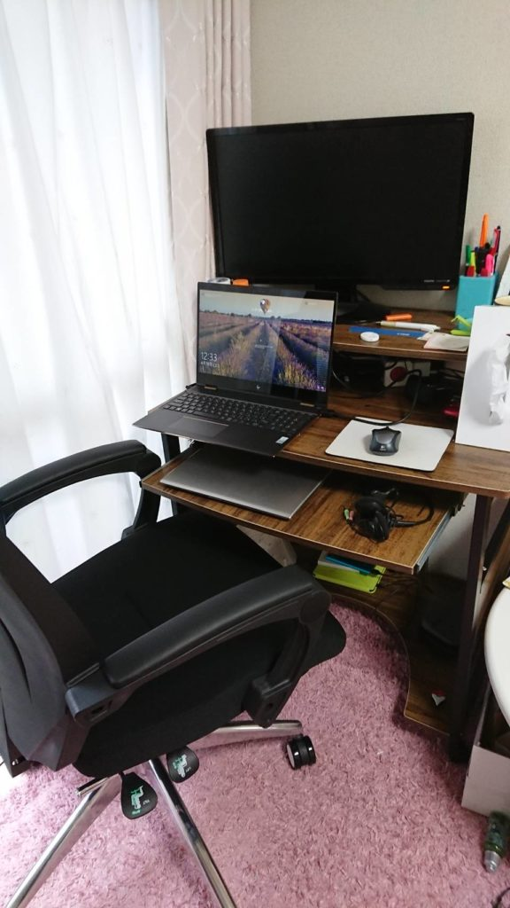
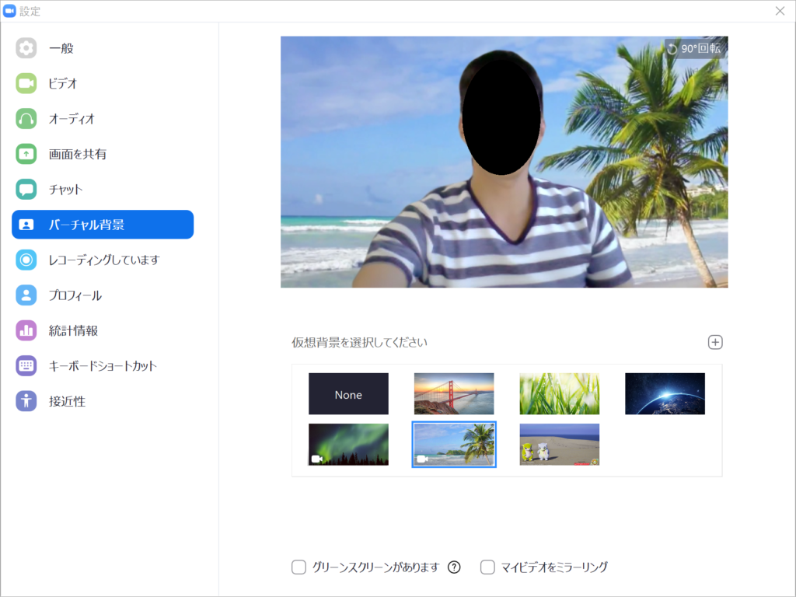

2020年、世間を騒がせている新型コロナウイルス。外出自粛が求められる中、職場が急遽テレワークを求めるケースも多々あると思います。  
私もそうした者の一人ですが、テレワーク経験の長い人から聞いたことも含めて、テレワークをする上で大事にしていることをここに残したいと思います。

## 運動

通勤がなくなると、自発的に動こうとしないと外に出ることがなくなります。そして、通勤が意外と大事な運動だったと気付かされます。  
心と身体はつながっているので、引きこもりがちになると心も塞ぎ込むようになってしまいます。

### 散歩

一番のお勧めは散歩をすることです。陽の光を浴びることもできるという面でも良いです。少なくとも10分でも、できれば雨でも外に出て歩きましょう。  
ポケモンGoなどの位置ゲームや、ランニング用アプリなどもあるので、そうしたもので目的意識を高めるのも大事と思います。

### ラジオ体操

手軽にできる運動として、完成されていると思います。  
同じようなものですが、私は以下の最近「超ラジオ体操」なるものをやっています。

<iframe src="https://www.youtube.com/embed/jPeHKtiFXIg" allow="accelerometer; autoplay; encrypted-media; gyroscope; picture-in-picture" allowfullscreen width="560" height="315" frameborder="0"></iframe>

## 作業環境

テレワークをするとなると、家で長時間座ることになります。なので、作業が快適に行える環境であることはとても重要です。私は低いテーブルで座布団に座ったりしていて、毎日膝が痛くなったり、肩が凝ったりとかなり辛かったです。ちゃんとしたデスクとチェアーを妥協せずに自分にあったものを確保することは必須と思います。

<figure>

<figcaption>

私の家の環境

</figcaption>

</figure>

ちなみに購入したのは以下のものです。デスク(11,599円)、チェアー(19,550円)の合計31,149円で安いものを頑張って探しました。といっても、安い買い物ではありませんが。  
組み立てには合計2時間弱かかり、そこそこ大変でした。こうした組み立て家具に慣れていないともっとかかるかもしれません。  
(個人的な感想ですが、自分の家にこうした仕事場ができるのはテンション上がります！)

<iframe style="width:120px;height:240px;" marginwidth="0" marginheight="0" scrolling="no" src="//rcm-fe.amazon-adsystem.com/e/cm?lt1=_blank&amp;bc1=000000&amp;IS2=1&amp;bg1=FFFFFF&amp;fc1=000000&amp;lc1=0000FF&amp;t=mitsuwo-22&amp;language=ja_JP&amp;o=9&amp;p=8&amp;l=as4&amp;m=amazon&amp;f=ifr&amp;ref=as_ss_li_til&amp;asins=B083M2966C&amp;linkId=7e28e5d357b43571dda1151100ee05a4" frameborder="0"></iframe>

<iframe style="width:120px;height:240px;" marginwidth="0" marginheight="0" scrolling="no" src="//rcm-fe.amazon-adsystem.com/e/cm?lt1=_blank&amp;bc1=000000&amp;IS2=1&amp;bg1=FFFFFF&amp;fc1=000000&amp;lc1=0000FF&amp;t=mitsuwo-22&amp;language=ja_JP&amp;o=9&amp;p=8&amp;l=as4&amp;m=amazon&amp;f=ifr&amp;ref=as_ss_li_til&amp;asins=B07SR41TF6&amp;linkId=194235976d5e4aef4b04fbe4efd8d97d" frameborder="0"></iframe>

また、デュアルディスプレイやキーボード、マウスなどの周辺機器といったものももちろん大事ですので、それらも自分にあったものを揃えて快適な環境を目指しましょう。

## 休息

適度に休息を取るということも、意識的に行う必要があるかなと思います。

### 水分補給

当然ではありますが、こまめに水分補給ができるようにしましょう。お勧めの方法は、デスクにはコップ一杯の飲み物だけを入れて飲むようにして、飲み終わったら歩いて汲みにいくようにする、です。面倒と言えば面倒ですが、この少しの作業が気分転換に繋がります。

### オンオフをしっかり切り替える

テレワークをすると、プライベートと仕事の境がなくなりがちになります。「今は昼休憩だ」とか、「今日の仕事はこれで終わり」など、意識して切り替えるようにして、緊張をほぐしリラックスしましょう。

## 会話

テレワークでは、コミュニケーションロスがかなりありますので、意図的になるべく会話をするように心がけましょう。

テレワークになると、自ずと人とのコミュニケーションが、メールやチャットなどの文章ベースのやりとりの比重が多くなってくるはずです。しかし、最も伝わりやすいコミュニケーションは「会話」です。文章ベースでは意外と伝わらないと感じることも多く、積極的にGoogle MeetやZoomといったWeb会議等を使って会話をするように心がけましょう。

### (おまけ)バーチャル背景

一部のWeb会議には、仮想の背景を合成してくれる機能があったります。部屋の中を見られなくて済みますし、背景を変えて気分転換もできたりするのでおすすめです。

<figure>

<figcaption>

Zoomでバーチャル背景を設定しているところ。背景が南国になっています。

</figcaption>

</figure>

以下に、バーチャル背景ができるWeb会議をまとめました。

| Web会議アプリ | バーチャル背景 | 備考 |
| --- | --- | --- |
| Zoom | ○ | 好きな背景画像を追加可能。 |
| Microsoft Teams | 一部○ | インストール版のみバーチャル背景設定可能。   Web版はできない。 |
| LINE | 一部○ | モバイル版のみバーチャル背景設定可能。   PC版はできない。 |
| Skype | △ | 背景設定はできず、背景ぼかしができる。 |

# 終わりに

ひとえにテレワークといっても、単に働く場所が変わっただけという単純なものではなく、やってみると色々と細かなところで違いややりにくさを感じます。ただ、通勤しなくて良いなどの便利なところもあります。  
今回ご紹介したものなども踏まえて、やりやすい形に工夫しながらテレワークをしていけると良いのかなと思います。
